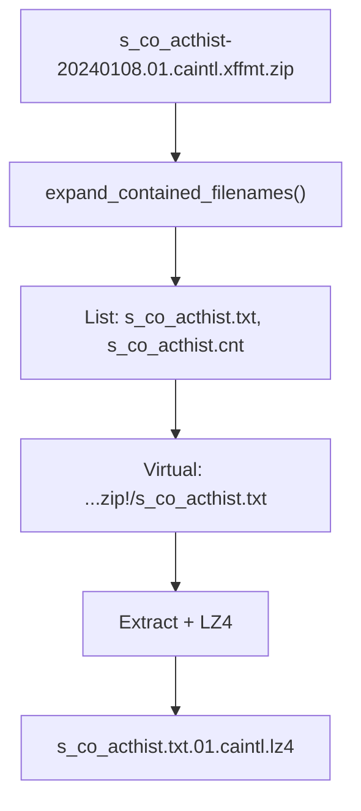

# GICS Discussion

## What is GICS?

**GICS** = Global Industry Classification Standard (S&P data)

Company and security classification data from S&P.

---

## Shovel Approach for GICS

### Core Idea: ZIP Expansion with `!/`

Shovel **doesn't extract ZIPs** at mapping time. Instead:

1. **List** ZIP contents → create virtual paths
2. **Process** virtual paths with `!/` notation
3. **Extract + compress** on final copy

```
file.xffmt.zip  →  file.xffmt.zip!/inner.txt  →  inner.txt.lz4
     ↑                    ↑                           ↑
  Original           Virtual path               Final output
```

---

## Processing Flow



---

## File Naming Pattern

### Input Structure

```
{table_name}-{YYYYMMDD}.{version}.{format}.xffmt.zip
     ↓           ↓         ↓        ↓
 key_name      date       id    extension
```

### Example Breakdown

```
s_co_acthist-20240108.01.caintl.xffmt.zip
^^^^^^^^^^^^          ^^ ^^^^^^
key_name             id (version.format)

Contains: s_co_acthist.txt, s_co_acthist.cnt
```

### Output Structure

```
v1/sp/gics/v1/v1/YYYY/MM/DD/{filename}.{ext}.{id}.lz4
```

**Example:**
```
Input:  s_co_acthist-20240108.01.caintl.xffmt.zip!/s_co_acthist.txt
Output: v1/sp/gics/v1/v1/2024/01/08/s_co_acthist.txt.01.caintl.lz4
```

---

## Products Handled

### GICS Current (pkgGIC01)

| File | Description |
|------|-------------|
| `f_gic_comp-YYYYMMDD.01.xffmt.zip` | Company GICS codes |
| `f_gic_secur-YYYYMMDD.01.xffmt.zip` | Security GICS codes |

### GICS History (bgicshglb03)

| File | Description |
|------|-------------|
| `f_gic_hcomp3-YYYYMMDD.01.xffmt.zip` | Historical company codes |
| `f_gic_hgics3-YYYYMMDD.01.xffmt.zip` | Historical GICS codes |
| `f_gic_hsecu3-YYYYMMDD.01.xffmt.zip` | Historical security codes |

### Corporate Actions

| Prefix | Files |
|--------|-------|
| `caintl/` | `s_co_acthist`, `s_sec_idhist` |
| `caprihistxna/` | `s_sec_idhist` historical |
| `caref/` | Reference data |

### Business Segments

| Prefix | Files |
|--------|-------|
| `seg/` | `s_seg_customer`, `s_seg_type`, etc. |
| `segh/` | Segment history |

### Compustat Reference

| Prefix | Description |
|--------|-------------|
| `CompustatRefDataV2/` | 70+ reference tables |

### Security IDs

| Prefix | Description |
|--------|-------------|
| `secidcusiphist/` | CUSIP history |
| `secidisinbycusiphist/` | ISIN by CUSIP |
| `secidsedolintlhist/` | SEDOL International |
| `secidsedolnahist/` | SEDOL North America |
| `secidtichist/` | TIC history |

---

## Source Buckets

### FETCH_BUCKET (2024+)

```
s3://cdp-fetch-data-1-us-east-1/sp_Scho9369/Xpressfeed/{prefix}/
```

**Prefixes:**
- `pkgGIC01/` - GICS Current
- `bgicshglb03/` - GICS History
- `caintl/` - Corporate Actions
- `seg/`, `segh/` - Segments
- `CompustatRefDataV2/` - Reference
- `secid*/` - Security IDs

### RAWMD_BUCKET (Pre-2024)

```
s3://rawmd-269785485565-us-east-1/SP/GICS/YYYY/MM/DD/
```

### Date Filtering

```python
RAWMD: date < 2023-12-31   # Old data
FETCH: date >= 2024-01-01  # New data
```

---

## File Types

| Extension | Description | Inside ZIP |
|-----------|-------------|------------|
| `.xffmt.zip` | Xpressfeed format | `.txt`, `.cnt` |
| `.asc.zip` | ASCII format | `.txt` |
| `.flg` | Flag file | - |

---

## Regex Pattern

```python
file_matcher = re.compile(
    r".*/(?P<key_name>.*)(-|\.)(?P<year>\d{4}|\d{2})(?P<month>\d{2})(?P<day>\d{2})(?P<id>.*)(\.(xffmt|asc)\.zip|flg)($|!/.*.(txt|cnt|asc)$)"
)
```

**Captures:**
- `key_name` - Table name (e.g., `s_co_acthist`)
- `year`, `month`, `day` - Date components
- `id` - Version + format (e.g., `.01.caintl`)

---

## Key Code (gics.py)

```python
def _process_event(self, s3_event, _matches):
    matches = common.pattern_to_named_matches(self.file_matcher, s3_event.key)

    # Pass 1: ZIP file → expand contents
    if s3_event.is_zip_file():
        return [self.expand_contained_filenames(s3_event=s3_event)]

    # Pass 2: Virtual path → extract and copy
    elif s3_event.is_expanded_path():
        target_filename = s3_event.get_content_path() + matches["id"] + ".lz4"
        return [self.copy_to(
            s3_event=s3_event,
            product="gics",
            product_version="1",
            filename=target_filename,
            date=common.CopyDestinationGenericFullDate(date_time),
        )]
```

---

## Summary

| Step | Action |
|------|--------|
| 1 | Detect `.xffmt.zip` file |
| 2 | List contents (don't extract) |
| 3 | Create virtual paths with `!/` |
| 4 | Extract date and ID from filename |
| 5 | Copy with LZ4 compression |
| 6 | Output: `v1/sp/gics/v1/v1/YYYY/MM/DD/{file}.{id}.lz4` |

---
