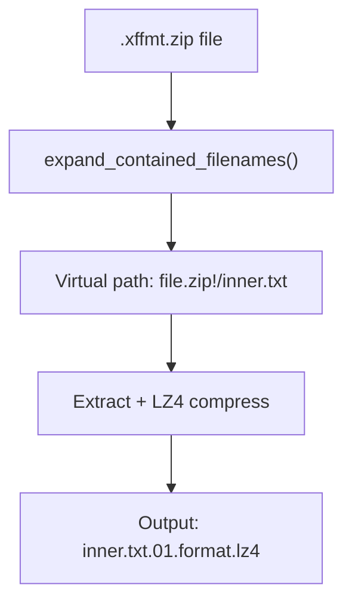

# GICS Discussion

## Overview

GICS (Global Industry Classification Standard) data pipeline - processing S&P company classification data.

---

## Shovel Approach: ZIP Expansion with `!/`

### Key Concept



### Two-Pass Processing

| Pass | Action | Example |
|------|--------|---------|
| **1** | See `.zip` → list contents | `s_co_acthist-20240108.01.caintl.xffmt.zip` |
| **2** | Process virtual `!/` paths | `...xffmt.zip!/s_co_acthist.txt` → `s_co_acthist.txt.01.caintl.lz4` |

### The Mimic Strategy

- **DON'T actually unzip** at mapping time
- Create **virtual paths** using `!/` notation
- `file.zip!/inner.txt` = "inner.txt inside file.zip"
- `is_expanded_path()` checks for `!/`
- `get_content_path()` gets filename after `!/`

### ID Extraction (Version + Format)

```
s_co_acthist-20240108.01.caintl.xffmt.zip
             ^^^^^^^^ ^^ ^^^^^^
             date     id (version.format)

Output: s_co_acthist.txt.01.caintl.lz4
                         ^^^^^^^^^
                         id preserved
```

### File Matcher Regex

```python
r".*/(?P<key_name>.*)(-|\.)(?P<year>\d{4}|\d{2})(?P<month>\d{2})(?P<day>\d{2})(?P<id>.*)(\.(xffmt|asc)\.zip|flg)($|!/.*.(txt|cnt|asc)$)"
```

---

## Products Handled

### FETCH_BUCKET Prefixes (2024+)

| Prefix | Description |
|--------|-------------|
| `sp_Scho9369/Xpressfeed/pkgGIC01/` | GICS Current (f_gic_comp, f_gic_secur) |
| `sp_Scho9369/Xpressfeed/bgicshglb03/` | GICS History (f_gic_hcomp3, f_gic_hgics3, f_gic_hsecu3) |
| `sp_Scho9369/outbound/trancxf/bgicshglb03/` | GICS History (alternate path) |
| `sp_Scho9369/Xpressfeed/asc/bgicshglb03/` | GICS History ASC format |
| `sp_Scho9369/Xpressfeed/CompustatRefDataV2/` | Compustat Reference Data V2 |
| `sp_Scho9369/Xpressfeed/suppcxf/` | Supplemental CXF |
| `sp_Scho9369/Xpressfeed/caintl/` | Corporate Actions International |
| `sp_Scho9369/Xpressfeed/caintntl/` | Corporate Actions International (alt) |
| `sp_Scho9369/Xpressfeed/caprihistxna/` | Corporate Actions History XNA |
| `sp_Scho9369/Xpressfeed/caref/` | Corporate Actions Reference |
| `sp_Scho9369/Xpressfeed/caustic/` | Corporate Actions USTIC |
| `sp_Scho9369/Xpressfeed/busdescl/` | Business Descriptions |
| `sp_Scho9369/Xpressfeed/epsalloc/` | EPS Allocations |
| `sp_Scho9369/Xpressfeed/globsupp/` | Global Supplemental |
| `sp_Scho9369/Xpressfeed/gvissue/` | Government Issues |
| `sp_Scho9369/Xpressfeed/ii/` | Institutional Investors |
| `sp_Scho9369/Xpressfeed/iqr/` | IQR Data |
| `sp_Scho9369/Xpressfeed/sec_mshare/` | Security Market Share |
| `sp_Scho9369/Xpressfeed/secidcusiphist/` | Security ID CUSIP History |
| `sp_Scho9369/Xpressfeed/secidisinbycusiphist/` | Security ID ISIN by CUSIP History |
| `sp_Scho9369/Xpressfeed/secidsedolintlhist/` | Security ID SEDOL Intl History |
| `sp_Scho9369/Xpressfeed/secidsedolnahist/` | Security ID SEDOL NA History |
| `sp_Scho9369/Xpressfeed/secidtichist/` | Security ID TIC History |
| `sp_Scho9369/Xpressfeed/secidunlicisinhist/` | Security ID Unlicensed ISIN History |
| `sp_Scho9369/Xpressfeed/seg/` | Business Segments |
| `sp_Scho9369/Xpressfeed/segh/` | Business Segments History |

### RAWMD_BUCKET Prefix (Pre-2024)

| Prefix | Description |
|--------|-------------|
| `SP/GICS/` | Legacy GICS data (before 2023-12-31) |

### Date Filtering

```python
RAWMD_BUCKET: lambda x: x < datetime.date(2023, 12, 31)   # Old data
FETCH_BUCKET: lambda x: x >= datetime.date(2024, 1, 1)    # New data
```

---

## File Types

| Extension | Description |
|-----------|-------------|
| `.xffmt.zip` | Xpressfeed format ZIP |
| `.asc.zip` | ASCII format ZIP |
| `.flg` | Flag/control file |
| `.txt` | Data file (inside ZIP) |
| `.cnt` | Count file (inside ZIP) |

---

## Output Structure

**Target Path Pattern:**
```
v1/sp/gics/v1/v1/YYYY/MM/DD/{filename}.{ext}.{id}.lz4
```

**Examples:**
```
Input:  s_co_acthist-20240108.01.caintl.xffmt.zip!/s_co_acthist.txt
Output: v1/sp/gics/v1/v1/2024/01/08/s_co_acthist.txt.01.caintl.lz4

Input:  f_gic_hcomp3-20240130.01.xffmt.zip!/f_gic_hcomp3.txt
Output: v1/sp/gics/v1/v1/2024/01/30/f_gic_hcomp3.txt.01.lz4
```

---

## Key Files

| File | Purpose |
|------|---------|
| `tfe-cdp-shovel/shovel/dataset_mapping/gics.py` | Shovel mapping (GICSV1 class) |
| `data-alchemy/resc/grabber_maps/sp_gics_cwiq_pipe_1_0.json` | data-alchemy grabber map |

---
