# Investigation DB

> 🔍 Pattern-based reverse lookup for data pipelines

## The Problem

❓ When a file is missing in Gold/Platinum, how do we trace it back?

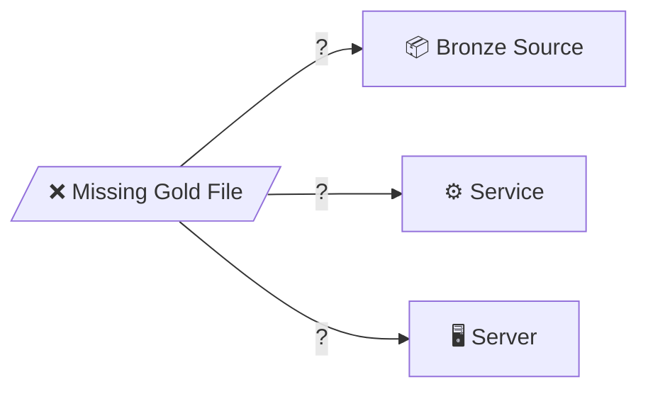

## Sample Query

*Reverse lookup: sf_table → enriched_file → platinum_path → raw_path*

## Core Idea

💡 **Don't track files - track patterns!**

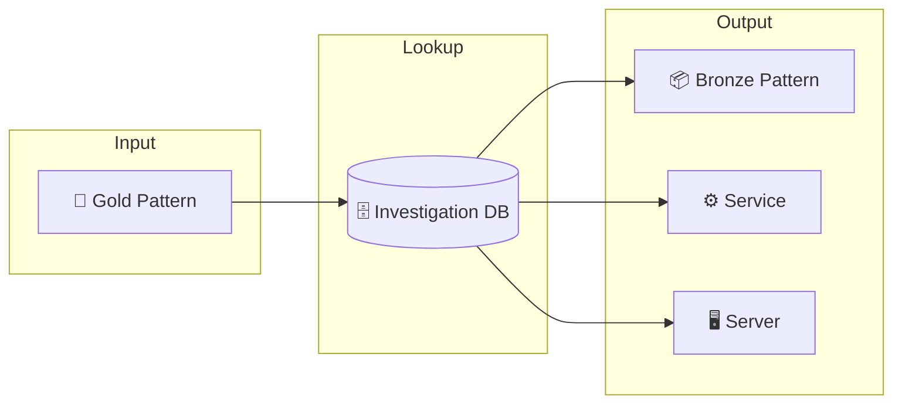

## Key Entities

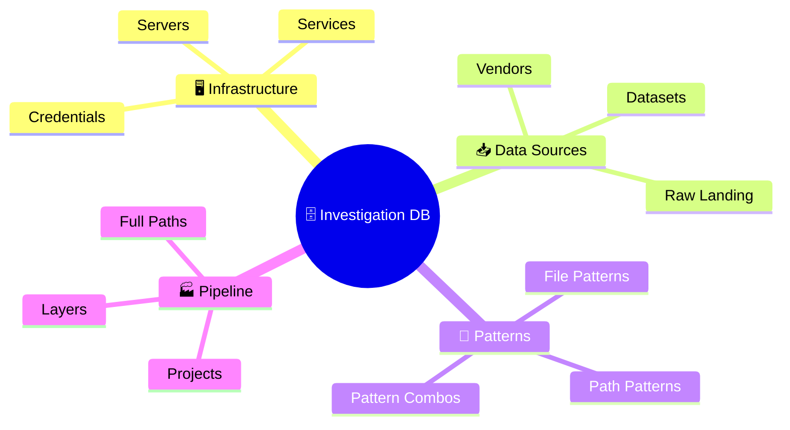

## Data Flow

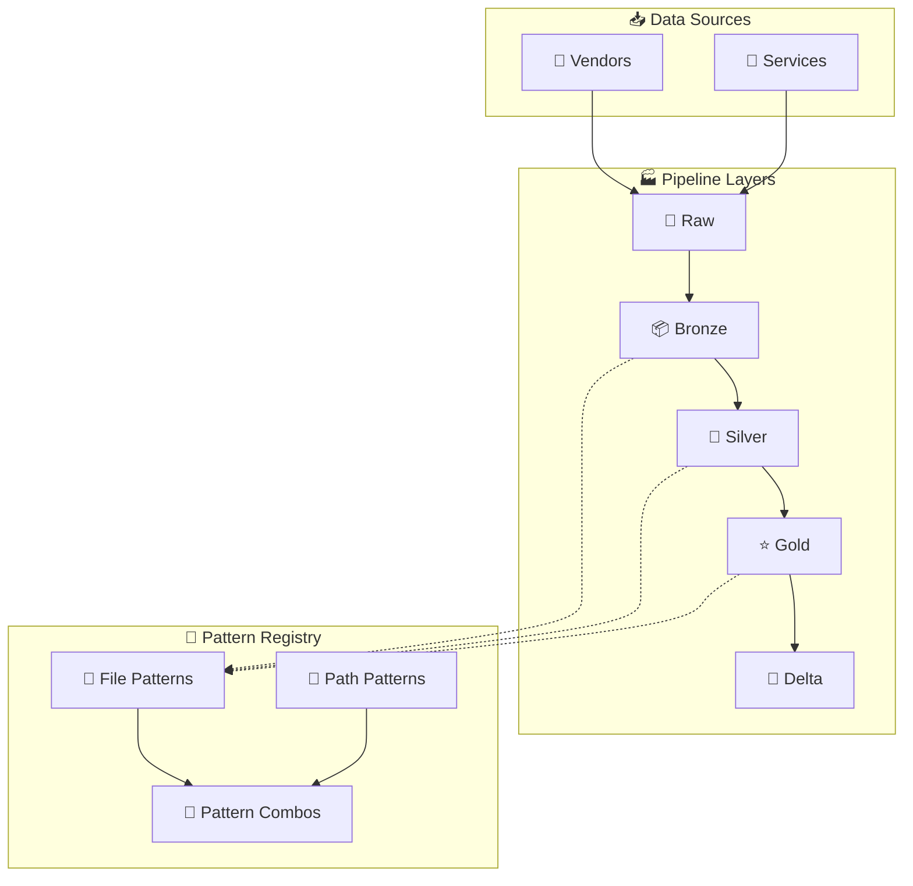

## Reverse Lookup Flow

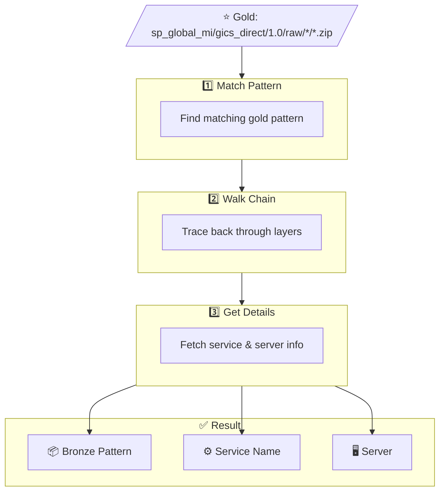

## Entity Relationships

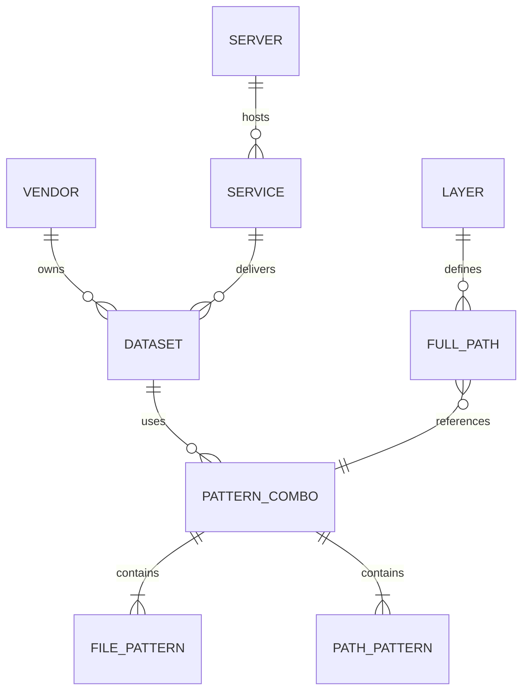

## Table Details

### 🖥️ Infrastructure Tables

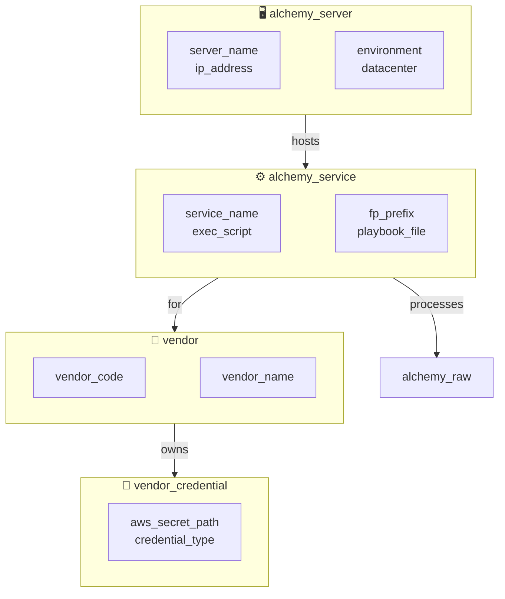

---

### 📥 Data Source Tables

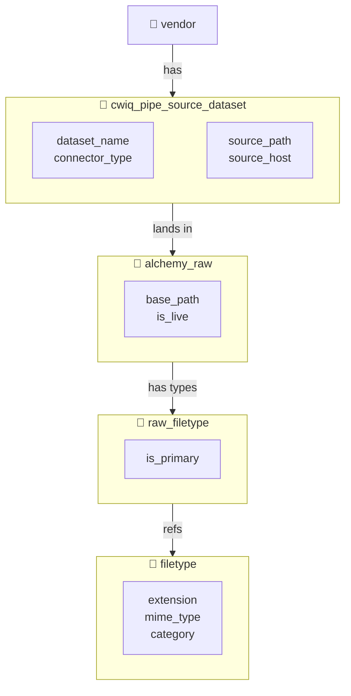

---

### 🧩 Pattern Tables

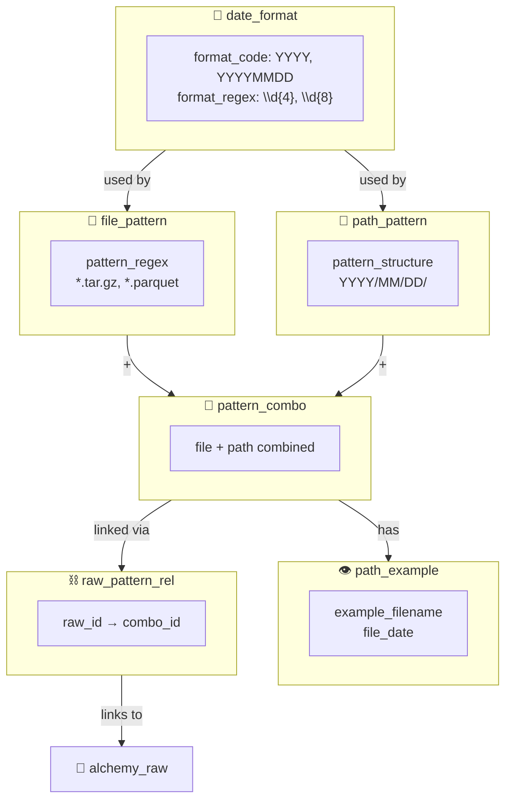

---

### 🏭 Pipeline Tables

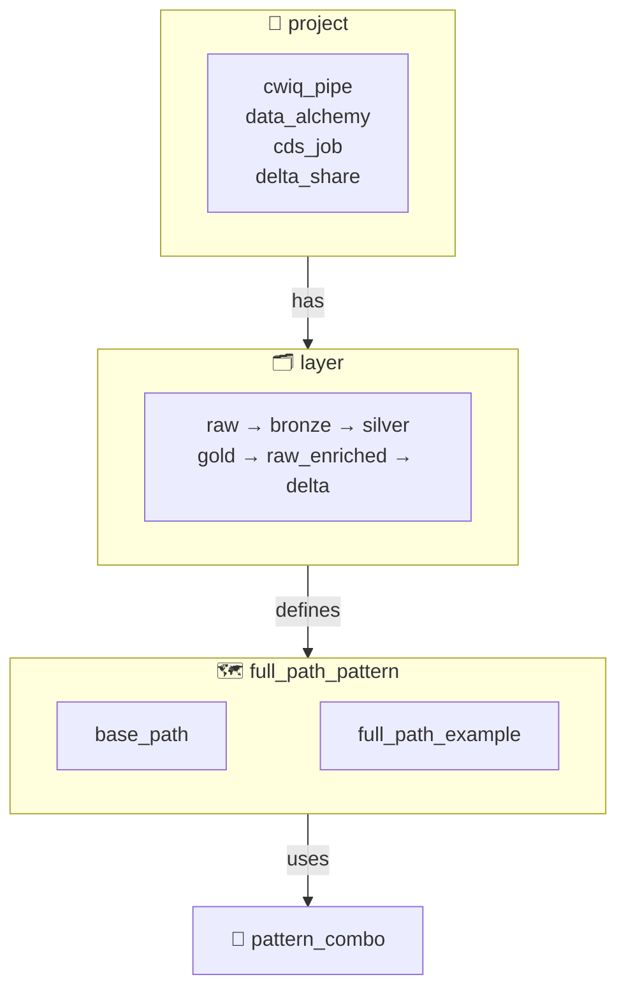

---

### 📐 CDP Retirement Tables

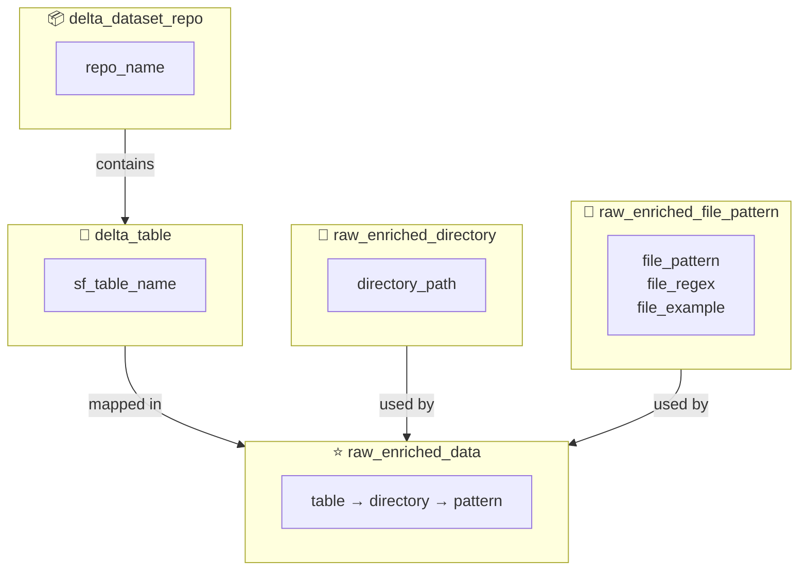

## Layers

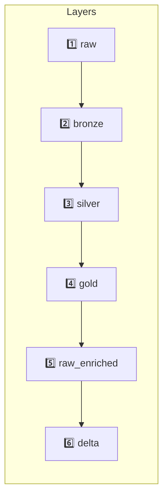

| Layer | Description |
|-------|-------------|
| 📥 raw | Landing zone (cwiq-pipe) |
| 📦 bronze | Timestamped archives |
| 💎 silver | Extracted files |
| ⭐ gold | Restructured/renamed |
| 🗄️ raw_enriched | CDP legacy format |
| 📐 delta | Delta Lake tables |

## Use Cases

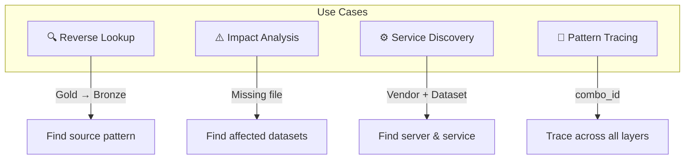

## Pattern Types

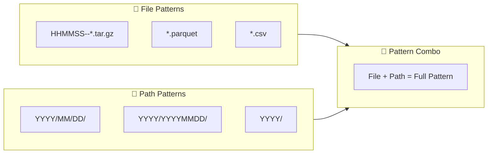

## CLI Ideas

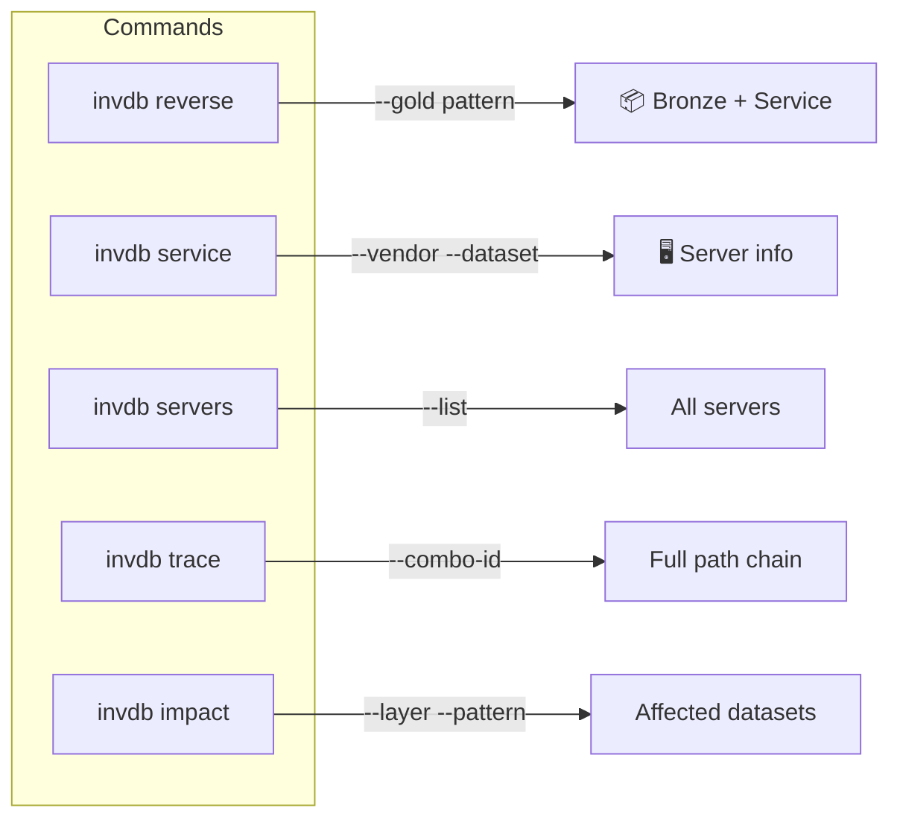

## Integration

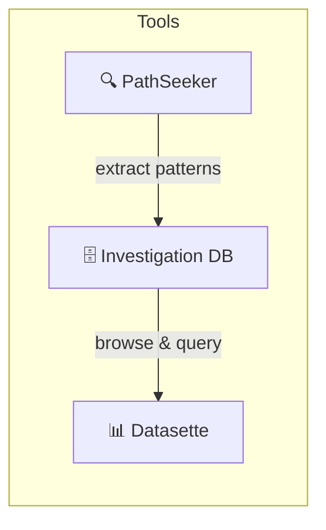

## References

- 🔗 **Repo:** [alchmydb](https://git.codewilling.com/alchmy/database/alchmydb)
- 🔗 **Related:** [PathSeeker](pathseeker.md)
