# Investigation DB

> :mag: Pattern-based reverse lookup for data pipelines

## The Problem

:question: When a file is missing in Gold/Platinum, how do we trace it back?

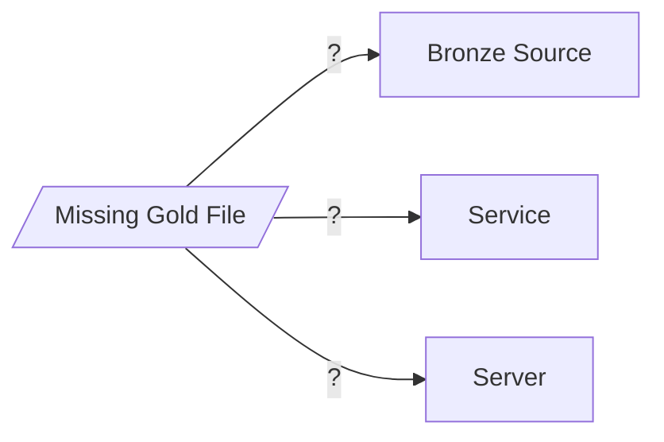

## Sample Query

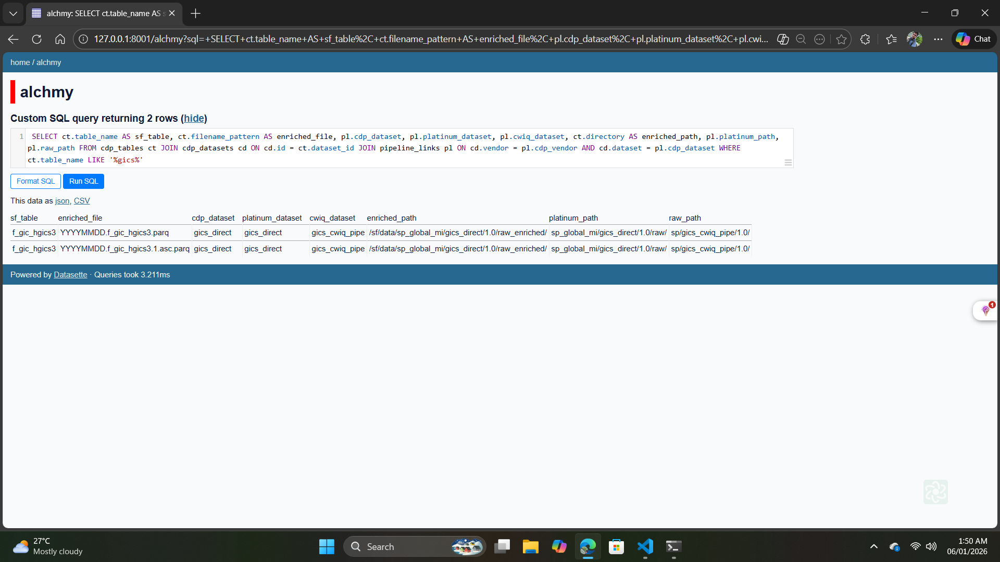

*Reverse lookup: sf_table → enriched_file → platinum_path → raw_path*

## Core Idea

:bulb: **Don't track files - track patterns!**

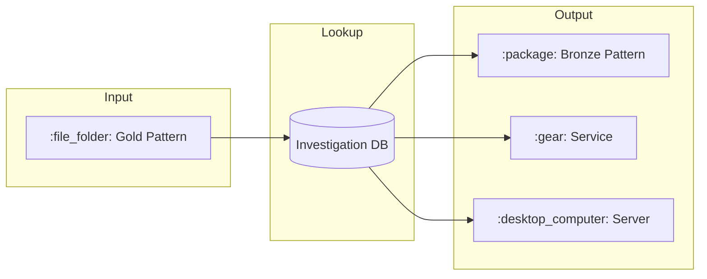

## Key Entities

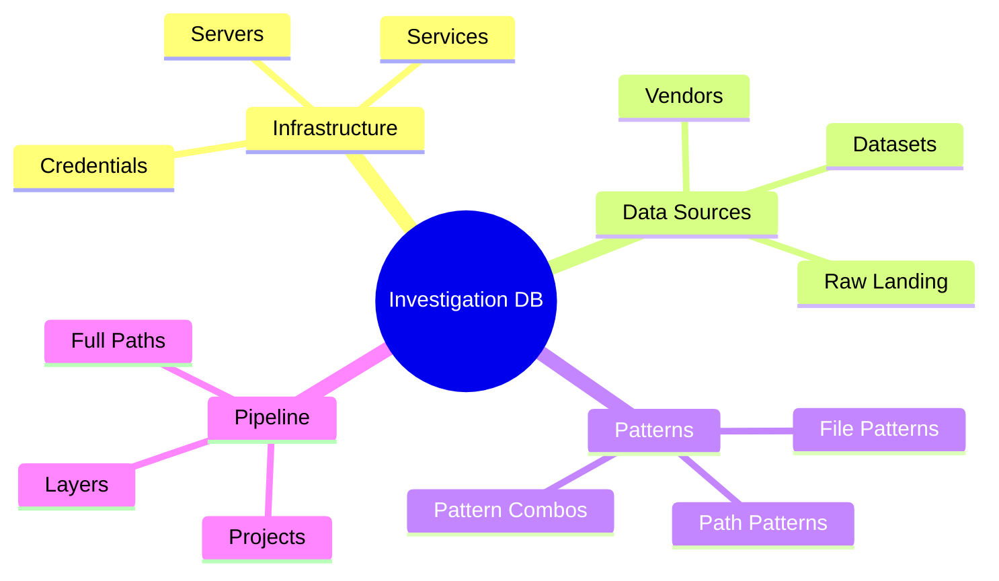

## Data Flow

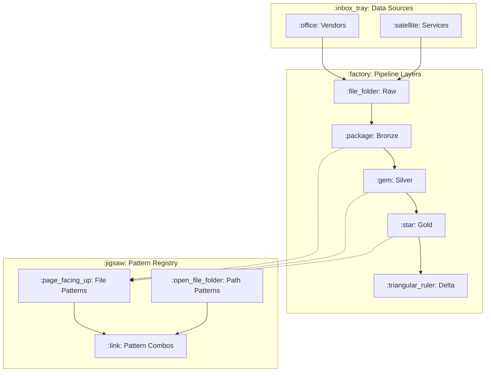

## Reverse Lookup Flow

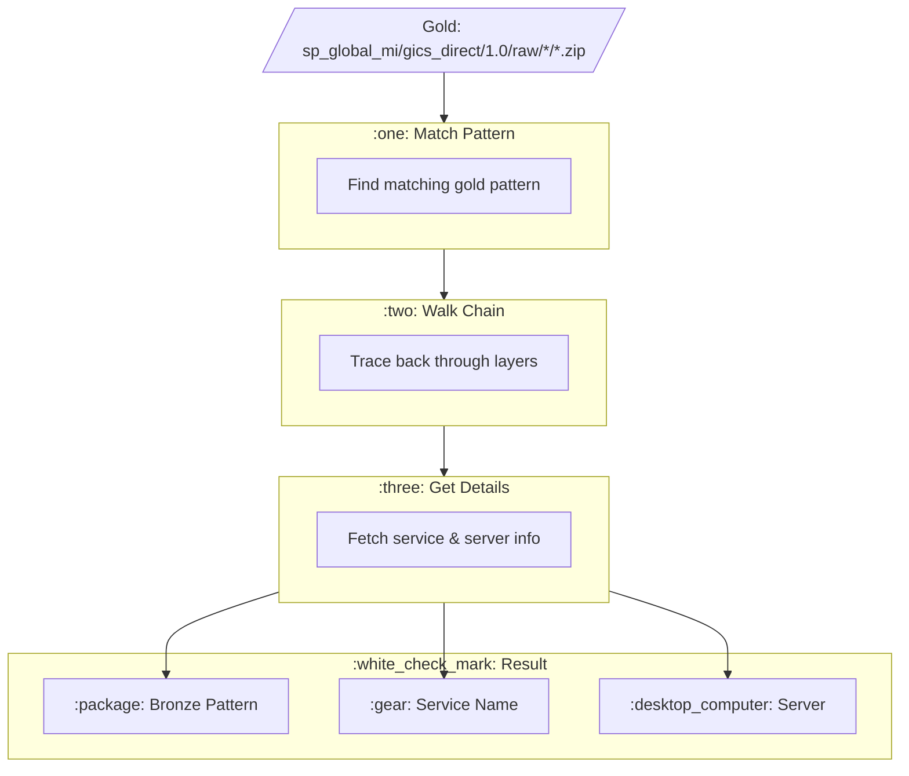

## Entity Relationships

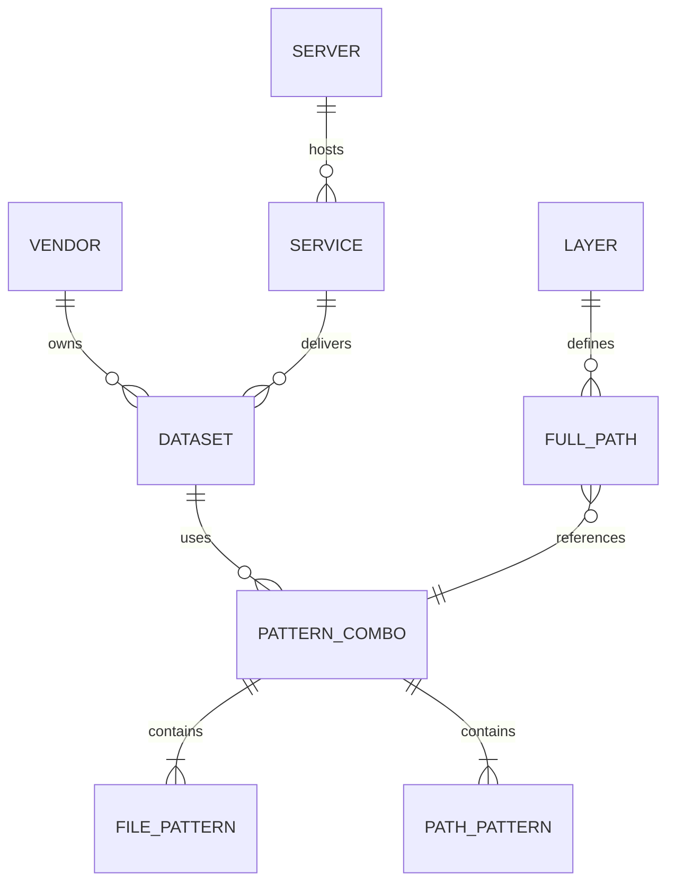

## Table Maps

### :desktop_computer: Infrastructure Tables

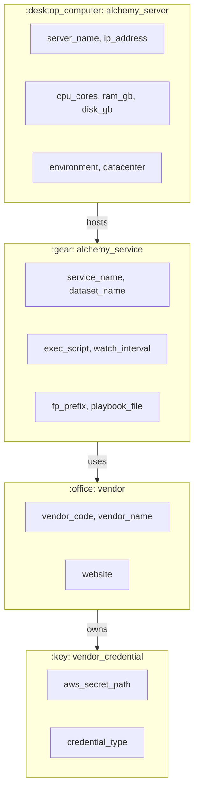

### :inbox_tray: Data Source Tables

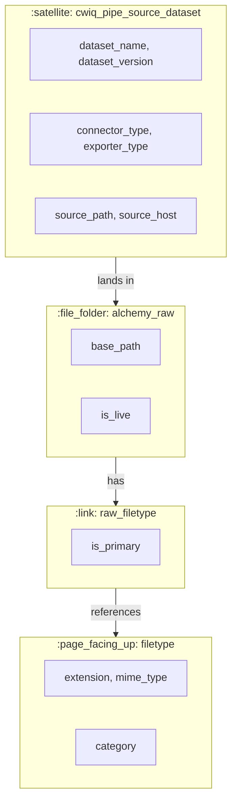

### :jigsaw: Pattern Tables

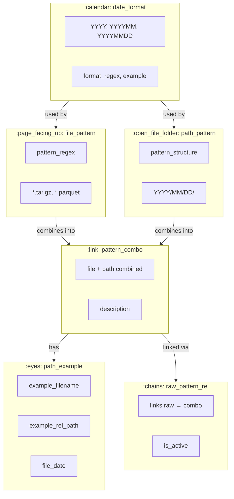

### :factory: Pipeline Tables

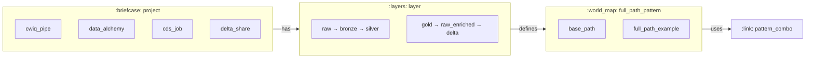

### :triangular_ruler: CDP Retirement Tables

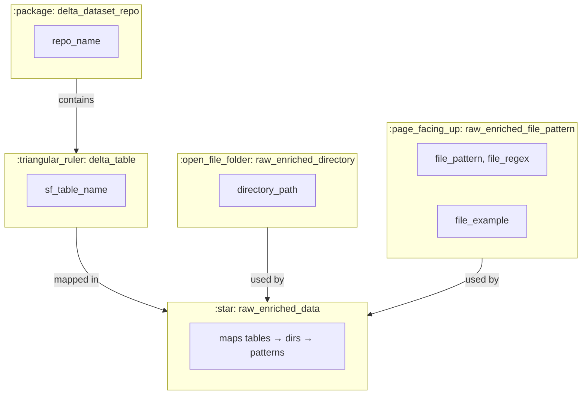

## Layers

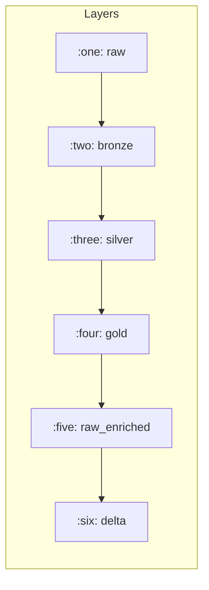

| Layer | Description |
|-------|-------------|
| :inbox_tray: raw | Landing zone (cwiq-pipe) |
| :package: bronze | Timestamped archives |
| :gem: silver | Extracted files |
| :star: gold | Restructured/renamed |
| :file_cabinet: raw_enriched | CDP legacy format |
| :triangular_ruler: delta | Delta Lake tables |

## Use Cases

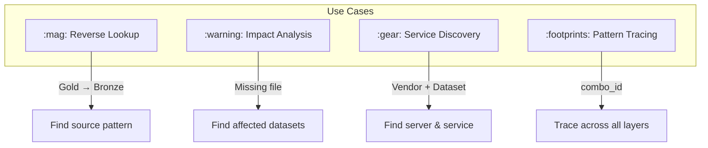

## Pattern Types

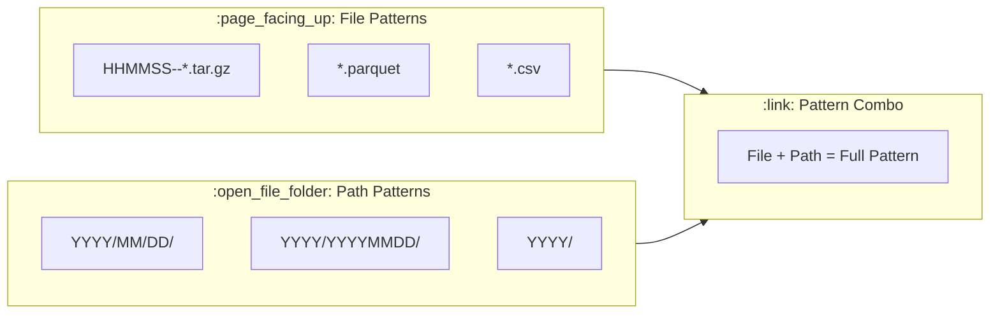

## CLI Ideas

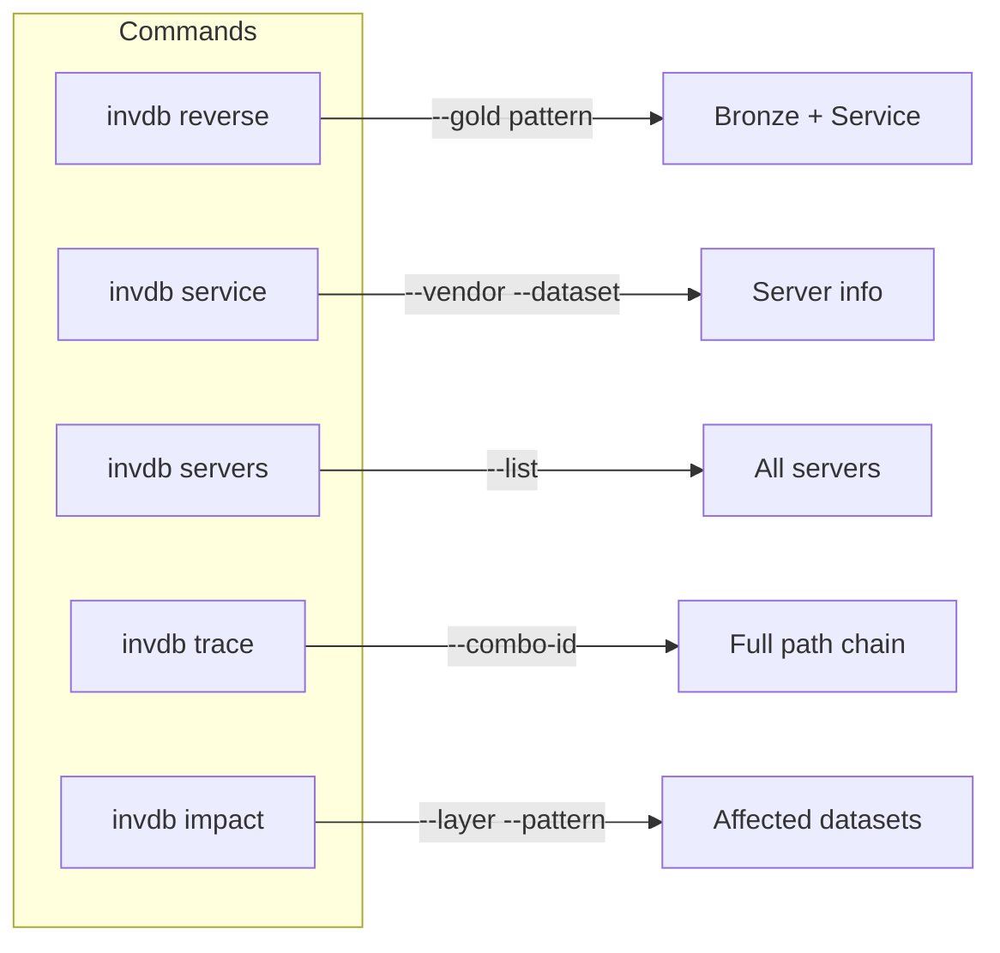

## Integration

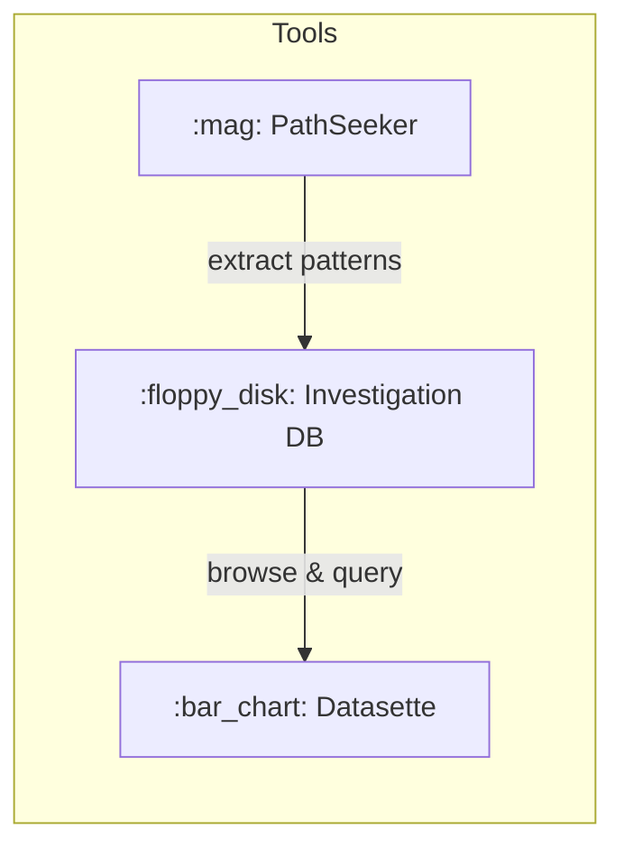

## Open Questions

- [ ] :thinking: Pattern versioning strategy?
- [ ] :thinking: Delta table tracking approach?
- [ ] :thinking: CDP migration status tracking?
- [ ] :thinking: Audit trail for changes?

## References

- :link: **Repo:** `git.codewilling.com:alchmy/database/alchmydb`
- :link: **Related:** [PathSeeker](pathseeker.md)
