# Investigation DB

> 🔍 Pattern-based reverse lookup for data pipelines

## The Problem

❓ When a file is missing in Gold/Platinum, how do we trace it back?

```mermaid
flowchart LR
    Q[/"❌ Missing Gold File"/]
    Q --> |"?"| B["📦 Bronze Source"]
    Q --> |"?"| S["⚙️ Service"]
    Q --> |"?"| SRV["🖥️ Server"]
```

## Sample Query


*Reverse lookup: sf_table → enriched_file → platinum_path → raw_path*

## Core Idea

💡 **Don't track files - track patterns!**

```mermaid
flowchart LR
    subgraph Input
        G["📁 Gold Pattern"]
    end

    subgraph Lookup
        DB[("🗄️ Investigation DB")]
    end

    subgraph Output
        B["📦 Bronze Pattern"]
        SVC["⚙️ Service"]
        SRV["🖥️ Server"]
    end

    G --> DB
    DB --> B
    DB --> SVC
    DB --> SRV
```

## Key Entities

```mermaid
mindmap
  root((🗄️ Investigation DB))
    🖥️ Infrastructure
      Servers
      Services
      Credentials
    📥 Data Sources
      Vendors
      Datasets
      Raw Landing
    🧩 Patterns
      File Patterns
      Path Patterns
      Pattern Combos
    🏭 Pipeline
      Projects
      Layers
      Full Paths
```

## Data Flow


## Reverse Lookup Flow

```mermaid
flowchart TD
    INPUT[/"⭐ Gold: sp_global_mi/gics_direct/1.0/raw/*/*.zip"/]

    subgraph Step1["1️⃣ Match Pattern"]
        MATCH["Find matching gold pattern"]
    end

    subgraph Step2["2️⃣ Walk Chain"]
        CHAIN["Trace back through layers"]
    end

    subgraph Step3["3️⃣ Get Details"]
        DETAILS["Fetch service & server info"]
    end

    subgraph Result["✅ Result"]
        R1["📦 Bronze Pattern"]
        R2["⚙️ Service Name"]
        R3["🖥️ Server"]
    end

    INPUT --> Step1
    Step1 --> Step2
    Step2 --> Step3
    Step3 --> R1 & R2 & R3
```

## Entity Relationships


## Table Details

### 🖥️ Infrastructure Tables

#### alchemy_server
> Production servers running Alchemy pipelines

| Column | Type | Description |
|--------|------|-------------|
| server_id | PK | Primary key |
| server_name | VARCHAR | Server hostname |
| ip_address | VARCHAR | IP address |
| cpu_cores | INT | CPU cores |
| ram_gb | INT | RAM in GB |
| disk_gb | INT | Disk in GB |
| os_version | VARCHAR | OS version |
| environment | VARCHAR | PROD/DEV |
| datacenter | VARCHAR | Datacenter location |
| status | VARCHAR | ACTIVE/INACTIVE |

```mermaid
flowchart LR
    S["🖥️ alchemy_server"] -->|hosts| SVC["⚙️ alchemy_service"]
```

---

#### alchemy_service
> Systemd services running data-alchemy pipelines

| Column | Type | Description |
|--------|------|-------------|
| service_id | PK | Primary key |
| server_id | FK | → alchemy_server |
| raw_id | FK | → alchemy_raw |
| vendor_id | FK | → vendor |
| dataset_name | VARCHAR | Dataset name |
| dataset_version | VARCHAR | Version |
| service_name | VARCHAR | Systemd service name |
| environment | VARCHAR | PROD/DEV |
| exec_script | VARCHAR | Execution script |
| watch_interval | INT | Watch interval (sec) |
| fp_prefix | VARCHAR | File path prefix |
| raw_fp_prefix | VARCHAR | Raw file path prefix |
| log_path | VARCHAR | Log file path |
| playbook_file | VARCHAR | Ansible playbook |
| is_active | BOOL | Active flag |

```mermaid
flowchart LR
    SVC["⚙️ alchemy_service"] -->|on| S["🖥️ server"]
    SVC -->|processes| R["📁 raw"]
    SVC -->|for| V["🏢 vendor"]
```

---

#### vendor
> Data vendors (bloomberg, factset, sp, etc.)

| Column | Type | Description |
|--------|------|-------------|
| vendor_id | PK | Primary key |
| vendor_code | VARCHAR | Short code (sp, bb) |
| vendor_name | VARCHAR | Full name |
| website | VARCHAR | Vendor website |

```mermaid
flowchart LR
    V["🏢 vendor"] -->|owns| C["🔑 credential"]
    V -->|provides| D["📡 dataset"]
```

---

#### vendor_credential
> Vendor credentials stored in AWS Secrets Manager

| Column | Type | Description |
|--------|------|-------------|
| credential_id | PK | Primary key |
| vendor_id | FK | → vendor |
| aws_secret_path | VARCHAR | AWS secret path |
| credential_type | VARCHAR | sftp/api/s3 |

---

### 📥 Data Source Tables

#### cwiq_pipe_source_dataset
> CWIQ pipe source datasets configuration

| Column | Type | Description |
|--------|------|-------------|
| source_id | PK | Primary key |
| vendor_id | FK | → vendor |
| credential_id | FK | → vendor_credential |
| dataset_name | VARCHAR | Dataset name |
| dataset_version | VARCHAR | Version |
| connector_type | VARCHAR | sftp/s3/api |
| exporter_type | VARCHAR | file_system |
| source_path | VARCHAR | Source path |
| source_host | VARCHAR | Source host |
| scan_time | INT | Scan interval |
| env_enabled | BOOL | Environment enabled |
| online | BOOL | Online flag |

```mermaid
flowchart LR
    V["🏢 vendor"] -->|has| DS["📡 cwiq_pipe_source"]
    DS -->|lands in| R["📁 alchemy_raw"]
```

---

#### alchemy_raw
> Dataset-level raw configuration

| Column | Type | Description |
|--------|------|-------------|
| raw_id | PK | Primary key |
| source_id | FK | → cwiq_pipe_source_dataset |
| base_path | VARCHAR | Base landing path |
| is_live | BOOL | Live data flag |

```mermaid
flowchart LR
    R["📁 alchemy_raw"] -->|has| RFT["🔗 raw_filetype"]
    R -->|uses| PC["🧩 pattern_combo"]
```

---

#### filetype
> Reusable file extensions

| Column | Type | Description |
|--------|------|-------------|
| filetype_id | PK | Primary key |
| extension | VARCHAR | csv, parquet, gz |
| mime_type | VARCHAR | MIME type |
| category | VARCHAR | archive/data/text |

---

#### raw_filetype
> Links alchemy_raw to filetype (bridge)

| Column | Type | Description |
|--------|------|-------------|
| raw_filetype_id | PK | Primary key |
| raw_id | FK | → alchemy_raw |
| filetype_id | FK | → filetype |
| is_primary | BOOL | Primary type flag |

---

### 🧩 Pattern Tables

#### date_format
> Normalized date format patterns

| Column | Type | Description |
|--------|------|-------------|
| format_id | PK | Primary key |
| format_code | VARCHAR | YYYY, YYYYMMDD |
| format_regex | VARCHAR | `\d{4}`, `\d{8}` |
| example | VARCHAR | 2025, 20251210 |

---

#### file_pattern
> File name regex patterns (reusable)

| Column | Type | Description |
|--------|------|-------------|
| file_pattern_id | PK | Primary key |
| pattern_regex | VARCHAR | File regex |
| format_id | FK | → date_format |

```mermaid
flowchart LR
    DF["📅 date_format"] -->|used by| FP["📄 file_pattern"]
    FP -->|combines into| PC["🔗 pattern_combo"]
```

---

#### path_pattern
> Directory path structure patterns (reusable)

| Column | Type | Description |
|--------|------|-------------|
| path_pattern_id | PK | Primary key |
| pattern_structure | VARCHAR | YYYY/MM/DD/ |
| format_id | FK | → date_format |

```mermaid
flowchart LR
    DF["📅 date_format"] -->|used by| PP["📂 path_pattern"]
    PP -->|combines into| PC["🔗 pattern_combo"]
```

---

#### pattern_combo
> Combines file_pattern + path_pattern (reusable)

| Column | Type | Description |
|--------|------|-------------|
| combo_id | PK | Primary key |
| file_pattern_id | FK | → file_pattern |
| path_pattern_id | FK | → path_pattern |
| description | VARCHAR | Combo description |

```mermaid
flowchart TB
    FP["📄 file_pattern"] --> PC["🔗 pattern_combo"]
    PP["📂 path_pattern"] --> PC
    PC --> EX["👁️ path_example"]
    PC --> FPP["🗺️ full_path_pattern"]
```

---

#### path_example
> Full path examples linked to pattern_combo

| Column | Type | Description |
|--------|------|-------------|
| example_id | PK | Primary key |
| combo_id | FK | → pattern_combo |
| example_filename | VARCHAR | Full filename |
| example_rel_path | VARCHAR | Relative path |
| file_date | DATE | File date |

---

#### raw_pattern_rel
> Links alchemy_raw to pattern_combo (bridge)

| Column | Type | Description |
|--------|------|-------------|
| rel_id | PK | Primary key |
| raw_id | FK | → alchemy_raw |
| combo_id | FK | → pattern_combo |
| is_active | BOOL | Active flag |

---

### 🏭 Pipeline Tables

#### project
> Systems that generate/manage data layers

| Column | Type | Description |
|--------|------|-------------|
| project_id | PK | Primary key |
| project_name | VARCHAR | cwiq_pipe, data_alchemy, cds_job |
| repo_url | VARCHAR | Git repo URL |

---

#### layer
> Data pipeline layers

| Column | Type | Description |
|--------|------|-------------|
| layer_id | PK | Primary key |
| layer_name | VARCHAR | raw, bronze, silver, gold |
| project_id | FK | → project |
| layer_order | INT | Layer sequence |

```mermaid
flowchart LR
    P["💼 project"] -->|has| L["🗂️ layer"]
    L -->|defines| FPP["🗺️ full_path_pattern"]
```

---

#### full_path_pattern
> Complete paths for traceability and impact analysis

| Column | Type | Description |
|--------|------|-------------|
| full_path_id | PK | Primary key |
| combo_id | FK | → pattern_combo |
| layer_id | FK | → layer |
| base_path | VARCHAR | Base path |
| full_path_pattern | VARCHAR | Full pattern |
| full_path_example | VARCHAR | Example path |
| is_active | BOOL | Active flag |

---

### 📐 CDP Retirement Tables

#### delta_dataset_repo
> Unique dataset repository names

| Column | Type | Description |
|--------|------|-------------|
| repo_id | PK | Primary key |
| repo_name | VARCHAR | Repository name |

---

#### delta_table
> SF table names with repo relationship

| Column | Type | Description |
|--------|------|-------------|
| table_id | PK | Primary key |
| sf_table_name | VARCHAR | Snowflake table name |
| repo_id | FK | → delta_dataset_repo |

```mermaid
flowchart LR
    R["📦 delta_dataset_repo"] -->|contains| T["📐 delta_table"]
    T -->|mapped in| D["⭐ raw_enriched_data"]
```

---

#### raw_enriched_directory
> Unique enriched directory paths

| Column | Type | Description |
|--------|------|-------------|
| directory_id | PK | Primary key |
| directory_path | VARCHAR | Directory path |

---

#### raw_enriched_file_pattern
> File patterns with regex and examples

| Column | Type | Description |
|--------|------|-------------|
| pattern_id | PK | Primary key |
| file_pattern | VARCHAR | File pattern |
| file_regex | VARCHAR | Regex version |
| file_example | VARCHAR | Example filename |

---

#### raw_enriched_data
> Maps tables to directories and patterns (fact)

| Column | Type | Description |
|--------|------|-------------|
| enriched_id | PK | Primary key |
| table_id | FK | → delta_table |
| directory_id | FK | → raw_enriched_directory |
| pattern_id | FK | → raw_enriched_file_pattern |

```mermaid
flowchart TB
    T["📐 delta_table"] --> D["⭐ raw_enriched_data"]
    DIR["📂 directory"] --> D
    P["📄 file_pattern"] --> D
```

## Layers

```mermaid
flowchart LR
    subgraph Layers
        direction TB
        L1["1️⃣ raw"]
        L2["2️⃣ bronze"]
        L3["3️⃣ silver"]
        L4["4️⃣ gold"]
        L5["5️⃣ raw_enriched"]
        L6["6️⃣ delta"]
    end

    L1 --> L2 --> L3 --> L4 --> L5 --> L6
```

| Layer | Description |
|-------|-------------|
| 📥 raw | Landing zone (cwiq-pipe) |
| 📦 bronze | Timestamped archives |
| 💎 silver | Extracted files |
| ⭐ gold | Restructured/renamed |
| 🗄️ raw_enriched | CDP legacy format |
| 📐 delta | Delta Lake tables |

## Use Cases

```mermaid
flowchart TB
    subgraph UC["Use Cases"]
        UC1["🔍 Reverse Lookup"]
        UC2["⚠️ Impact Analysis"]
        UC3["⚙️ Service Discovery"]
        UC4["👣 Pattern Tracing"]
    end

    UC1 --> |"Gold → Bronze"| R1["Find source pattern"]
    UC2 --> |"Missing file"| R2["Find affected datasets"]
    UC3 --> |"Vendor + Dataset"| R3["Find server & service"]
    UC4 --> |"combo_id"| R4["Trace across all layers"]
```

## Pattern Types

```mermaid
flowchart LR
    subgraph FilePatterns["📄 File Patterns"]
        FP1["HHMMSS--*.tar.gz"]
        FP2["*.parquet"]
        FP3["*.csv"]
    end

    subgraph PathPatterns["📂 Path Patterns"]
        PP1["YYYY/MM/DD/"]
        PP2["YYYY/YYYYMMDD/"]
        PP3["YYYY/"]
    end

    subgraph Combo["🔗 Pattern Combo"]
        C["File + Path = Full Pattern"]
    end

    FilePatterns --> Combo
    PathPatterns --> Combo
```

## CLI Ideas

```mermaid
flowchart LR
    subgraph Commands
        C1["invdb reverse"]
        C2["invdb service"]
        C3["invdb servers"]
        C4["invdb trace"]
        C5["invdb impact"]
    end

    C1 --> |"--gold pattern"| O1["📦 Bronze + Service"]
    C2 --> |"--vendor --dataset"| O2["🖥️ Server info"]
    C3 --> |"--list"| O3["All servers"]
    C4 --> |"--combo-id"| O4["Full path chain"]
    C5 --> |"--layer --pattern"| O5["Affected datasets"]
```

## Integration

```mermaid
flowchart LR
    subgraph Tools
        PS["🔍 PathSeeker"]
        DB["🗄️ Investigation DB"]
        DS["📊 Datasette"]
    end

    PS --> |"extract patterns"| DB
    DB --> |"browse & query"| DS
```

## References

- 🔗 **Repo:** [alchmydb](https://git.codewilling.com/alchmy/database/alchmydb)
- 🔗 **Related:** [PathSeeker](pathseeker.md)
