# PathSeeker

> 🔍 CLI tool for path analysis and pattern extraction

## The Problem

❓ How do we analyze directory structures and extract reusable patterns?

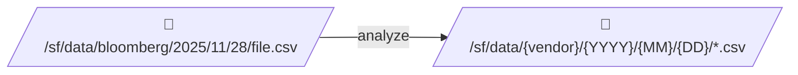

## Core Idea

💡 **Split paths → Classify segments → Generate patterns**

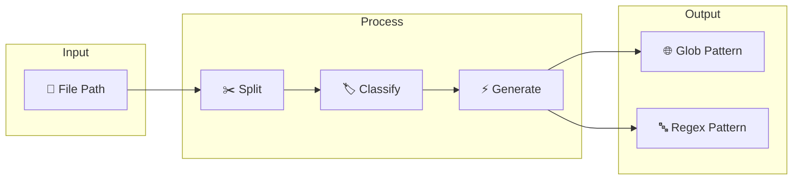

## Key Components

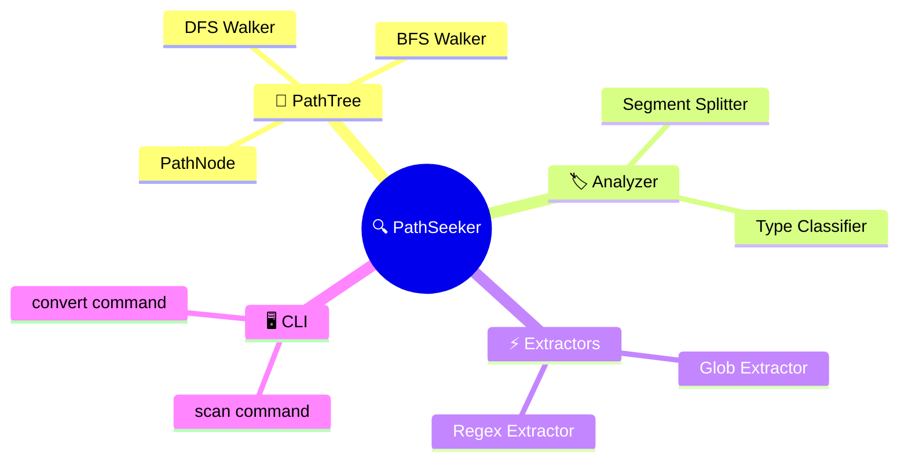

## Segment Types

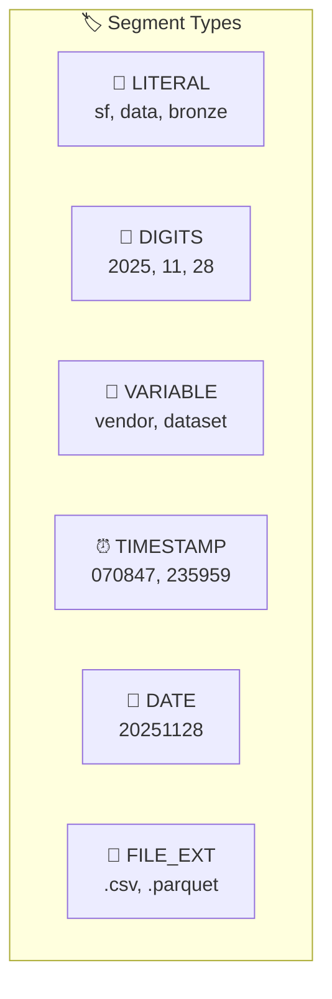

## Analysis Flow

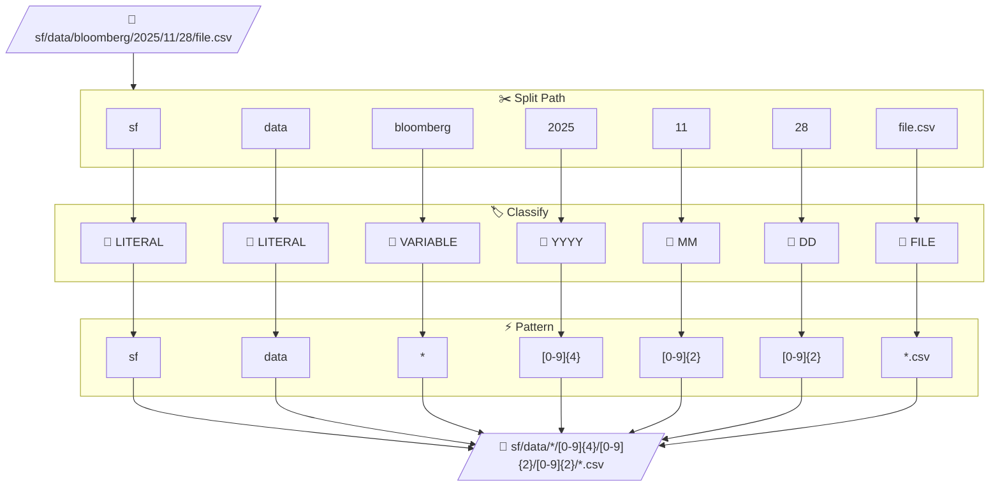

## Extraction Modes

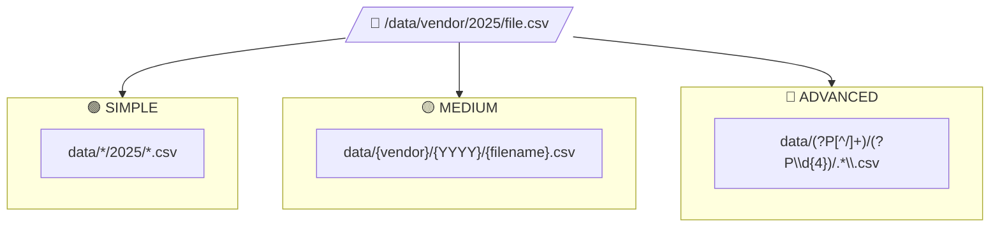

## PathTree Structure

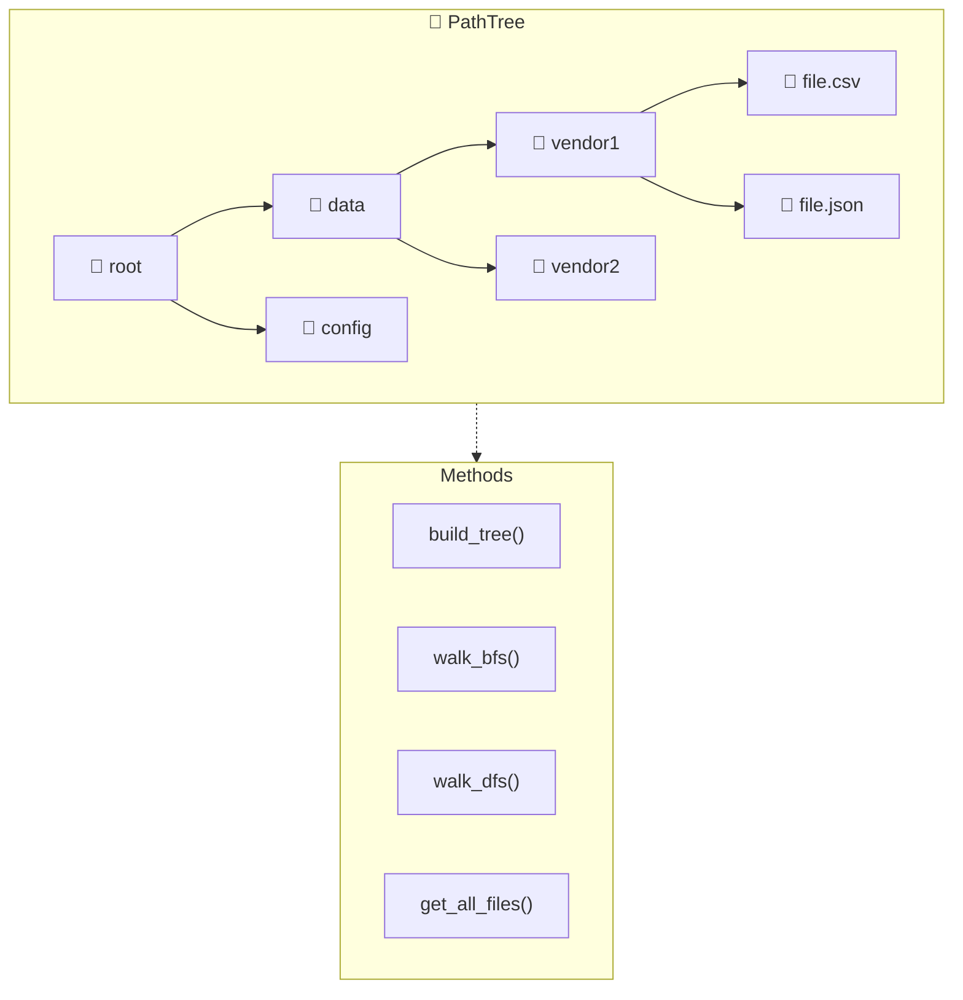

## CLI Commands

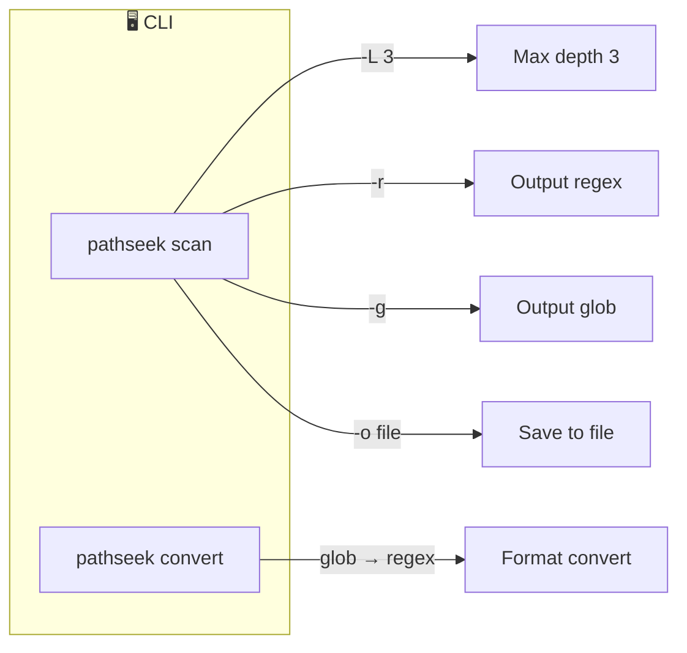

## Output Formats

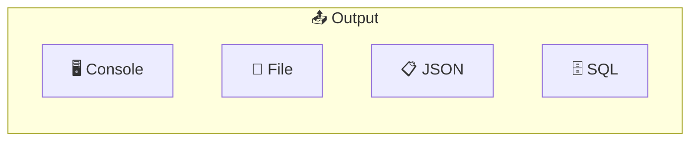

## Integration

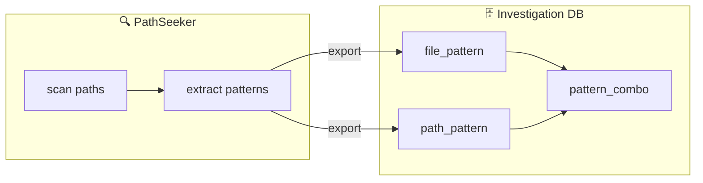

## Project Structure

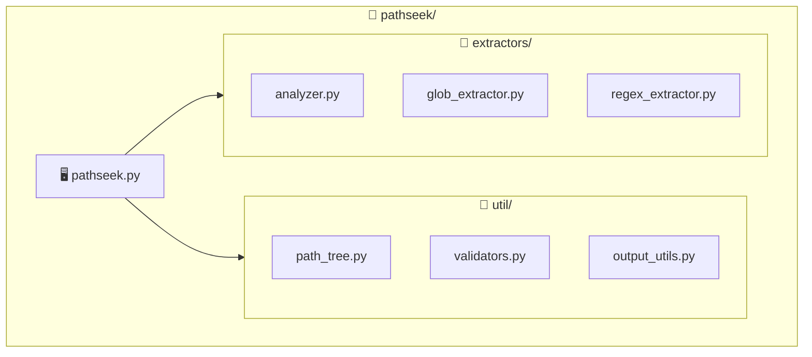

## Tech Stack

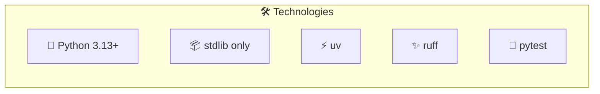

## Status

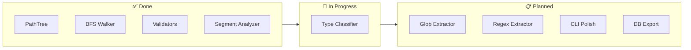

## References

- 🔗 **Related:** [Investigation DB](investigation-db.md)
