# Staging Manifest - Complete Design Document

**Date:** 2026-01-18
**Status:** Brainstorm
**Author:** Session with Claude

---

## Table of Contents

1. [Problem Statement](#problem-statement)
2. [Root Cause Analysis](#root-cause-analysis)
3. [Solutions Explored](#solutions-explored)
4. [Why Watchdog/Inotifywait Don't Work](#why-watchdoginotifywait-dont-work)
5. [The Simple Solution](#the-simple-solution)
6. [Implementation Details](#implementation-details)
7. [Benefits](#benefits)

---

## Problem Statement

### Current Situation

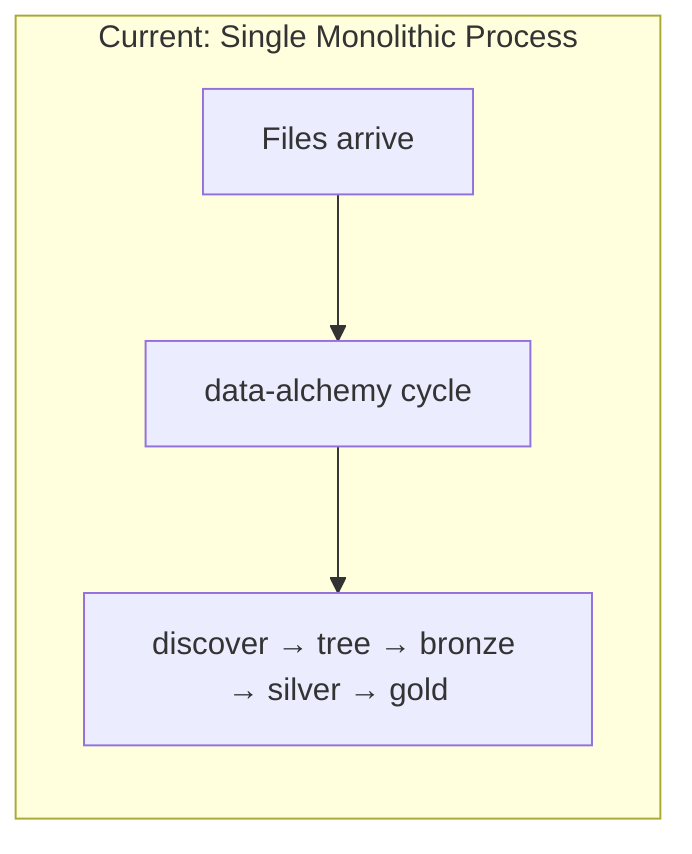

**Issues:**
- Everything happens in one process
- No visibility before files are processed
- Can't preview/sample files before prod moves them
- No staging layer for validation

### What We Want

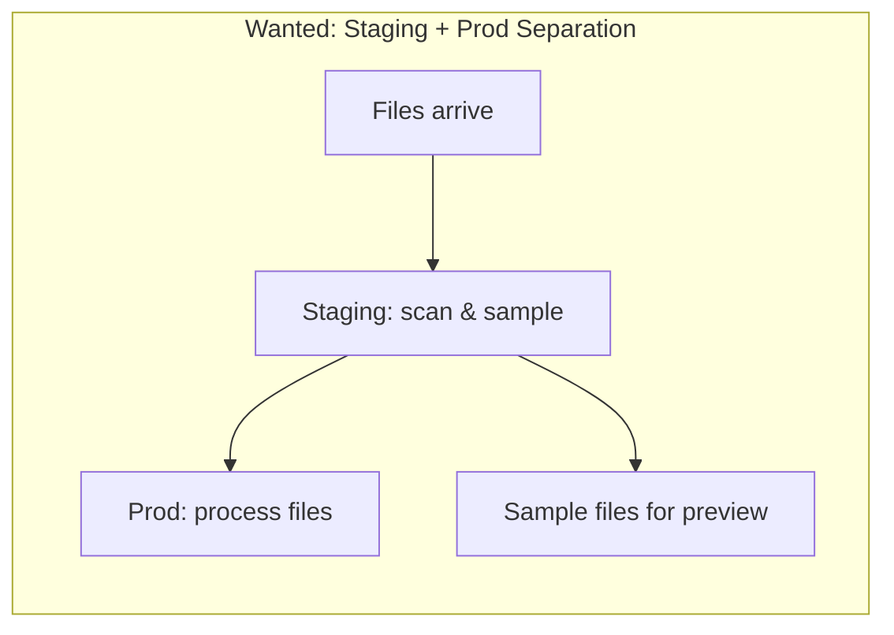

**Goals:**
- Separate staging from production
- Sample files WITHOUT copying TBs of data
- No impact on prod performance
- Track what was processed (raw → bronze mapping)

---

## Root Cause Analysis

### Why Can't We Just Scan Raw Files?

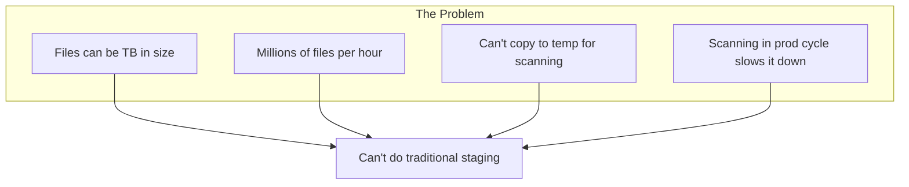

### Scale Challenges

| Challenge | Impact |
|-----------|--------|
| TB-sized files | Can't copy to temp location |
| Millions of files/hour | Can't process all proactively |
| Prod cycle every 5 min | Adding scan step slows prod |
| Raw files may be deleted | After move, raw is gone |

---

## Solutions Explored

### Solution 1: Watchdog (Python File Listener)

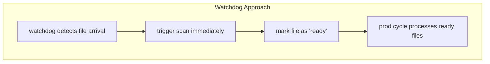

**What is Watchdog?**
- Python library for file system events
- Cross-platform (Windows, Linux, Mac)
- Detects: create, modify, move, delete events

```python
from watchdog.observers import Observer
from watchdog.events import FileSystemEventHandler

class MyHandler(FileSystemEventHandler):
    def on_created(self, event):
        # File created - trigger scan
        scan_file(event.src_path)
```

**Why It Doesn't Work:**

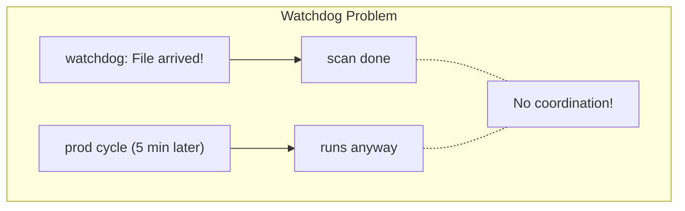

- Watchdog is reactive, prod cycle is scheduled
- No natural coordination between them
- Would need complex state management
- Still need to scan TB files (slow)

---

### Solution 2: Inotifywait (Linux Native)

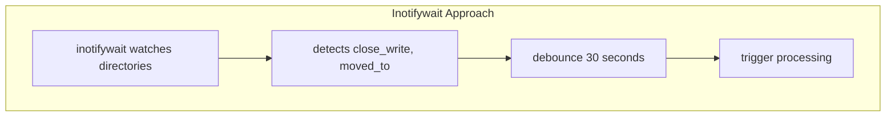

**What is Inotifywait?**
- Linux native file system monitoring
- CLI tool from inotify-tools package
- More efficient than polling

```bash
inotifywait -m -r -e close_write /raw/
```

**Why It Doesn't Work:**

| Issue | Problem |
|-------|---------|
| Linux only | No Windows support |
| Same coordination issue | Async events vs scheduled cycle |
| Still need to scan | TB files still slow |
| Complex state | Need to track what's scanned |

---

### Solution 3: Scan Inside Prod Cycle

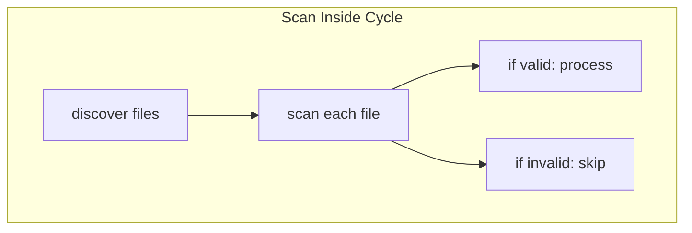

**Why It Doesn't Work:**

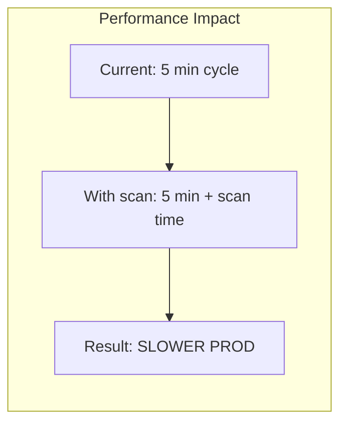

- Adds latency to every cycle
- Scanning TB files takes time
- Defeats purpose of fast prod processing

---

### Solution 4: Two-Step (Scan Raw, Check Bronze)

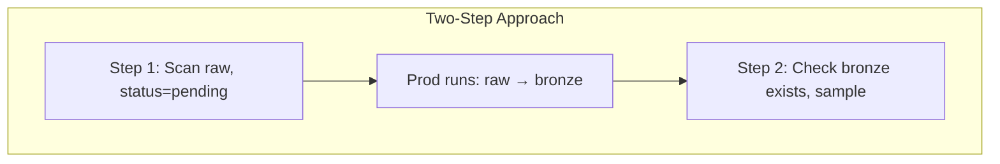

**Why It's Overcomplicated:**
- Two separate scans needed
- State management for pending/ready
- More moving parts to fail

---

## Why Watchdog/Inotifywait Don't Work

### The Core Problem

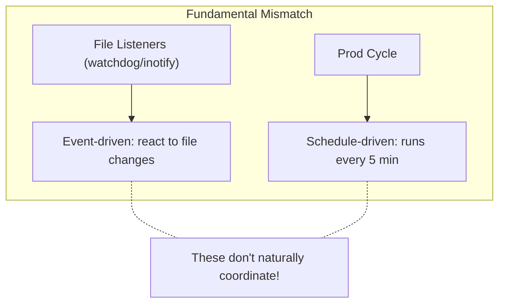

### What Would Be Needed

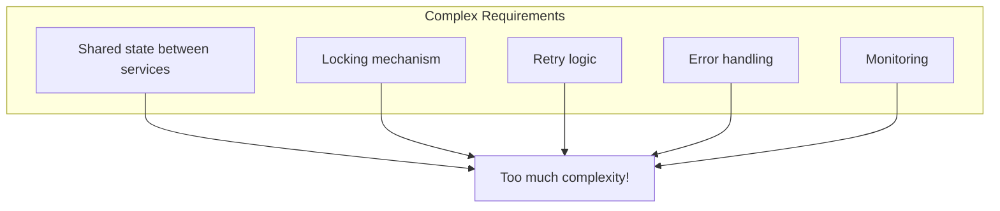

### The Insight

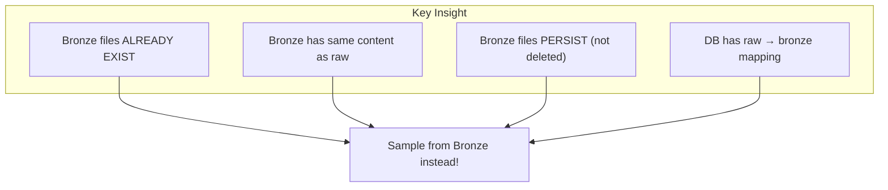

**Why sample from Bronze?**
- Files are already copied (no extra I/O)
- Files persist (safe to read anytime)
- Smaller time window (not TB backlog)
- Path mapping exists in DB

---

## Alternative Approaches

### Option A: Sample from Bronze (Recommended)

Generate sample files from bronze layer after prod processes.

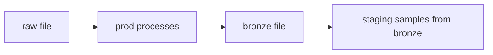

**Pros:** No impact on prod, files already exist
**Cons:** Slight delay (after prod cycle)

---

### Option B: Temp File in Raw (Optional)

Create `temp_` prefixed file while writing, rename when complete.

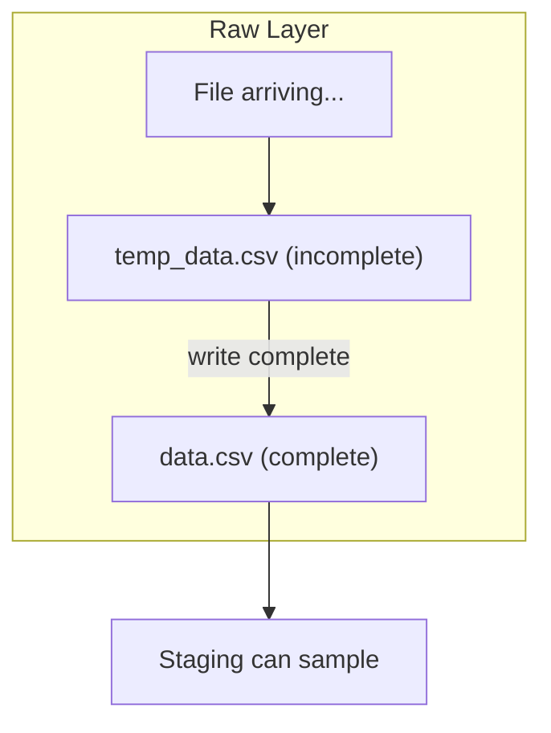

**How it works:**

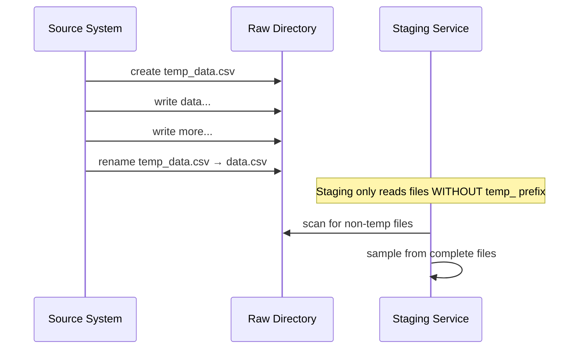

**Rules:**
- Files with `temp_` prefix = incomplete, skip
- Files without `temp_` prefix = complete, safe to sample

**Pros:** Can sample from raw before bronze
**Cons:** Requires source system to follow temp_ convention

---

### Option C: Hybrid (Both)

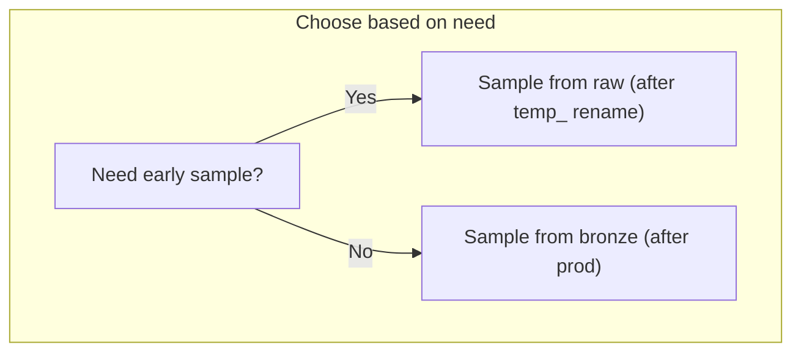

---

## The Simple Solution

### Core Idea

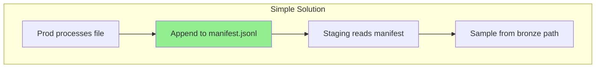

**One line change in prod: append to JSONL**

---

### Complete Flow

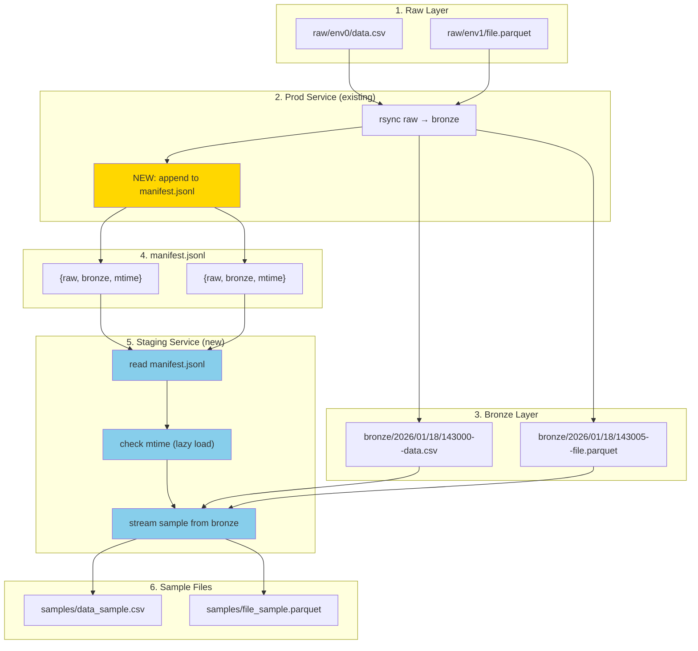

---

### JSONL Manifest Format

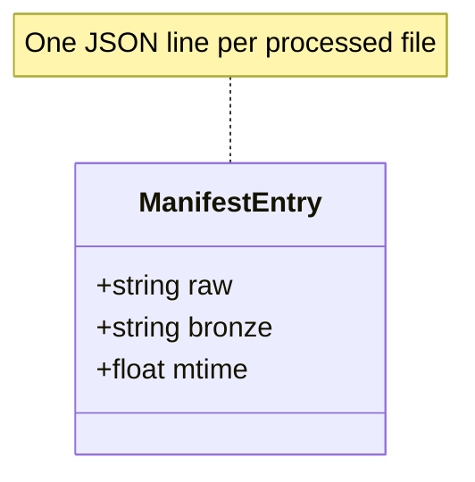

**Visual Structure:**

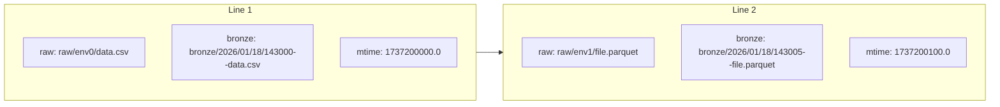

**Raw Example:**

```jsonl
{"raw": "raw/env0/data.csv", "bronze": "bronze/2026/01/18/143000--data.csv", "mtime": 1737200000.0}
{"raw": "raw/env1/file.parquet", "bronze": "bronze/2026/01/18/143005--file.parquet", "mtime": 1737200100.0}
```

---

### Path Transformation

```mermaid
flowchart LR
    subgraph RAW["Raw Path"]
        R["raw/env0/data.csv"]
    end

    subgraph TRANSFORM["Transformation"]
        T1["1. remove env0"]
        T2["2. add date: 2026/01/18"]
        T3["3. add time prefix: 143000--"]
    end

    subgraph BRONZE["Bronze Path"]
        B["bronze/2026/01/18/143000--data.csv"]
    end

    R --> T1 --> T2 --> T3 --> B
```

---

### Sample File Types (Same Format as Original)

```mermaid
flowchart TB
    subgraph INPUT["Bronze File"]
        B["bronze/data.xxx"]
    end

    subgraph DETECT["Detect File Type"]
        D{".ext?"}
    end

    subgraph OUTPUT["Sample File (Same Format)"]
        O1[".csv → sample.csv"]
        O2[".parquet → sample.parquet"]
        O3[".json → sample.json"]
        O4[".jsonl → sample.jsonl"]
        O5[".gz → sample.gz"]
        O6[".zip → sample.zip"]
        O7[".tar → sample.txt (list)"]
        O8["unknown → sample.meta.json"]
    end

    B --> D
    D -->|.csv| O1
    D -->|.parquet| O2
    D -->|.json| O3
    D -->|.jsonl| O4
    D -->|.gz| O5
    D -->|.zip| O6
    D -->|.tar| O7
    D -->|other| O8
```

**Sample Strategy by Type:**

| File Type | Sample Strategy | Output |
|-----------|-----------------|--------|
| `.csv` | First N rows | `.csv` |
| `.parquet` | First N rows | `.parquet` |
| `.json` | First N records (if array) | `.json` |
| `.jsonl` | First N lines | `.jsonl` |
| `.gz` | Decompress → first N lines → compress | `.gz` |
| `.zip` | Manifest + first small file | `.zip` |
| `.tar` | List contents only | `.txt` |
| unknown | Metadata (size, mtime) | `.meta.json` |

**Key Principle:** Sample files are **real files** in the same format - can be used for testing/preview.

---

### File Location

```mermaid
flowchart TB
    subgraph ROOT["{FP_PREFIX}"]
        subgraph VENDOR["sp/"]
            subgraph DATASET["gics_cwiq_pipe/"]
                subgraph VERSION["1.0/"]
                    BRONZE["bronze/"]
                    SILVER["silver/"]
                    GOLD["gold/"]
                    subgraph MANIFESTS["manifests/"]
                        M1["processed.jsonl"]
                    end
                    subgraph SAMPLES["samples/"]
                        S1["data_sample.csv"]
                        S2["file_sample.parquet"]
                    end
                end
            end
        end
    end

    style M1 fill:#90EE90
    style S1 fill:#87CEEB
    style S2 fill:#87CEEB
```

---

### Lazy Load (mtime Check)

```mermaid
flowchart TD
    A["Read manifest entry"] --> B{"mtime changed?"}
    B -->|Yes| C["Sample from bronze"]
    B -->|No| D["Skip - already sampled"]
    C --> E["Update cached mtime"]
    E --> F["Next entry"]
    D --> F
```

**Why mtime?**
- If file unchanged (same mtime), skip sampling
- Only sample new or modified files
- Efficient for millions of files

---

### Service Interaction

```mermaid
sequenceDiagram
    participant R as Raw Files
    participant P as Prod Service
    participant B as Bronze Layer
    participant M as manifest.jsonl
    participant S as Staging Service
    participant SA as Samples

    Note over R,P: File arrives in raw

    R->>P: new file detected
    P->>B: rsync copy to bronze
    P->>M: append {raw, bronze, mtime}

    Note over S: Staging runs (separate schedule)

    S->>M: read new entries
    S->>S: check mtime (lazy load)
    S->>B: stream first N rows
    S->>SA: save sample file

    Note over SA: Samples available for preview
```

---

## Implementation Details

### Prod Change (handle_bronze.py)

```python
import json
from pathlib import Path

def handle_bronze(raw_path, bronze_path, file_mtime, ...):
    # Existing rsync logic
    rsync_copy(raw_path, bronze_path)

    # NEW: Append to manifest
    manifest_path = get_manifest_path(vendor, dataset, version)
    manifest_path.parent.mkdir(parents=True, exist_ok=True)

    with open(manifest_path, 'a') as f:
        f.write(json.dumps({
            "raw": str(raw_path),
            "bronze": str(bronze_path),
            "mtime": file_mtime
        }) + '\n')
```

**That's it. One append per file.**

---

### Staging Service (new file)

```python
import json
from pathlib import Path

def run_staging(manifest_path, samples_dir, cache_path):
    # Load mtime cache
    cached_mtime = load_cache(cache_path)

    # Read manifest
    with open(manifest_path) as f:
        for line in f:
            entry = json.loads(line)

            # Lazy load - skip if unchanged
            if cached_mtime.get(entry['raw']) == entry['mtime']:
                continue

            # Stream sample from bronze (first N rows only)
            sample = stream_sample(entry['bronze'], rows=100)

            # Save sample
            sample_name = Path(entry['raw']).stem + '_sample' + Path(entry['raw']).suffix
            save_sample(sample, samples_dir / sample_name)

            # Update cache
            cached_mtime[entry['raw']] = entry['mtime']

    # Save cache
    save_cache(cached_mtime, cache_path)


def create_sample_file(bronze_path, sample_path, rows=100):
    """Create sample file in SAME FORMAT as original."""

    ext = Path(bronze_path).suffix.lower()

    if ext == '.csv':
        # CSV → sample CSV
        import pandas as pd
        df = pd.read_csv(bronze_path, nrows=rows)
        df.to_csv(sample_path, index=False)

    elif ext == '.parquet':
        # Parquet → sample Parquet
        import pyarrow.parquet as pq
        table = pq.read_table(bronze_path).slice(0, rows)
        pq.write_table(table, sample_path)

    elif ext == '.json':
        # JSON → sample JSON (first N records)
        import json
        with open(bronze_path) as f:
            data = json.load(f)
        if isinstance(data, list):
            data = data[:rows]
        with open(sample_path, 'w') as f:
            json.dump(data, f, indent=2)

    elif ext == '.jsonl':
        # JSONL → sample JSONL (first N lines)
        with open(bronze_path) as f:
            lines = [next(f) for _ in range(rows)]
        with open(sample_path, 'w') as f:
            f.writelines(lines)

    elif ext == '.gz':
        # .gz → sample .gz (compressed)
        import gzip
        with gzip.open(bronze_path, 'rt') as f:
            lines = [next(f) for _ in range(rows)]
        with gzip.open(sample_path, 'wt') as f:
            f.writelines(lines)

    elif ext == '.zip':
        # ZIP → sample ZIP (list + first file sample)
        import zipfile
        with zipfile.ZipFile(bronze_path) as zin:
            names = zin.namelist()
            with zipfile.ZipFile(sample_path, 'w') as zout:
                # Write manifest
                zout.writestr('_manifest.txt', '\n'.join(names))
                # Sample first file if small
                if names and zin.getinfo(names[0]).file_size < 1_000_000:
                    zout.writestr(names[0], zin.read(names[0]))

    elif ext == '.tar':
        # TAR → sample TAR (list contents)
        import tarfile
        with tarfile.open(bronze_path) as tin:
            names = tin.getnames()
        with open(sample_path.with_suffix('.txt'), 'w') as f:
            f.write('\n'.join(names))

    else:
        # Unknown → metadata file
        import json
        stat = Path(bronze_path).stat()
        with open(sample_path.with_suffix('.meta.json'), 'w') as f:
            json.dump({
                "original": str(bronze_path),
                "size": stat.st_size,
                "mtime": stat.st_mtime,
                "type": "unknown"
            }, f, indent=2)
```

---

### Staging Service File

```ini
# /etc/systemd/system/staging-sampler.service
[Unit]
Description=Data Alchemy Staging Sampler
After=network.target

[Service]
Type=simple
ExecStart=/usr/bin/python -m data_alchemy.staging_sampler
Restart=always
RestartSec=60
Environment=FP_PREFIX=/data

[Install]
WantedBy=multi-user.target
```

---

## Benefits

### Comparison Table

| Aspect | Watchdog/Inotify | JSONL Manifest |
|--------|------------------|----------------|
| Complexity | High (event coordination) | Low (just append) |
| Prod impact | Potential slowdown | Zero (one write) |
| State management | Complex | Simple (JSONL + cache) |
| Cross-platform | Varies | Works everywhere |
| Debugging | Hard (async events) | Easy (read JSONL) |

### Why This Works

```mermaid
flowchart TB
    subgraph BENEFITS["Benefits"]
        B1["No TB copies - stream samples"]
        B2["No prod slowdown - just append"]
        B3["Lazy load - skip unchanged"]
        B4["Decoupled - staging runs separately"]
        B5["Debuggable - JSONL is human-readable"]
    end
```

### Summary

```mermaid
flowchart LR
    subgraph BEFORE["Before"]
        A1["Monolithic process"]
        A2["No staging visibility"]
        A3["Complex event systems"]
    end

    subgraph AFTER["After"]
        B1["Prod: append JSONL"]
        B2["Staging: read & sample"]
        B3["Simple, decoupled"]
    end

    BEFORE --> |"Simple solution"| AFTER
```

