# Staging Manifest - Simple Approach

**Date:** 2026-01-18

---

## Overview

Simple staging solution: Prod writes JSONL manifest, Staging samples from Bronze.

---

## Flow Diagram

```mermaid
flowchart TB
    subgraph RAW["Raw Layer"]
        R1["raw/env0/data.csv"]
        R2["raw/env1/file.parquet"]
    end

    subgraph PROD["Prod Service"]
        P1["rsync raw → bronze"]
        P2["append to manifest.jsonl"]
    end

    subgraph BRONZE["Bronze Layer"]
        B1["bronze/2026/01/18/143000--data.csv"]
        B2["bronze/2026/01/18/143005--file.parquet"]
    end

    subgraph MANIFEST["manifest.jsonl"]
        M1["{raw, bronze, mtime}"]
    end

    subgraph STAGING["Staging Service"]
        S1["read manifest.jsonl"]
        S2["sample from bronze"]
        S3["create sample files"]
    end

    subgraph SAMPLES["Samples"]
        SA1["samples/data_sample.csv"]
        SA2["samples/file_sample.parquet"]
    end

    R1 --> P1
    R2 --> P1
    P1 --> B1
    P1 --> B2
    P1 --> P2
    P2 --> M1
    B1 --> S2
    B2 --> S2
    M1 --> S1
    S1 --> S2
    S2 --> S3
    S3 --> SA1
    S3 --> SA2
```



---

## Manifest Format


---

## JSONL Entry Structure


---

## JSONL Visual Example


---

## Path Transformation


---

## JSONL File Location


---

## Write Flow


---

## Raw JSON Example

```jsonl
{"raw": "raw/env0/data.csv", "bronze": "bronze/2026/01/18/143000--data.csv", "mtime": 1737200000.0}
{"raw": "raw/env1/file.parquet", "bronze": "bronze/2026/01/18/143005--file.parquet", "mtime": 1737200100.0}
```

---

## Service Interaction


---

## Lazy Load (mtime check)


---

## File Structure


---

## Implementation

### Prod Change (handle_bronze.py)

```python
# After rsync success
manifest_path = fp_prefix / vendor / dataset / version / "manifests" / "processed.jsonl"
manifest_path.parent.mkdir(parents=True, exist_ok=True)

with open(manifest_path, 'a') as f:
    f.write(json.dumps({
        "raw": str(raw_path),
        "bronze": str(bronze_path),
        "mtime": file_mtime
    }) + '\n')
```

### Staging Service

```python
def run_staging(manifest_path, samples_dir):
    cached_mtime = load_cache()

    for line in open(manifest_path):
        entry = json.loads(line)

        # Lazy load - skip if unchanged
        if cached_mtime.get(entry['raw']) == entry['mtime']:
            continue

        # Sample from bronze
        sample = stream_sample(entry['bronze'], rows=100)
        save_sample(sample, samples_dir / Path(entry['raw']).name)

        # Update cache
        cached_mtime[entry['raw']] = entry['mtime']

    save_cache(cached_mtime)
```

---

## Benefits

| Benefit | Description |
|---------|-------------|
| Simple | One JSONL append per file |
| No prod slowdown | Just one write per file |
| Lazy load | mtime check skips unchanged |
| Stream sample | No TB copy, just first N rows |
| Decoupled | Staging runs independently |

---

## Links

- [Investigation DB](https://git.codewilling.com/-/snippets/4)
- [staging-watcher-design.md](../../alchmy/docs/data-alchemy/staging-watcher-design.md)
