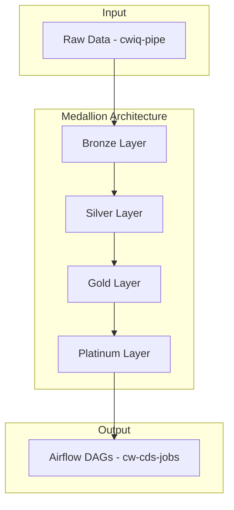
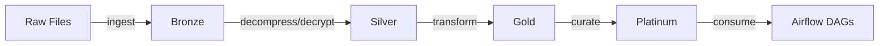

# Alchmy DB

Enterprise data processing pipeline using medallion architecture.

## Overview

**Alchmy** transforms raw data into analytics-ready datasets through a 4-layer medallion architecture. Replaces legacy pipeline (tfe-cdp-shovel) and feeds downstream Airflow workflows.

## Architecture



## Layers

| Layer | Purpose |
|-------|---------|
| **Bronze** | Raw ingestion, MD5 checksums, date partitioning |
| **Silver** | Decompress, decrypt, extract archives |
| **Gold** | Transform via grabber maps, compress |
| **Platinum** | Final curated output for analytics |

## Key Features

- Multi-vendor support (Bloomberg, S&P, OptionMetrics)
- Metadata tracking via SQLite
- Regex-based grabber maps for transformations
- Configurable compression (LZ4, Gzip)
- Data quality validation
- Reprocessing capability

## Technologies

| Component | Technology |
|-----------|------------|
| Language | Python 3.11+ |
| Data | Polars, PyArrow, Parquet |
| Database | SQLite, SQLModel |
| Deployment | Docker |
| Package Manager | uv |

## Data Flow



## Project Structure

```
alchmy/
├── data-alchemy/          # Core engine
│   ├── data_alchemy/
│   │   ├── config/        # Grabber maps, timezone
│   │   ├── handlers/      # Layer handlers
│   │   ├── models/        # SQLModel metadata
│   │   └── main.py        # CLI
│   └── resc/              # Resources
├── cw-cds-jobs/           # Downstream DAGs
└── docs/                  # Documentation
```

## CLI Usage

```bash
# Full pipeline with backfill
python -m data_alchemy.main --vendor sp --dataset gics_cwiq_pipe --version 1.0 --backfill 720

# Data quality check
python -m data_alchemy.main --vendor sp --dataset gics --version 1.0 --dq --lookback 20
```
