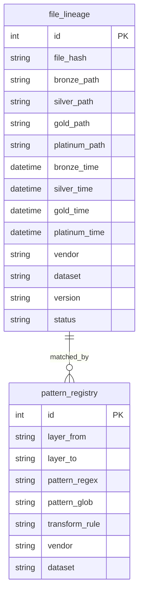
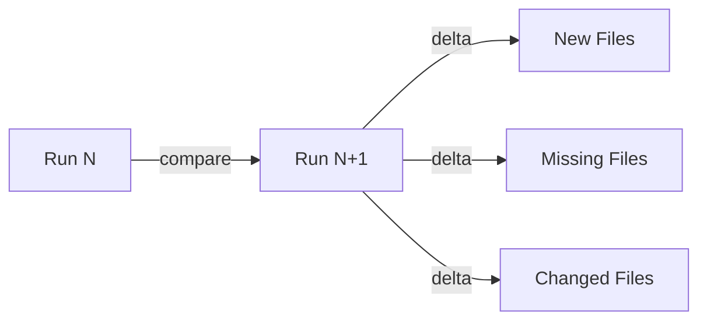
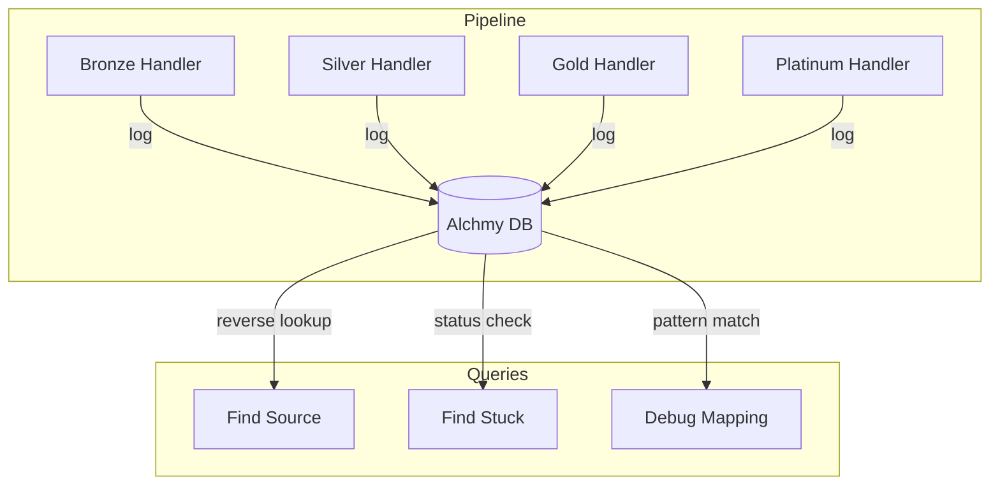

# Alchmy DB

Lineage tracking database for investigating file mappings across pipeline layers.

## Problem

When a file is missing in Platinum/Gold, how do we find its source in Bronze/Silver?

```
Missing: /sp_global_mi/gics_direct/1.0/raw/2025/20251128/f_gic_comp-20251128.01.xffmt.zip
Question: Where is the Bronze source?
```

## Solution

A database that stores:
1. **File lineage** across all layers
2. **Pattern mappings** (regex/glob) between layers
3. **Reverse lookup** capability

## Schema

### Core Tables



### file_lineage

Tracks each file through all layers.

| Column | Type | Description |
|--------|------|-------------|
| `id` | INT | Primary key |
| `file_hash` | VARCHAR | MD5 hash for identity |
| `bronze_path` | VARCHAR | `bronze/2025/11/28/070847--f_gic_comp...` |
| `silver_path` | VARCHAR | `silver/2025/11/28/work/Xpressfeed/...` |
| `gold_path` | VARCHAR | `sp_global_mi/gics_direct/1.0/raw/...` |
| `platinum_path` | VARCHAR | Final output path |
| `bronze_time` | DATETIME | When ingested to bronze |
| `silver_time` | DATETIME | When processed to silver |
| `gold_time` | DATETIME | When transformed to gold |
| `platinum_time` | DATETIME | When curated to platinum |
| `vendor` | VARCHAR | e.g., `sp`, `bloomberg` |
| `dataset` | VARCHAR | e.g., `gics_cwiq_pipe` |
| `version` | VARCHAR | e.g., `1.0` |
| `status` | VARCHAR | `complete`, `partial`, `missing` |

### pattern_registry

Stores transformation patterns between layers.

| Column | Type | Description |
|--------|------|-------------|
| `id` | INT | Primary key |
| `layer_from` | VARCHAR | `bronze`, `silver`, `gold` |
| `layer_to` | VARCHAR | `silver`, `gold`, `platinum` |
| `pattern_regex` | VARCHAR | Regex pattern to match |
| `pattern_glob` | VARCHAR | Glob equivalent |
| `transform_rule` | JSON | Transformation logic |
| `vendor` | VARCHAR | Vendor filter |
| `dataset` | VARCHAR | Dataset filter |

## Pattern Examples

### Bronze → Silver

```sql
INSERT INTO pattern_registry (layer_from, layer_to, pattern_regex, pattern_glob, transform_rule) VALUES
('bronze', 'silver',
 'bronze/(\d{4})/(\d{2})/(\d{2})/(\d{6})--(.+\.gz)$',
 'bronze/[0-9][0-9][0-9][0-9]/[0-9][0-9]/[0-9][0-9]/*--*.gz',
 '{"action": "decompress", "output": "silver/{1}/{2}/{3}/work/{5}"}');
```

### Silver → Gold

```sql
INSERT INTO pattern_registry (layer_from, layer_to, pattern_regex, pattern_glob, transform_rule) VALUES
('silver', 'gold',
 'silver/(\d{4})/(\d{2})/(\d{2})/work/Xpressfeed/pkgGIC01/\d{6}--(.+)$',
 'silver/*/work/Xpressfeed/pkgGIC01/*--*',
 '{"action": "transform", "output": "sp_global_mi/gics_direct/1.0/raw/{year}/{date}/{filename}"}');
```

## Sample Queries

### 1. Find Bronze source for missing Gold file

```sql
-- Missing: sp_global_mi/gics_direct/1.0/raw/2025/20251128/f_gic_comp-20251128.01.xffmt.zip
SELECT bronze_path, silver_path, bronze_time
FROM file_lineage
WHERE gold_path LIKE '%f_gic_comp-20251128%'
   OR platinum_path LIKE '%f_gic_comp-20251128%';
```

### 2. Find all incomplete files

```sql
SELECT bronze_path, status,
       CASE WHEN silver_path IS NULL THEN 'stuck at bronze'
            WHEN gold_path IS NULL THEN 'stuck at silver'
            WHEN platinum_path IS NULL THEN 'stuck at gold'
       END as stuck_at
FROM file_lineage
WHERE status != 'complete';
```

### 3. Reverse lookup by pattern

```sql
-- Given gold pattern, find bronze pattern
SELECT p1.pattern_glob as bronze_pattern,
       p2.pattern_glob as silver_pattern,
       p3.pattern_glob as gold_pattern
FROM pattern_registry p1
JOIN pattern_registry p2 ON p1.layer_to = p2.layer_from
JOIN pattern_registry p3 ON p2.layer_to = p3.layer_from
WHERE p3.pattern_glob LIKE '%gics_direct%';
```

### 4. Time-based investigation

```sql
-- Files processed in bronze but not in silver within 24 hours
SELECT bronze_path, bronze_time
FROM file_lineage
WHERE silver_time IS NULL
  AND bronze_time < NOW() - INTERVAL 24 HOUR;
```

### 5. Pattern match for debugging

```sql
-- Find pattern that should have matched
SELECT pattern_regex, transform_rule
FROM pattern_registry
WHERE 'silver/2025/11/28/work/Xpressfeed/pkgGIC01/070847--f_gic_comp-20251128.01.xffmt.zip'
      REGEXP pattern_regex;
```

## Delta Table Concept

Track changes between runs:



### delta_tracking

| Column | Type | Description |
|--------|------|-------------|
| `run_id` | INT | Pipeline run ID |
| `run_time` | DATETIME | When run started |
| `layer` | VARCHAR | bronze/silver/gold/platinum |
| `files_added` | INT | New files this run |
| `files_removed` | INT | Files no longer present |
| `files_changed` | INT | Files with different hash |

## CLI Integration

```bash
# Find bronze source for missing gold file
alchmy-db find-source --gold "sp_global_mi/gics_direct/1.0/raw/2025/20251128/*.zip"

# Show lineage for a file
alchmy-db lineage --file "f_gic_comp-20251128.01.xffmt.zip"

# List stuck files
alchmy-db stuck --layer silver --hours 24

# Pattern test
alchmy-db test-pattern --input "silver/2025/11/28/work/..." --vendor sp
```

## Architecture



## Implementation Notes

1. **Use SQLite** for single-machine, **PostgreSQL** for distributed
2. **Index** on `bronze_path`, `gold_path`, `vendor`, `dataset`
3. **Trigger** inserts from existing `FileMetadata` model
4. **Pattern registry** populated from grabber_maps JSON files

## Current FileMetadata vs Alchmy DB

| Feature | FileMetadata | Alchmy DB |
|---------|--------------|-----------|
| Single layer tracking | Yes | No |
| Full lineage | No | Yes |
| Pattern registry | No | Yes |
| Reverse lookup | No | Yes |
| Delta tracking | No | Yes |
