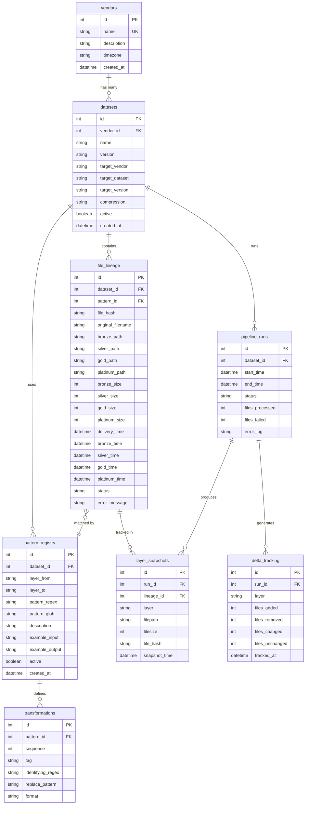
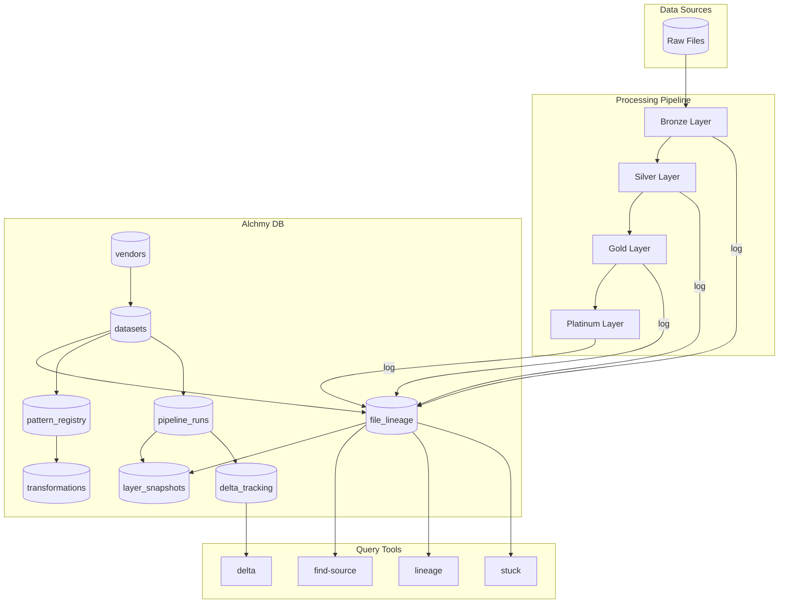
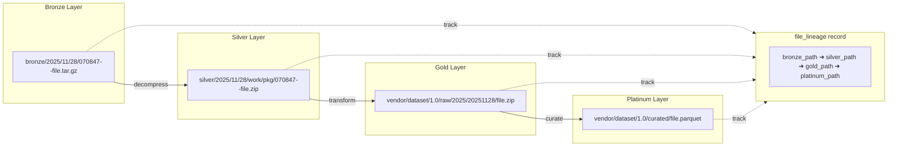
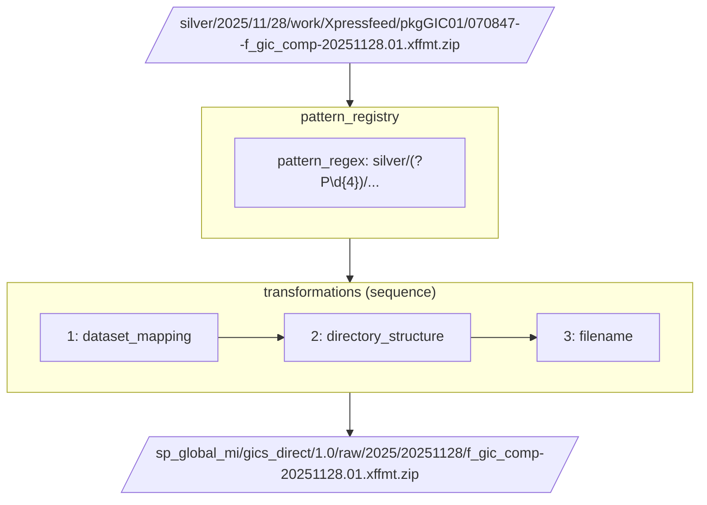
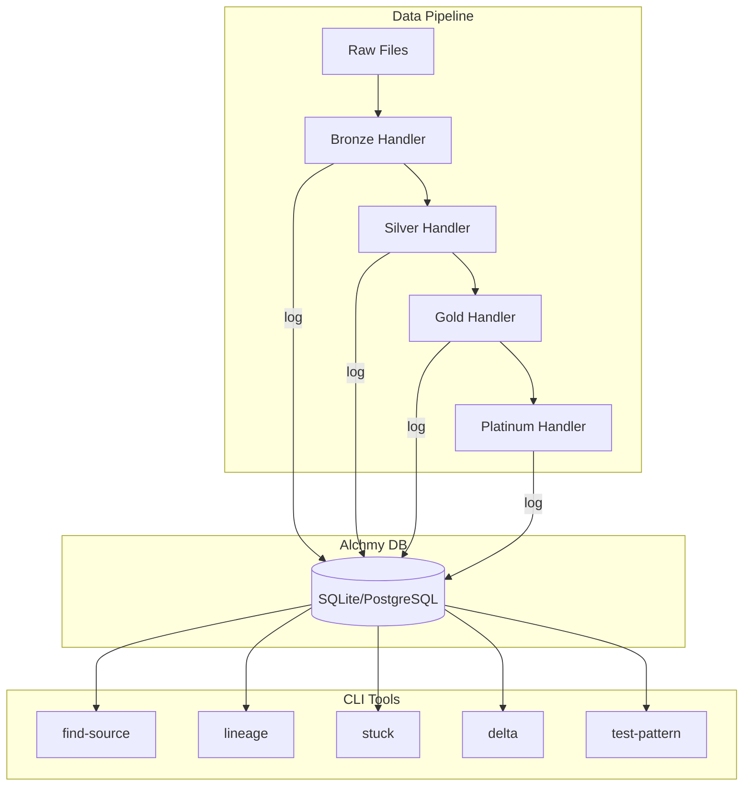

# Investigation DB

Lineage tracking database for investigating file mappings across pipeline layers.

## Problem

When a file is missing in Platinum/Gold, how do we find its source in Bronze/Silver?

```
Missing: /sp_global_mi/gics_direct/1.0/raw/2025/20251128/f_gic_comp-20251128.01.xffmt.zip
Question: Where is the Bronze source?
```

## Full Schema

### ER Diagram (Full)



### Data Flow Diagram



### Lineage Flow



### Pattern Matching Flow



### SQL Schema

```sql
-- ============================================
-- ALCHMY DB - Full Schema
-- ============================================

-- Vendors table
CREATE TABLE vendors (
    id INTEGER PRIMARY KEY AUTOINCREMENT,
    name VARCHAR(100) UNIQUE NOT NULL,
    description TEXT,
    timezone VARCHAR(50) DEFAULT 'UTC',
    created_at DATETIME DEFAULT CURRENT_TIMESTAMP
);

-- Datasets table
CREATE TABLE datasets (
    id INTEGER PRIMARY KEY AUTOINCREMENT,
    vendor_id INTEGER NOT NULL,
    name VARCHAR(200) NOT NULL,
    version VARCHAR(20) NOT NULL,
    target_vendor VARCHAR(100),
    target_dataset VARCHAR(200),
    target_version VARCHAR(20),
    compression VARCHAR(20) DEFAULT 'none',
    active BOOLEAN DEFAULT TRUE,
    created_at DATETIME DEFAULT CURRENT_TIMESTAMP,
    FOREIGN KEY (vendor_id) REFERENCES vendors(id),
    UNIQUE (vendor_id, name, version)
);

-- File lineage table (core tracking)
CREATE TABLE file_lineage (
    id INTEGER PRIMARY KEY AUTOINCREMENT,
    dataset_id INTEGER NOT NULL,
    file_hash VARCHAR(32),
    original_filename VARCHAR(500),

    -- Layer paths
    bronze_path VARCHAR(1000),
    silver_path VARCHAR(1000),
    gold_path VARCHAR(1000),
    platinum_path VARCHAR(1000),

    -- Layer sizes (bytes)
    bronze_size INTEGER,
    silver_size INTEGER,
    gold_size INTEGER,
    platinum_size INTEGER,

    -- Timestamps
    delivery_time DATETIME,
    bronze_time DATETIME,
    silver_time DATETIME,
    gold_time DATETIME,
    platinum_time DATETIME,

    -- Status tracking
    status VARCHAR(20) DEFAULT 'pending',
    error_message TEXT,
    pattern_id INTEGER,

    FOREIGN KEY (dataset_id) REFERENCES datasets(id),
    FOREIGN KEY (pattern_id) REFERENCES pattern_registry(id)
);

-- Pattern registry table
CREATE TABLE pattern_registry (
    id INTEGER PRIMARY KEY AUTOINCREMENT,
    dataset_id INTEGER NOT NULL,
    layer_from VARCHAR(20) NOT NULL,
    layer_to VARCHAR(20) NOT NULL,
    pattern_regex TEXT NOT NULL,
    pattern_glob TEXT,
    description TEXT,
    example_input TEXT,
    example_output TEXT,
    active BOOLEAN DEFAULT TRUE,
    created_at DATETIME DEFAULT CURRENT_TIMESTAMP,
    FOREIGN KEY (dataset_id) REFERENCES datasets(id)
);

-- Transformations table (pattern steps)
CREATE TABLE transformations (
    id INTEGER PRIMARY KEY AUTOINCREMENT,
    pattern_id INTEGER NOT NULL,
    sequence INTEGER NOT NULL,
    tag VARCHAR(50),
    identifying_regex TEXT NOT NULL,
    replace_pattern TEXT NOT NULL,
    format VARCHAR(50),
    FOREIGN KEY (pattern_id) REFERENCES pattern_registry(id)
);

-- Pipeline runs table
CREATE TABLE pipeline_runs (
    id INTEGER PRIMARY KEY AUTOINCREMENT,
    dataset_id INTEGER NOT NULL,
    start_time DATETIME NOT NULL,
    end_time DATETIME,
    status VARCHAR(20) DEFAULT 'running',
    files_processed INTEGER DEFAULT 0,
    files_failed INTEGER DEFAULT 0,
    error_log TEXT,
    FOREIGN KEY (dataset_id) REFERENCES datasets(id)
);

-- Layer snapshots table
CREATE TABLE layer_snapshots (
    id INTEGER PRIMARY KEY AUTOINCREMENT,
    run_id INTEGER NOT NULL,
    lineage_id INTEGER NOT NULL,
    layer VARCHAR(20) NOT NULL,
    filepath VARCHAR(1000) NOT NULL,
    filesize INTEGER,
    file_hash VARCHAR(32),
    snapshot_time DATETIME DEFAULT CURRENT_TIMESTAMP,
    FOREIGN KEY (run_id) REFERENCES pipeline_runs(id),
    FOREIGN KEY (lineage_id) REFERENCES file_lineage(id)
);

-- Delta tracking table
CREATE TABLE delta_tracking (
    id INTEGER PRIMARY KEY AUTOINCREMENT,
    run_id INTEGER NOT NULL,
    layer VARCHAR(20) NOT NULL,
    files_added INTEGER DEFAULT 0,
    files_removed INTEGER DEFAULT 0,
    files_changed INTEGER DEFAULT 0,
    files_unchanged INTEGER DEFAULT 0,
    tracked_at DATETIME DEFAULT CURRENT_TIMESTAMP,
    FOREIGN KEY (run_id) REFERENCES pipeline_runs(id)
);

-- ============================================
-- INDEXES
-- ============================================

CREATE INDEX idx_lineage_dataset ON file_lineage(dataset_id);
CREATE INDEX idx_lineage_hash ON file_lineage(file_hash);
CREATE INDEX idx_lineage_bronze ON file_lineage(bronze_path);
CREATE INDEX idx_lineage_silver ON file_lineage(silver_path);
CREATE INDEX idx_lineage_gold ON file_lineage(gold_path);
CREATE INDEX idx_lineage_platinum ON file_lineage(platinum_path);
CREATE INDEX idx_lineage_status ON file_lineage(status);
CREATE INDEX idx_lineage_delivery ON file_lineage(delivery_time);

CREATE INDEX idx_pattern_dataset ON pattern_registry(dataset_id);
CREATE INDEX idx_pattern_layers ON pattern_registry(layer_from, layer_to);

CREATE INDEX idx_runs_dataset ON pipeline_runs(dataset_id);
CREATE INDEX idx_runs_status ON pipeline_runs(status);

CREATE INDEX idx_snapshots_run ON layer_snapshots(run_id);
CREATE INDEX idx_snapshots_lineage ON layer_snapshots(lineage_id);
CREATE INDEX idx_snapshots_layer ON layer_snapshots(layer);
```

## Sample Data

### Insert Vendor & Dataset

```sql
-- Add vendor
INSERT INTO vendors (name, description, timezone) VALUES
('sp', 'S&P Global', 'UTC'),
('bloomberg', 'Bloomberg LP', 'EST');

-- Add dataset
INSERT INTO datasets (vendor_id, name, version, target_vendor, target_dataset, target_version, compression) VALUES
(1, 'gics_cwiq_pipe', '1.0', 'sp_global_mi', 'gics_direct', '1.0', 'lz4');
```

### Insert Pattern & Transformations

```sql
-- Add pattern
INSERT INTO pattern_registry (dataset_id, layer_from, layer_to, pattern_regex, pattern_glob, description, example_input, example_output) VALUES
(1, 'silver', 'gold',
 'silver/(?P<year>\d{4})/(?P<month>\d{2})/(?P<day>\d{2})/work/Xpressfeed/pkgGIC01/\d{6}--(?P<filename>f_gic_comp-(?P<file_year>\d{4})(?P<file_month>\d{2})(?P<file_day>\d{2})\.01\.xffmt\.zip)$',
 'silver/*/work/Xpressfeed/pkgGIC01/*--f_gic_comp-*.xffmt.zip',
 'pkgGIC01 f_gic_comp xffmt.zip files',
 'silver/2025/11/28/work/Xpressfeed/pkgGIC01/070847--f_gic_comp-20251128.01.xffmt.zip',
 'sp_global_mi/gics_direct/1.0/raw/2025/20251128/f_gic_comp-20251128.01.xffmt.zip');

-- Add transformations for the pattern
INSERT INTO transformations (pattern_id, sequence, tag, identifying_regex, replace_pattern, format) VALUES
(1, 1, 'dataset_mapping', 'sp/gics_cwiq_pipe/1\.0', 'sp_global_mi/gics_direct/1.0/raw/', ''),
(1, 2, 'directory_structure', '\d{4}/\d{2}/\d{2}/work/Xpressfeed/pkgGIC01/\d{6}--(?P<filename>f_gic_comp-(?P<file_year>\d{4})(?P<file_month>\d{2})(?P<file_day>\d{2})\.01\.xffmt\.zip)', '\g<file_year>/\g<file_year>\g<file_month>\g<file_day>/', 'YYYYMMDD'),
(1, 3, 'filename', '\d{6}--(?P<filename>f_gic_comp-\d{8}\.01\.xffmt\.zip)$', '\g<filename>', '');
```

### Insert File Lineage

```sql
INSERT INTO file_lineage (dataset_id, file_hash, original_filename, bronze_path, silver_path, gold_path, bronze_size, silver_size, gold_size, delivery_time, bronze_time, silver_time, gold_time, status, pattern_id) VALUES
(1, 'a1b2c3d4e5f6', 'f_gic_comp-20251128.01.xffmt.zip',
 'sp/gics_cwiq_pipe/1.0/bronze/2025/11/28/070847--Xpressfeed_pkgGIC01.tar.gz',
 'sp/gics_cwiq_pipe/1.0/silver/2025/11/28/work/Xpressfeed/pkgGIC01/070847--f_gic_comp-20251128.01.xffmt.zip',
 'sp_global_mi/gics_direct/1.0/raw/2025/20251128/f_gic_comp-20251128.01.xffmt.zip',
 1024000, 2048000, 2048000,
 '2025-11-28 07:08:47', '2025-11-28 07:10:00', '2025-11-28 07:15:00', '2025-11-28 07:20:00',
 'complete', 1);
```

## Query Examples

### 1. Find Bronze Source for Missing Gold File

```sql
SELECT
    v.name as vendor,
    d.name as dataset,
    fl.bronze_path,
    fl.silver_path,
    fl.delivery_time,
    fl.status
FROM file_lineage fl
JOIN datasets d ON fl.dataset_id = d.id
JOIN vendors v ON d.vendor_id = v.id
WHERE fl.gold_path LIKE '%f_gic_comp-20251128%'
   OR fl.original_filename LIKE '%f_gic_comp-20251128%';
```

### 2. Find All Stuck Files

```sql
SELECT
    fl.original_filename,
    fl.bronze_path,
    fl.status,
    CASE
        WHEN fl.silver_path IS NULL THEN 'stuck at bronze'
        WHEN fl.gold_path IS NULL THEN 'stuck at silver'
        WHEN fl.platinum_path IS NULL THEN 'stuck at gold'
        ELSE 'unknown'
    END as stuck_at,
    fl.error_message
FROM file_lineage fl
WHERE fl.status IN ('pending', 'processing', 'failed')
   OR (fl.bronze_path IS NOT NULL AND fl.gold_path IS NULL);
```

### 3. Reverse Pattern Lookup

```sql
-- Given a gold path pattern, find the bronze pattern
SELECT
    pr.layer_from,
    pr.layer_to,
    pr.pattern_glob,
    pr.example_input,
    pr.example_output
FROM pattern_registry pr
JOIN datasets d ON pr.dataset_id = d.id
WHERE pr.example_output LIKE '%gics_direct%'
ORDER BY pr.layer_from;
```

### 4. Full Lineage Chain

```sql
-- Get complete file journey
SELECT
    fl.original_filename,
    fl.bronze_path,
    fl.bronze_time,
    fl.silver_path,
    fl.silver_time,
    fl.gold_path,
    fl.gold_time,
    fl.platinum_path,
    fl.platinum_time,
    ROUND((julianday(fl.gold_time) - julianday(fl.bronze_time)) * 24 * 60, 2) as processing_minutes
FROM file_lineage fl
WHERE fl.original_filename = 'f_gic_comp-20251128.01.xffmt.zip';
```

### 5. Delta Between Runs

```sql
SELECT
    pr.id as run_id,
    pr.start_time,
    dt.layer,
    dt.files_added,
    dt.files_removed,
    dt.files_changed
FROM pipeline_runs pr
JOIN delta_tracking dt ON pr.id = dt.run_id
WHERE pr.dataset_id = 1
ORDER BY pr.start_time DESC
LIMIT 10;
```

### 6. Pattern Match Test

```sql
-- Test if a path matches any pattern
SELECT
    pr.id,
    pr.description,
    pr.pattern_regex,
    pr.example_output
FROM pattern_registry pr
WHERE 'silver/2025/11/28/work/Xpressfeed/pkgGIC01/070847--f_gic_comp-20251128.01.xffmt.zip'
      REGEXP pr.pattern_regex;
```

## CLI Commands

```bash
# Find source for missing file
alchmy-db find-source --gold "sp_global_mi/gics_direct/1.0/raw/2025/20251128/*.zip"

# Show full lineage
alchmy-db lineage --file "f_gic_comp-20251128.01.xffmt.zip"

# List stuck files
alchmy-db stuck --dataset gics_cwiq_pipe --hours 24

# Test pattern match
alchmy-db test-pattern --path "silver/2025/11/28/work/..." --verbose

# Show delta between runs
alchmy-db delta --run-id 123 --compare-run 122

# Export patterns to JSON
alchmy-db export-patterns --dataset gics_cwiq_pipe --output patterns.json
```

## Architecture



## Views (Helpful Shortcuts)

```sql
-- View: Complete lineage with vendor info
CREATE VIEW v_file_lineage_full AS
SELECT
    v.name as vendor_name,
    d.name as dataset_name,
    d.version,
    fl.*
FROM file_lineage fl
JOIN datasets d ON fl.dataset_id = d.id
JOIN vendors v ON d.vendor_id = v.id;

-- View: Stuck files summary
CREATE VIEW v_stuck_files AS
SELECT
    d.name as dataset,
    COUNT(CASE WHEN fl.silver_path IS NULL THEN 1 END) as stuck_at_bronze,
    COUNT(CASE WHEN fl.silver_path IS NOT NULL AND fl.gold_path IS NULL THEN 1 END) as stuck_at_silver,
    COUNT(CASE WHEN fl.gold_path IS NOT NULL AND fl.platinum_path IS NULL THEN 1 END) as stuck_at_gold
FROM file_lineage fl
JOIN datasets d ON fl.dataset_id = d.id
WHERE fl.status != 'complete'
GROUP BY d.name;

-- View: Pattern coverage
CREATE VIEW v_pattern_coverage AS
SELECT
    d.name as dataset,
    pr.layer_from,
    pr.layer_to,
    COUNT(DISTINCT fl.id) as files_matched
FROM pattern_registry pr
JOIN datasets d ON pr.dataset_id = d.id
LEFT JOIN file_lineage fl ON fl.pattern_id = pr.id
GROUP BY d.name, pr.layer_from, pr.layer_to;
```
