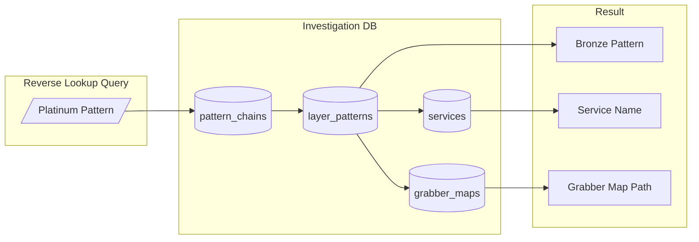
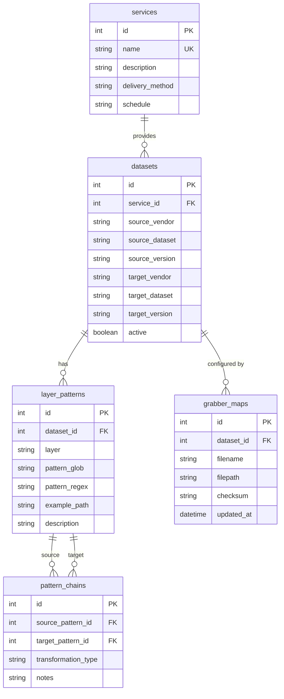
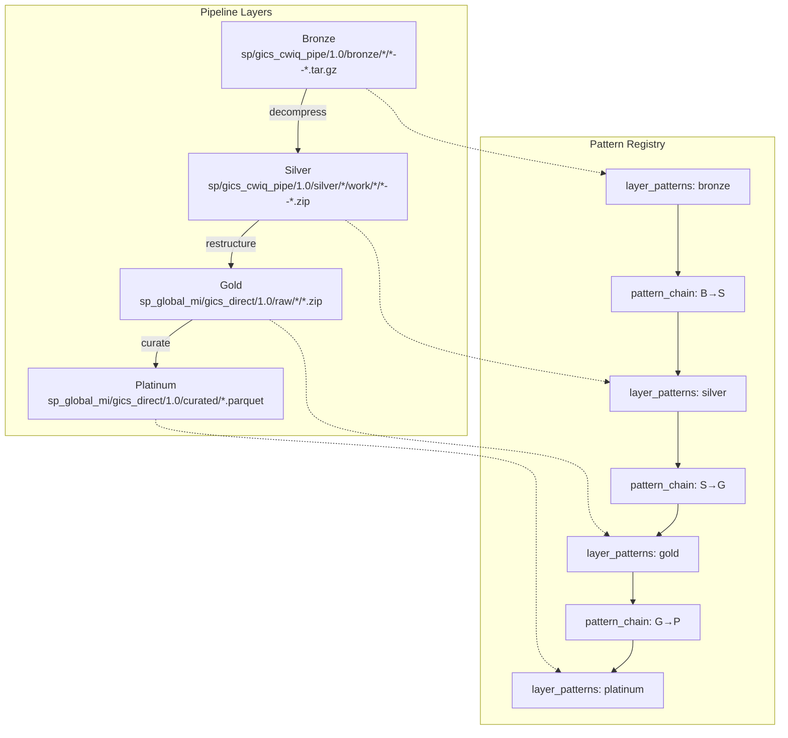
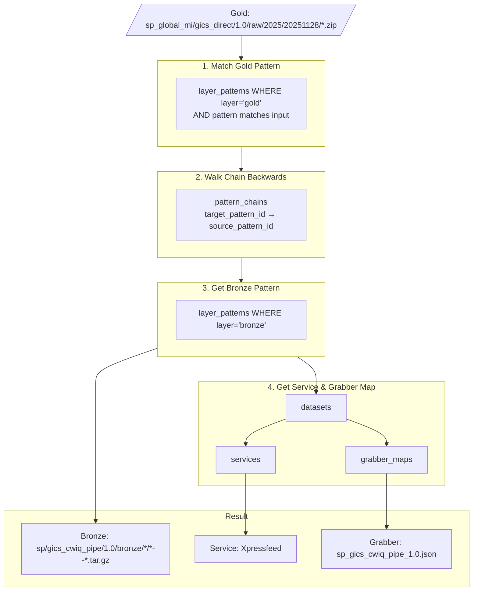
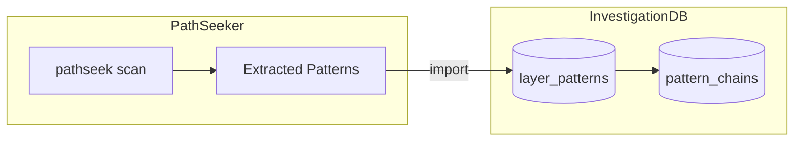

# Investigation DB

[](https://github.com/ThanuMahee12/invdb)

Pattern-based reverse lookup database for medallion-architecture pipelines.

> **Purpose:** Given a Platinum/Gold pattern, find the Bronze source pattern, service, and grabber map.
> No individual file tracking - only pattern relationships.
>
> **Repo:** [github.com/ThanuMahee12/invdb](https://github.com/ThanuMahee12/invdb)

## Problem

```
Input:  sp_global_mi/gics_direct/1.0/raw/2025/20251128/*.zip
Output:
  Bronze Pattern: sp/gics_cwiq_pipe/1.0/bronze/*/*--*.tar.gz
  Service:        Xpressfeed
  Grabber Map:    sp_gics_cwiq_pipe_1.0.json
```

## Core Concept



## Schema

### ER Diagram



### SQL Schema

```sql
-- ============================================
-- INVESTIGATION DB - Pattern Registry
-- ============================================

-- Services (data delivery sources)
CREATE TABLE services (
    id INTEGER PRIMARY KEY AUTOINCREMENT,
    name VARCHAR(100) UNIQUE NOT NULL,
    description TEXT,
    delivery_method VARCHAR(50),  -- 'sftp', 'api', 'feed'
    schedule VARCHAR(100),         -- 'daily 07:00 UTC', 'hourly'
    created_at DATETIME DEFAULT CURRENT_TIMESTAMP
);

-- Datasets (source → target mapping)
CREATE TABLE datasets (
    id INTEGER PRIMARY KEY AUTOINCREMENT,
    service_id INTEGER NOT NULL,

    -- Source (Bronze/Silver naming)
    source_vendor VARCHAR(100) NOT NULL,
    source_dataset VARCHAR(200) NOT NULL,
    source_version VARCHAR(20) NOT NULL,

    -- Target (Gold/Platinum naming)
    target_vendor VARCHAR(100),
    target_dataset VARCHAR(200),
    target_version VARCHAR(20),

    active BOOLEAN DEFAULT TRUE,
    created_at DATETIME DEFAULT CURRENT_TIMESTAMP,

    FOREIGN KEY (service_id) REFERENCES services(id),
    UNIQUE (source_vendor, source_dataset, source_version)
);

-- Grabber Maps (JSON config files)
CREATE TABLE grabber_maps (
    id INTEGER PRIMARY KEY AUTOINCREMENT,
    dataset_id INTEGER NOT NULL,
    filename VARCHAR(200) NOT NULL,
    filepath VARCHAR(500),
    checksum VARCHAR(64),
    updated_at DATETIME DEFAULT CURRENT_TIMESTAMP,

    FOREIGN KEY (dataset_id) REFERENCES datasets(id)
);

-- Layer Patterns (glob/regex per layer)
CREATE TABLE layer_patterns (
    id INTEGER PRIMARY KEY AUTOINCREMENT,
    dataset_id INTEGER NOT NULL,
    layer VARCHAR(20) NOT NULL,  -- 'bronze', 'silver', 'gold', 'platinum'
    pattern_glob TEXT NOT NULL,
    pattern_regex TEXT,
    example_path TEXT,
    description TEXT,

    FOREIGN KEY (dataset_id) REFERENCES datasets(id),
    UNIQUE (dataset_id, layer, pattern_glob)
);

-- Pattern Chains (how patterns connect across layers)
CREATE TABLE pattern_chains (
    id INTEGER PRIMARY KEY AUTOINCREMENT,
    source_pattern_id INTEGER NOT NULL,
    target_pattern_id INTEGER NOT NULL,
    transformation_type VARCHAR(50),  -- 'decompress', 'rename', 'restructure'
    notes TEXT,

    FOREIGN KEY (source_pattern_id) REFERENCES layer_patterns(id),
    FOREIGN KEY (target_pattern_id) REFERENCES layer_patterns(id)
);

-- ============================================
-- INDEXES
-- ============================================

CREATE INDEX idx_datasets_source ON datasets(source_vendor, source_dataset);
CREATE INDEX idx_datasets_target ON datasets(target_vendor, target_dataset);
CREATE INDEX idx_patterns_layer ON layer_patterns(layer);
CREATE INDEX idx_patterns_dataset ON layer_patterns(dataset_id);
CREATE INDEX idx_grabber_dataset ON grabber_maps(dataset_id);
```

## Data Flow



## Reverse Lookup Flow



## Sample Data

```sql
-- Service
INSERT INTO services (name, description, delivery_method, schedule) VALUES
('Xpressfeed', 'S&P Global Market Intelligence Feed', 'sftp', 'daily 07:00 UTC'),
('Bloomberg_SFTP', 'Bloomberg Data License SFTP', 'sftp', 'daily 06:00 EST');

-- Dataset
INSERT INTO datasets (service_id, source_vendor, source_dataset, source_version, target_vendor, target_dataset, target_version) VALUES
(1, 'sp', 'gics_cwiq_pipe', '1.0', 'sp_global_mi', 'gics_direct', '1.0');

-- Grabber Map
INSERT INTO grabber_maps (dataset_id, filename, filepath) VALUES
(1, 'sp_gics_cwiq_pipe_1.0.json', 'resc/grabber_maps/sp_gics_cwiq_pipe_1.0.json');

-- Layer Patterns
INSERT INTO layer_patterns (dataset_id, layer, pattern_glob, pattern_regex, example_path, description) VALUES
(1, 'bronze', 'sp/gics_cwiq_pipe/1.0/bronze/*/*/*/*--*.tar.gz',
   'sp/gics_cwiq_pipe/1\.0/bronze/\d{4}/\d{2}/\d{2}/\d{6}--.*\.tar\.gz',
   'sp/gics_cwiq_pipe/1.0/bronze/2025/11/28/070847--Xpressfeed_pkgGIC01.tar.gz',
   'Bronze compressed archives'),

(1, 'silver', 'sp/gics_cwiq_pipe/1.0/silver/*/work/*/*/*/*--*.zip',
   'sp/gics_cwiq_pipe/1\.0/silver/\d{4}/\d{2}/\d{2}/work/[^/]+/[^/]+/\d{6}--.*\.zip',
   'sp/gics_cwiq_pipe/1.0/silver/2025/11/28/work/Xpressfeed/pkgGIC01/070847--f_gic_comp-20251128.01.xffmt.zip',
   'Silver extracted files'),

(1, 'gold', 'sp_global_mi/gics_direct/1.0/raw/*/*/*.zip',
   'sp_global_mi/gics_direct/1\.0/raw/\d{4}/\d{8}/.*\.zip',
   'sp_global_mi/gics_direct/1.0/raw/2025/20251128/f_gic_comp-20251128.01.xffmt.zip',
   'Gold renamed/restructured files'),

(1, 'platinum', 'sp_global_mi/gics_direct/1.0/curated/*.parquet',
   'sp_global_mi/gics_direct/1\.0/curated/.*\.parquet',
   'sp_global_mi/gics_direct/1.0/curated/gics_data.parquet',
   'Platinum curated parquet');

-- Pattern Chains
INSERT INTO pattern_chains (source_pattern_id, target_pattern_id, transformation_type, notes) VALUES
(1, 2, 'decompress', 'tar.gz → extracted files'),
(2, 3, 'restructure', 'YYYY/MM/DD → YYYY/YYYYMMDD, vendor rename'),
(3, 4, 'curate', 'zip → parquet conversion');
```

## Query Examples

### 1. Reverse Lookup: Gold → Bronze

```sql
-- Given a gold path, find bronze pattern and service
WITH RECURSIVE chain AS (
    -- Start from gold pattern that matches
    SELECT
        lp.id,
        lp.layer,
        lp.pattern_glob,
        lp.dataset_id,
        1 as depth
    FROM layer_patterns lp
    WHERE lp.layer = 'gold'
      AND 'sp_global_mi/gics_direct/1.0/raw/2025/20251128/f_gic_comp.zip' GLOB lp.pattern_glob

    UNION ALL

    -- Walk backwards through chain
    SELECT
        lp.id,
        lp.layer,
        lp.pattern_glob,
        lp.dataset_id,
        c.depth + 1
    FROM chain c
    JOIN pattern_chains pc ON pc.target_pattern_id = c.id
    JOIN layer_patterns lp ON lp.id = pc.source_pattern_id
    WHERE c.depth < 10
)
SELECT
    c.layer,
    c.pattern_glob,
    s.name as service,
    gm.filename as grabber_map
FROM chain c
JOIN datasets d ON c.dataset_id = d.id
JOIN services s ON d.service_id = s.id
LEFT JOIN grabber_maps gm ON gm.dataset_id = d.id
ORDER BY c.depth DESC;
```

### 2. Find All Patterns for a Service

```sql
SELECT
    s.name as service,
    d.source_vendor || '/' || d.source_dataset as source,
    d.target_vendor || '/' || d.target_dataset as target,
    lp.layer,
    lp.pattern_glob,
    lp.example_path
FROM services s
JOIN datasets d ON d.service_id = s.id
JOIN layer_patterns lp ON lp.dataset_id = d.id
WHERE s.name = 'Xpressfeed'
ORDER BY d.id,
    CASE lp.layer
        WHEN 'bronze' THEN 1
        WHEN 'silver' THEN 2
        WHEN 'gold' THEN 3
        WHEN 'platinum' THEN 4
    END;
```

### 3. Find Grabber Map for Pattern

```sql
SELECT
    gm.filename,
    gm.filepath,
    d.source_vendor,
    d.source_dataset,
    d.source_version
FROM grabber_maps gm
JOIN datasets d ON gm.dataset_id = d.id
JOIN layer_patterns lp ON lp.dataset_id = d.id
WHERE lp.layer = 'gold'
  AND 'sp_global_mi/gics_direct/1.0/raw/2025/20251128/test.zip' GLOB lp.pattern_glob;
```

### 4. List All Dataset Mappings

```sql
SELECT
    s.name as service,
    d.source_vendor || '/' || d.source_dataset || '/' || d.source_version as bronze_naming,
    d.target_vendor || '/' || d.target_dataset || '/' || d.target_version as gold_naming,
    gm.filename as grabber_map,
    d.active
FROM datasets d
JOIN services s ON d.service_id = s.id
LEFT JOIN grabber_maps gm ON gm.dataset_id = d.id
ORDER BY s.name, d.source_vendor;
```

### 5. Find Dataset by Filename Pattern

```sql
-- Which dataset handles files like "f_gic_comp-*.xffmt.zip"?
SELECT
    s.name as service,
    d.source_vendor || '/' || d.source_dataset as dataset,
    lp.layer,
    lp.pattern_glob,
    lp.example_path,
    gm.filename as grabber_map
FROM layer_patterns lp
JOIN datasets d ON lp.dataset_id = d.id
JOIN services s ON d.service_id = s.id
LEFT JOIN grabber_maps gm ON gm.dataset_id = d.id
WHERE lp.example_path LIKE '%f_gic_comp%'
   OR lp.pattern_glob LIKE '%xffmt%';
```

### 6. Find Incomplete Dataset Configurations

```sql
-- Which datasets are missing patterns for certain layers?
SELECT
    d.source_vendor || '/' || d.source_dataset as dataset,
    s.name as service,
    GROUP_CONCAT(lp.layer) as configured_layers,
    CASE
        WHEN SUM(CASE WHEN lp.layer = 'bronze' THEN 1 ELSE 0 END) = 0 THEN 'missing bronze'
        WHEN SUM(CASE WHEN lp.layer = 'gold' THEN 1 ELSE 0 END) = 0 THEN 'missing gold'
        ELSE 'complete'
    END as status
FROM datasets d
JOIN services s ON d.service_id = s.id
LEFT JOIN layer_patterns lp ON lp.dataset_id = d.id
GROUP BY d.id
HAVING status != 'complete';
```

## CLI Commands

```bash
# Reverse lookup: find bronze for gold pattern
invdb reverse --gold "sp_global_mi/gics_direct/1.0/raw/*/*.zip"

# Find service for a pattern
invdb service --pattern "sp/gics_cwiq_pipe/1.0/bronze/*/*--*.tar.gz"

# Get grabber map for dataset
invdb grabber-map --dataset "sp/gics_cwiq_pipe/1.0"

# List all patterns for a service
invdb patterns --service Xpressfeed

# Validate pattern chain (bronze → platinum)
invdb validate-chain --dataset "sp/gics_cwiq_pipe/1.0"

# Export all mappings to JSON
invdb export --output mappings.json
```

## Views

```sql
-- View: Full pattern chain with service info
CREATE VIEW v_pattern_chain AS
SELECT
    s.name as service,
    d.source_vendor || '/' || d.source_dataset as source_path,
    d.target_vendor || '/' || d.target_dataset as target_path,
    lp_b.pattern_glob as bronze_pattern,
    lp_s.pattern_glob as silver_pattern,
    lp_g.pattern_glob as gold_pattern,
    lp_p.pattern_glob as platinum_pattern,
    gm.filename as grabber_map
FROM datasets d
JOIN services s ON d.service_id = s.id
LEFT JOIN layer_patterns lp_b ON lp_b.dataset_id = d.id AND lp_b.layer = 'bronze'
LEFT JOIN layer_patterns lp_s ON lp_s.dataset_id = d.id AND lp_s.layer = 'silver'
LEFT JOIN layer_patterns lp_g ON lp_g.dataset_id = d.id AND lp_g.layer = 'gold'
LEFT JOIN layer_patterns lp_p ON lp_p.dataset_id = d.id AND lp_p.layer = 'platinum'
LEFT JOIN grabber_maps gm ON gm.dataset_id = d.id;

-- View: Quick reverse lookup
CREATE VIEW v_reverse_lookup AS
SELECT
    lp_g.pattern_glob as gold_pattern,
    lp_b.pattern_glob as bronze_pattern,
    s.name as service,
    gm.filename as grabber_map,
    d.source_vendor,
    d.source_dataset
FROM layer_patterns lp_g
JOIN datasets d ON lp_g.dataset_id = d.id
JOIN services s ON d.service_id = s.id
LEFT JOIN layer_patterns lp_b ON lp_b.dataset_id = d.id AND lp_b.layer = 'bronze'
LEFT JOIN grabber_maps gm ON gm.dataset_id = d.id
WHERE lp_g.layer = 'gold';
```

## Integration with PathSeeker



```bash
# Extract patterns from directory and import to Investigation DB
pathseek scan /sf/data/bloomberg --export-sql | invdb import

# Validate extracted patterns against existing registry
pathseek scan /sf/data/sp --compare invdb
```
