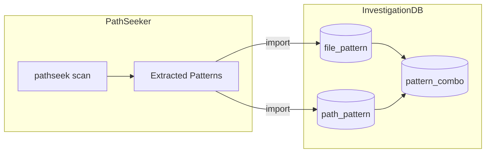

# Investigation DB

[](https://github.com/ThanuMahee12/invdb)

Pattern-based reverse lookup database for medallion-architecture pipelines.

> **Purpose:** Given a Platinum/Gold pattern, find the Bronze source pattern, service, and grabber map.
> No individual file tracking - only pattern relationships.
>
> **Repo:** [github.com/ThanuMahee12/invdb](https://github.com/ThanuMahee12/invdb)

## Problem

```
Input:  sp_global_mi/gics_direct/1.0/raw/2025/20251128/*.zip
Output:
  Bronze Pattern: sp/gics_cwiq_pipe/1.0/bronze/*/*--*.tar.gz
  Service:        Xpressfeed
  Grabber Map:    sp_gics_cwiq_pipe_1.0.json
  Server:         ny5-predpalch01
```

## Schema Diagram

```
┌─────────────────────────────────────────────────────────────────────────────────────┐
│                              INVESTIGATION DB SCHEMA                                 │
│                         (Optimized with pattern_combo)                              │
└─────────────────────────────────────────────────────────────────────────────────────┘

┌─────────────────────┐       ┌─────────────────────────────────┐
│   alchemy_server    │◄──────│        alchemy_service          │
├─────────────────────┤       ├─────────────────────────────────┤
│ server_id       PK  │       │ service_id                  PK  │
│ server_name         │       │ server_id                   FK  │──► alchemy_server
│ ip_address          │       │ raw_id                      FK  │──► alchemy_raw
│ cpu_cores, ram_gb   │       │ vendor_id                   FK  │──► vendor
│ disk_gb, os_version │       │ dataset_name, dataset_version   │
│ environment         │       │ service_name, environment       │
│ datacenter, status  │       │ exec_script, watch_interval     │
└─────────────────────┘       │ fp_prefix, raw_fp_prefix        │
                              │ log_path, playbook_file         │
                              │ is_active                       │
                              └─────────────────────────────────┘

┌─────────────────────┐       ┌─────────────────────────────┐
│       vendor        │       │      vendor_credential      │
├─────────────────────┤       ├─────────────────────────────┤
│ vendor_id       PK  │◄──────│ credential_id           PK  │
│ vendor_code         │       │ vendor_id               FK  │
│ vendor_name         │       │ aws_secret_path             │
│ website             │       │ credential_type             │
└─────────────────────┘       └─────────────────────────────┘
         │
         ▼
┌─────────────────────────────────────┐
│      cwiq_pipe_source_dataset       │
├─────────────────────────────────────┤
│ source_id                       PK  │
│ vendor_id                       FK  │──► vendor
│ credential_id                   FK  │──► vendor_credential
│ dataset_name, dataset_version       │
│ connector_type, exporter_type       │
│ source_path, source_host            │
│ scan_time, env_enabled, online      │
└─────────────────────────────────────┘
         │
         ▼
┌─────────────────────────────┐       ┌─────────────────────┐       ┌─────────────────┐
│        alchemy_raw          │       │    raw_filetype     │       │    filetype     │
├─────────────────────────────┤       ├─────────────────────┤       ├─────────────────┤
│ raw_id                  PK  │◄──────│ raw_filetype_id PK  │──────►│ filetype_id PK  │
│ source_id               FK  │       │ raw_id          FK  │       │ extension       │
│ base_path                   │       │ filetype_id     FK  │       │ mime_type       │
│ is_live                     │       │ is_primary          │       │ category        │
└─────────────────────────────┘       └─────────────────────┘       └─────────────────┘
         │
         ▼
┌─────────────────────────────┐
│      raw_pattern_rel        │  (Bridge: raw → combo)
├─────────────────────────────┤
│ rel_id                  PK  │
│ raw_id                  FK  │──► alchemy_raw
│ combo_id                FK  │──► pattern_combo
│ is_active                   │
└─────────────────────────────┘
                    │
                    ▼
         ┌──────────────────────┐
         │    pattern_combo     │  (Reusable for raw/bronze/gold)
         ├──────────────────────┤
         │ combo_id         PK  │
         │ file_pattern_id  FK  │──► file_pattern
         │ path_pattern_id  FK  │──► path_pattern
         │ description          │
         └──────────────────────┘
                    │
       ┌────────────┼────────────┐
       │            │            │
       ▼            │            ▼
┌─────────────────┐ │  ┌─────────────────┐
│  file_pattern   │ │  │  path_pattern   │
├─────────────────┤ │  ├─────────────────┤
│ file_pattern_id │ │  │ path_pattern_id │
│ pattern_regex   │ │  │ pattern_struct  │
│ format_id    FK │ │  │ format_id    FK │
└─────────────────┘ │  └─────────────────┘
       │            │            │
       └────────────┼────────────┘
                    ▼
         ┌──────────────────────┐
         │    date_format       │  (Lookup)
         ├──────────────────────┤
         │ format_id        PK  │
         │ format_code          │  ← YYYY, YYYYMM, YYYYMMDD
         │ format_regex         │
         │ example              │
         └──────────────────────┘

         ┌──────────────────────┐
         │    path_example      │  (Full path examples)
         ├──────────────────────┤
         │ example_id       PK  │
         │ combo_id         FK  │──► pattern_combo
         │ example_filename     │  ← 2025/12/02/123456--file.csv
         │ example_rel_path     │
         │ file_date            │
         └──────────────────────┘
```

## Entity Relationship Summary

```
alchemy_server (3) ◄─── alchemy_service (20)
                              │
                              ├──► vendor
                              └──► alchemy_raw

vendor (13)
  ├── vendor_credential (22)
  ├── alchemy_service (20)
  └── cwiq_pipe_source_dataset (22)
        └── alchemy_raw (22)
              ├── raw_filetype (47) ──► filetype (13)
              ├── alchemy_service (20)
              └── raw_pattern_rel (34) ──► pattern_combo (32)
                                                │
                                      ┌─────────┴─────────┐
                                      ▼                   ▼
                               file_pattern (32)    path_pattern (5)
                                      │                   │
                                      └─────────┬─────────┘
                                                ▼
                                          date_format (7)
                                                ▲
                                                │
                                          path_example (29)

project (4) ──► layer (6) ──► full_path_pattern (22)
                                      │
                                      └──► pattern_combo (reuse)
```

## Project/Layer Flow

```
┌─────────────┐     ┌─────────────┐     ┌─────────────────────────┐
│   project   │────►│    layer    │────►│   full_path_pattern     │
├─────────────┤     ├─────────────┤     ├─────────────────────────┤
│ cwiq_pipe   │     │ raw (1)     │     │ /sf/data/.../raw/...    │
│ data_alchemy│     │ bronze (2)  │     │ /sf/data/.../bronze/... │
│ cds_job     │     │ silver (3)  │     │ /sf/data/.../silver/... │
│ delta_share │     │ gold (4)    │     │ /sf/data/.../gold/...   │
└─────────────┘     │ raw_enrich  │     │ /sf/data/.../raw/...    │
                    │ delta (6)   │     └─────────────────────────┘
                    └─────────────┘
```

## Tables Overview

| Table | Type | Records | Purpose |
|-------|------|---------|---------|
| `alchemy_server` | Dimension | 3 | Production servers (ny5-predpalch01/04/06) |
| `alchemy_service` | Dimension | 20 | Systemd services running data-alchemy pipelines |
| `vendor` | Dimension | 13 | Source vendors (bloomberg, sp, factset, etc.) |
| `vendor_credential` | Dimension | 22 | AWS Secrets Manager paths |
| `cwiq_pipe_source_dataset` | Dimension | 22 | Source dataset configurations |
| `alchemy_raw` | Dimension | 22 | Raw file landing paths |
| `filetype` | Lookup | 13 | Reusable file extensions (csv, parquet, gz, etc.) |
| `raw_filetype` | Bridge | 47 | Links alchemy_raw to filetype |
| `date_format` | Lookup | 7 | Date format patterns (YYYY, YYYYMM, etc.) |
| `file_pattern` | Dimension | 32 | File regex patterns (reusable) |
| `path_pattern` | Dimension | 5 | Directory structures (reusable) |
| `pattern_combo` | Dimension | 32 | Combines file + path pattern (reusable) |
| `path_example` | Dimension | 29 | Full path examples |
| `raw_pattern_rel` | Bridge | 34 | Links raw → combo |
| `project` | Lookup | 4 | Systems (cwiq_pipe, data_alchemy, cds_job, delta_share) |
| `layer` | Lookup | 6 | Pipeline layers (raw, bronze, silver, gold, raw_enriched, delta) |
| `full_path_pattern` | Dimension | 22 | Complete paths for traceability |

## SQL Schema

```sql
-- ============================================
-- INVESTIGATION DB - Full Schema
-- ============================================

-- Servers (production infrastructure)
CREATE TABLE alchemy_server (
    server_id INTEGER PRIMARY KEY AUTOINCREMENT,
    server_name VARCHAR(100) UNIQUE NOT NULL,  -- 'ny5-predpalch01'
    ip_address VARCHAR(45),
    cpu_cores INTEGER,
    ram_gb INTEGER,
    disk_gb INTEGER,
    os_version VARCHAR(50),
    environment VARCHAR(20),                    -- 'prod', 'dev', 'staging'
    datacenter VARCHAR(50),
    status VARCHAR(20) DEFAULT 'active',        -- 'active', 'maintenance', 'offline'
    created_at DATETIME DEFAULT CURRENT_TIMESTAMP
);

-- Vendors (data providers)
CREATE TABLE vendor (
    vendor_id INTEGER PRIMARY KEY AUTOINCREMENT,
    vendor_code VARCHAR(50) UNIQUE NOT NULL,    -- 'sp', 'bloomberg', 'factset'
    vendor_name VARCHAR(100),                   -- 'S&P Global', 'Bloomberg LP'
    website VARCHAR(200),
    created_at DATETIME DEFAULT CURRENT_TIMESTAMP
);

-- Vendor Credentials (AWS Secrets)
CREATE TABLE vendor_credential (
    credential_id INTEGER PRIMARY KEY AUTOINCREMENT,
    vendor_id INTEGER NOT NULL,
    aws_secret_path VARCHAR(500),               -- 'arn:aws:secretsmanager:...'
    credential_type VARCHAR(50),                -- 'sftp', 'api', 'gpg'
    created_at DATETIME DEFAULT CURRENT_TIMESTAMP,
    FOREIGN KEY (vendor_id) REFERENCES vendor(vendor_id)
);

-- CWIQ Pipe Source Dataset (source configurations)
CREATE TABLE cwiq_pipe_source_dataset (
    source_id INTEGER PRIMARY KEY AUTOINCREMENT,
    vendor_id INTEGER NOT NULL,
    credential_id INTEGER,
    dataset_name VARCHAR(200) NOT NULL,         -- 'gics_cwiq_pipe'
    dataset_version VARCHAR(20) NOT NULL,       -- '1.0'
    connector_type VARCHAR(50),                 -- 'sftp', 'api'
    exporter_type VARCHAR(50),                  -- 'tar', 'zip'
    source_path VARCHAR(500),
    source_host VARCHAR(200),
    scan_time VARCHAR(50),                      -- '07:00 UTC'
    env_enabled VARCHAR(100),                   -- 'env1,env2,env3'
    online BOOLEAN DEFAULT TRUE,
    created_at DATETIME DEFAULT CURRENT_TIMESTAMP,
    FOREIGN KEY (vendor_id) REFERENCES vendor(vendor_id),
    FOREIGN KEY (credential_id) REFERENCES vendor_credential(credential_id),
    UNIQUE (vendor_id, dataset_name, dataset_version)
);

-- Alchemy Raw (raw file landing paths)
CREATE TABLE alchemy_raw (
    raw_id INTEGER PRIMARY KEY AUTOINCREMENT,
    source_id INTEGER NOT NULL,
    base_path VARCHAR(500) NOT NULL,            -- '/sf/data/sp/gics_cwiq_pipe/1.0'
    is_live BOOLEAN DEFAULT TRUE,
    created_at DATETIME DEFAULT CURRENT_TIMESTAMP,
    FOREIGN KEY (source_id) REFERENCES cwiq_pipe_source_dataset(source_id)
);

-- Alchemy Service (systemd services)
CREATE TABLE alchemy_service (
    service_id INTEGER PRIMARY KEY AUTOINCREMENT,
    server_id INTEGER NOT NULL,
    raw_id INTEGER NOT NULL,
    vendor_id INTEGER NOT NULL,
    dataset_name VARCHAR(200) NOT NULL,
    dataset_version VARCHAR(20) NOT NULL,
    service_name VARCHAR(200) NOT NULL,         -- 'data-alchemy-sp-gics'
    environment VARCHAR(20),                    -- 'prod', 'dev'
    exec_script VARCHAR(500),
    watch_interval INTEGER DEFAULT 300,
    fp_prefix VARCHAR(500),                     -- '/sf/data'
    raw_fp_prefix VARCHAR(500),
    log_path VARCHAR(500),
    playbook_file VARCHAR(200),                 -- 'deploy-data-alchemy-prod01.yml'
    is_active BOOLEAN DEFAULT TRUE,
    created_at DATETIME DEFAULT CURRENT_TIMESTAMP,
    FOREIGN KEY (server_id) REFERENCES alchemy_server(server_id),
    FOREIGN KEY (raw_id) REFERENCES alchemy_raw(raw_id),
    FOREIGN KEY (vendor_id) REFERENCES vendor(vendor_id)
);

-- Filetype (lookup: file extensions)
CREATE TABLE filetype (
    filetype_id INTEGER PRIMARY KEY AUTOINCREMENT,
    extension VARCHAR(20) UNIQUE NOT NULL,      -- 'csv', 'parquet', 'tar.gz'
    mime_type VARCHAR(100),
    category VARCHAR(50)                        -- 'data', 'archive', 'compressed'
);

-- Raw Filetype (bridge: raw → filetype)
CREATE TABLE raw_filetype (
    raw_filetype_id INTEGER PRIMARY KEY AUTOINCREMENT,
    raw_id INTEGER NOT NULL,
    filetype_id INTEGER NOT NULL,
    is_primary BOOLEAN DEFAULT FALSE,
    FOREIGN KEY (raw_id) REFERENCES alchemy_raw(raw_id),
    FOREIGN KEY (filetype_id) REFERENCES filetype(filetype_id),
    UNIQUE (raw_id, filetype_id)
);

-- Date Format (lookup)
CREATE TABLE date_format (
    format_id INTEGER PRIMARY KEY AUTOINCREMENT,
    format_code VARCHAR(50) UNIQUE NOT NULL,    -- 'YYYY', 'YYYYMM', 'YYYYMMDD'
    format_regex VARCHAR(100) NOT NULL,         -- '\d{4}', '\d{6}', '\d{8}'
    example VARCHAR(50)                         -- '2025', '202512', '20251210'
);

-- File Pattern (reusable file regex)
CREATE TABLE file_pattern (
    file_pattern_id INTEGER PRIMARY KEY AUTOINCREMENT,
    pattern_regex VARCHAR(500) NOT NULL,        -- '^\d{6}--.*\.tar\.gz$'
    format_id INTEGER,
    description TEXT,
    FOREIGN KEY (format_id) REFERENCES date_format(format_id)
);

-- Path Pattern (reusable directory structures)
CREATE TABLE path_pattern (
    path_pattern_id INTEGER PRIMARY KEY AUTOINCREMENT,
    pattern_structure VARCHAR(200) NOT NULL,    -- 'YYYY/MM/DD/', 'YYYY/YYYYMMDD/'
    format_id INTEGER,
    description TEXT,
    FOREIGN KEY (format_id) REFERENCES date_format(format_id)
);

-- Pattern Combo (combines file + path pattern)
CREATE TABLE pattern_combo (
    combo_id INTEGER PRIMARY KEY AUTOINCREMENT,
    file_pattern_id INTEGER NOT NULL,
    path_pattern_id INTEGER NOT NULL,
    description TEXT,
    FOREIGN KEY (file_pattern_id) REFERENCES file_pattern(file_pattern_id),
    FOREIGN KEY (path_pattern_id) REFERENCES path_pattern(path_pattern_id),
    UNIQUE (file_pattern_id, path_pattern_id)
);

-- Path Example (full path examples)
CREATE TABLE path_example (
    example_id INTEGER PRIMARY KEY AUTOINCREMENT,
    combo_id INTEGER NOT NULL,
    example_filename VARCHAR(500),              -- '070847--Xpressfeed_pkgGIC01.tar.gz'
    example_rel_path VARCHAR(500),              -- '2025/12/02/070847--file.tar.gz'
    file_date DATE,
    FOREIGN KEY (combo_id) REFERENCES pattern_combo(combo_id)
);

-- Raw Pattern Rel (bridge: raw → combo)
CREATE TABLE raw_pattern_rel (
    rel_id INTEGER PRIMARY KEY AUTOINCREMENT,
    raw_id INTEGER NOT NULL,
    combo_id INTEGER NOT NULL,
    is_active BOOLEAN DEFAULT TRUE,
    FOREIGN KEY (raw_id) REFERENCES alchemy_raw(raw_id),
    FOREIGN KEY (combo_id) REFERENCES pattern_combo(combo_id)
);

-- Project (systems)
CREATE TABLE project (
    project_id INTEGER PRIMARY KEY AUTOINCREMENT,
    project_name VARCHAR(100) UNIQUE NOT NULL,  -- 'cwiq_pipe', 'data_alchemy', 'cds_job'
    description TEXT
);

-- Layer (pipeline layers)
CREATE TABLE layer (
    layer_id INTEGER PRIMARY KEY AUTOINCREMENT,
    project_id INTEGER NOT NULL,
    layer_name VARCHAR(50) NOT NULL,            -- 'raw', 'bronze', 'silver', 'gold', 'delta'
    layer_order INTEGER NOT NULL,
    description TEXT,
    FOREIGN KEY (project_id) REFERENCES project(project_id),
    UNIQUE (project_id, layer_name)
);

-- Full Path Pattern (complete paths for traceability)
CREATE TABLE full_path_pattern (
    path_id INTEGER PRIMARY KEY AUTOINCREMENT,
    layer_id INTEGER NOT NULL,
    combo_id INTEGER NOT NULL,
    base_path VARCHAR(500) NOT NULL,            -- '/sf/data/sp/gics_cwiq_pipe/1.0/bronze'
    full_path_example VARCHAR(1000),            -- '/sf/data/.../2025/12/02/070847--file.tar.gz'
    FOREIGN KEY (layer_id) REFERENCES layer(layer_id),
    FOREIGN KEY (combo_id) REFERENCES pattern_combo(combo_id)
);

-- ============================================
-- INDEXES
-- ============================================

CREATE INDEX idx_vendor_code ON vendor(vendor_code);
CREATE INDEX idx_source_vendor ON cwiq_pipe_source_dataset(vendor_id);
CREATE INDEX idx_raw_source ON alchemy_raw(source_id);
CREATE INDEX idx_service_server ON alchemy_service(server_id);
CREATE INDEX idx_service_vendor ON alchemy_service(vendor_id);
CREATE INDEX idx_raw_filetype_raw ON raw_filetype(raw_id);
CREATE INDEX idx_pattern_rel_raw ON raw_pattern_rel(raw_id);
CREATE INDEX idx_pattern_rel_combo ON raw_pattern_rel(combo_id);
CREATE INDEX idx_full_path_layer ON full_path_pattern(layer_id);
CREATE INDEX idx_full_path_combo ON full_path_pattern(combo_id);
```

## Lookup Tables

### Date Format

| format_code | format_regex | example |
|-------------|--------------|---------|
| YYYY | `\d{4}` | 2025 |
| YYYYMM | `\d{6}` | 202511 |
| YYYYMMDD | `\d{8}` | 20251119 |
| YYMMDD | `\d{6}` | 251119 |
| YYYYMMDD_HHMMSS | `\d{8}_\d{6}` | 20251119_143022 |
| HHMMSS | `\d{6}` | 143022 |
| MM | `\d{2}` | 11 |

### Path Pattern Structures

| pattern_structure | format | example |
|-------------------|--------|---------|
| `YYYY/MM/DD/` | YYYYMMDD | 2025/12/02/ |
| `YYYY/YYYYMM/` | YYYYMM | 2025/202512/ |
| `YYYY/YYYYMMDD/` | YYYYMMDD | 2025/20251202/ |
| `YYYY/` | YYYY | 2025/ |
| `/` | - | (flat) |

### Filetype

| extension | mime_type | category |
|-----------|-----------|----------|
| csv | text/csv | data |
| parquet | application/parquet | data |
| json | application/json | data |
| tar.gz | application/gzip | archive |
| zip | application/zip | archive |
| gz | application/gzip | compressed |
| gpg | application/pgp-encrypted | encrypted |

### Layer

| layer_name | layer_order | description |
|------------|-------------|-------------|
| raw | 1 | Landing zone (cwiq-pipe) |
| bronze | 2 | Timestamped archives |
| silver | 3 | Extracted files |
| gold | 4 | Restructured/renamed |
| raw_enriched | 5 | CDP legacy format |
| delta | 6 | Delta Lake tables |

## Sample Data

```sql
-- ============================================
-- SERVERS
-- ============================================
INSERT INTO alchemy_server (server_name, ip_address, environment, datacenter, status) VALUES
('ny5-predpalch01', '10.0.1.1', 'prod', 'NY5', 'active'),
('ny5-predpalch04', '10.0.1.4', 'prod', 'NY5', 'active'),
('ny5-predpalch06', '10.0.1.6', 'prod', 'NY5', 'active');

-- ============================================
-- VENDORS
-- ============================================
INSERT INTO vendor (vendor_code, vendor_name, website) VALUES
('sp', 'S&P Global', 'https://spglobal.com'),
('bloomberg', 'Bloomberg LP', 'https://bloomberg.com'),
('factset', 'FactSet', 'https://factset.com'),
('refinitiv', 'Refinitiv', 'https://refinitiv.com');

-- ============================================
-- VENDOR CREDENTIALS
-- ============================================
INSERT INTO vendor_credential (vendor_id, aws_secret_path, credential_type) VALUES
(1, 'arn:aws:secretsmanager:us-east-1:123:secret/sp-sftp', 'sftp'),
(2, 'arn:aws:secretsmanager:us-east-1:123:secret/bloomberg-sftp', 'sftp'),
(2, 'arn:aws:secretsmanager:us-east-1:123:secret/bloomberg-gpg', 'gpg');

-- ============================================
-- SOURCE DATASETS
-- ============================================
INSERT INTO cwiq_pipe_source_dataset (vendor_id, credential_id, dataset_name, dataset_version, connector_type, exporter_type, scan_time) VALUES
(1, 1, 'gics_cwiq_pipe', '1.0', 'sftp', 'tar', '07:00 UTC'),
(2, 2, 'bbocax_cwiq_pipe', '1.0', 'sftp', 'tar', '06:00 EST');

-- ============================================
-- ALCHEMY RAW
-- ============================================
INSERT INTO alchemy_raw (source_id, base_path, is_live) VALUES
(1, '/sf/data/sp/gics_cwiq_pipe/1.0', TRUE),
(2, '/sf/data/bloomberg/bbocax_cwiq_pipe/1.0', TRUE);

-- ============================================
-- FILETYPES
-- ============================================
INSERT INTO filetype (extension, mime_type, category) VALUES
('csv', 'text/csv', 'data'),
('parquet', 'application/parquet', 'data'),
('tar.gz', 'application/gzip', 'archive'),
('zip', 'application/zip', 'archive'),
('gpg', 'application/pgp-encrypted', 'encrypted');

-- ============================================
-- DATE FORMATS
-- ============================================
INSERT INTO date_format (format_code, format_regex, example) VALUES
('YYYY', '\\d{4}', '2025'),
('YYYYMM', '\\d{6}', '202512'),
('YYYYMMDD', '\\d{8}', '20251210'),
('HHMMSS', '\\d{6}', '070847'),
('MM', '\\d{2}', '12'),
('DD', '\\d{2}', '10');

-- ============================================
-- PATH PATTERNS
-- ============================================
INSERT INTO path_pattern (pattern_structure, format_id, description) VALUES
('YYYY/MM/DD/', 3, 'Year/Month/Day directories'),
('YYYY/YYYYMMDD/', 3, 'Year/DateStamp directories'),
('YYYY/', 1, 'Year only');

-- ============================================
-- FILE PATTERNS
-- ============================================
INSERT INTO file_pattern (pattern_regex, format_id, description) VALUES
('^\\d{6}--.*\\.tar\\.gz$', 4, 'Timestamped tar.gz archives'),
('^\\d{6}--.*\\.zip$', 4, 'Timestamped zip files'),
('^.*\\.parquet$', NULL, 'Parquet files'),
('^.*\\.csv$', NULL, 'CSV files');

-- ============================================
-- PATTERN COMBOS
-- ============================================
INSERT INTO pattern_combo (file_pattern_id, path_pattern_id, description) VALUES
(1, 1, 'Bronze: YYYY/MM/DD/HHMMSS--*.tar.gz'),
(2, 1, 'Silver: YYYY/MM/DD/HHMMSS--*.zip'),
(3, 2, 'Gold: YYYY/YYYYMMDD/*.parquet');

-- ============================================
-- PROJECTS & LAYERS
-- ============================================
INSERT INTO project (project_name, description) VALUES
('cwiq_pipe', 'CWIQ Pipeline - raw landing'),
('data_alchemy', 'Data Alchemy - bronze/silver/gold'),
('cds_job', 'CDS Jobs - downstream'),
('delta_share', 'Delta Share - delta tables');

INSERT INTO layer (project_id, layer_name, layer_order, description) VALUES
(1, 'raw', 1, 'Raw landing zone'),
(2, 'bronze', 2, 'Timestamped archives'),
(2, 'silver', 3, 'Extracted files'),
(2, 'gold', 4, 'Restructured output'),
(3, 'raw_enriched', 5, 'CDP legacy format'),
(4, 'delta', 6, 'Delta Lake tables');
```

## Query Examples

### 1. Reverse Lookup: Gold → Bronze → Service

```sql
-- Given a gold path, find bronze pattern, service, and server
SELECT
    v.vendor_code,
    d.dataset_name,
    l_bronze.layer_name as source_layer,
    fpp_bronze.full_path_example as bronze_path,
    l_gold.layer_name as target_layer,
    fpp_gold.full_path_example as gold_path,
    svc.service_name,
    srv.server_name
FROM full_path_pattern fpp_gold
JOIN layer l_gold ON fpp_gold.layer_id = l_gold.layer_id
JOIN pattern_combo pc ON fpp_gold.combo_id = pc.combo_id
JOIN raw_pattern_rel rpr ON pc.combo_id = rpr.combo_id
JOIN alchemy_raw ar ON rpr.raw_id = ar.raw_id
JOIN cwiq_pipe_source_dataset d ON ar.source_id = d.source_id
JOIN vendor v ON d.vendor_id = v.vendor_id
JOIN alchemy_service svc ON svc.raw_id = ar.raw_id
JOIN alchemy_server srv ON svc.server_id = srv.server_id
JOIN full_path_pattern fpp_bronze ON fpp_bronze.combo_id = pc.combo_id
JOIN layer l_bronze ON fpp_bronze.layer_id = l_bronze.layer_id
WHERE l_gold.layer_name = 'gold'
  AND l_bronze.layer_name = 'bronze'
  AND fpp_gold.full_path_example LIKE '%gics%';
```

### 2. Find All Patterns for a Vendor

```sql
SELECT
    v.vendor_code,
    d.dataset_name,
    fp.pattern_regex as file_pattern,
    pp.pattern_structure as path_pattern,
    pe.example_rel_path
FROM vendor v
JOIN cwiq_pipe_source_dataset d ON v.vendor_id = d.vendor_id
JOIN alchemy_raw r ON d.source_id = r.source_id
JOIN raw_pattern_rel rel ON r.raw_id = rel.raw_id
JOIN pattern_combo pc ON rel.combo_id = pc.combo_id
JOIN file_pattern fp ON pc.file_pattern_id = fp.file_pattern_id
JOIN path_pattern pp ON pc.path_pattern_id = pp.path_pattern_id
LEFT JOIN path_example pe ON pc.combo_id = pe.combo_id
WHERE v.vendor_code = 'bloomberg';
```

### 3. List Services by Server

```sql
SELECT
    s.server_name,
    svc.service_name,
    svc.environment,
    v.vendor_code,
    svc.dataset_name,
    svc.dataset_version,
    svc.is_active
FROM alchemy_service svc
JOIN alchemy_server s ON svc.server_id = s.server_id
JOIN vendor v ON svc.vendor_id = v.vendor_id
WHERE s.server_name = 'ny5-predpalch01'
ORDER BY v.vendor_code, svc.dataset_name;
```

### 4. Impact Analysis: Find Affected Datasets

```sql
-- Given a missing raw_enriched path, find the source dataset
SELECT
    p.project_name,
    l.layer_name,
    fpp.full_path_example,
    d.dataset_name as source_dataset,
    v.vendor_code
FROM full_path_pattern fpp
JOIN layer l ON fpp.layer_id = l.layer_id
JOIN project p ON l.project_id = p.project_id
JOIN pattern_combo pc ON fpp.combo_id = pc.combo_id
JOIN raw_pattern_rel rpr ON pc.combo_id = rpr.combo_id
JOIN alchemy_raw ar ON rpr.raw_id = ar.raw_id
JOIN cwiq_pipe_source_dataset d ON ar.source_id = d.source_id
JOIN vendor v ON d.vendor_id = v.vendor_id
WHERE l.layer_name = 'raw_enriched'
  AND fpp.full_path_example LIKE '%bloomberg%';
```

### 5. Trace Full Path Across Layers

```sql
-- See all layers for a specific combo_id (same file pattern)
SELECT
    p.project_name,
    l.layer_name,
    l.layer_order,
    fpp.base_path,
    fpp.full_path_example
FROM full_path_pattern fpp
JOIN layer l ON fpp.layer_id = l.layer_id
JOIN project p ON l.project_id = p.project_id
WHERE fpp.combo_id = 1
ORDER BY l.layer_order;
```

### 6. Find File Types per Dataset

```sql
SELECT
    d.dataset_name,
    GROUP_CONCAT(f.extension) as extensions
FROM cwiq_pipe_source_dataset d
JOIN alchemy_raw r ON d.source_id = r.source_id
JOIN raw_filetype rf ON r.raw_id = rf.raw_id
JOIN filetype f ON rf.filetype_id = f.filetype_id
GROUP BY d.dataset_name;
```

## CLI Commands

```bash
# Reverse lookup: find bronze for gold pattern
invdb reverse --gold "sp_global_mi/gics_direct/1.0/raw/*/*.zip"

# Find service for a dataset
invdb service --vendor sp --dataset gics_cwiq_pipe

# List all servers and their services
invdb servers --list

# Find patterns by vendor
invdb patterns --vendor bloomberg

# Trace path across layers
invdb trace --combo-id 1

# Impact analysis
invdb impact --layer raw_enriched --pattern "*bloomberg*"

# Export all mappings to JSON
invdb export --output mappings.json
```

## Views

```sql
-- View: Full denormalized data
CREATE VIEW v_full_investigation AS
SELECT
    srv.server_name,
    svc.service_name,
    v.vendor_code,
    v.vendor_name,
    d.dataset_name,
    d.dataset_version,
    ar.base_path,
    p.project_name,
    l.layer_name,
    l.layer_order,
    fp.pattern_regex as file_pattern,
    pp.pattern_structure as path_pattern,
    fpp.full_path_example
FROM alchemy_service svc
JOIN alchemy_server srv ON svc.server_id = srv.server_id
JOIN vendor v ON svc.vendor_id = v.vendor_id
JOIN alchemy_raw ar ON svc.raw_id = ar.raw_id
JOIN cwiq_pipe_source_dataset d ON ar.source_id = d.source_id
JOIN raw_pattern_rel rpr ON ar.raw_id = rpr.raw_id
JOIN pattern_combo pc ON rpr.combo_id = pc.combo_id
JOIN file_pattern fp ON pc.file_pattern_id = fp.file_pattern_id
JOIN path_pattern pp ON pc.path_pattern_id = pp.path_pattern_id
JOIN full_path_pattern fpp ON pc.combo_id = fpp.combo_id
JOIN layer l ON fpp.layer_id = l.layer_id
JOIN project p ON l.project_id = p.project_id;

-- View: Quick reverse lookup
CREATE VIEW v_reverse_lookup AS
SELECT
    l_gold.layer_name as gold_layer,
    fpp_gold.full_path_example as gold_path,
    l_bronze.layer_name as bronze_layer,
    fpp_bronze.full_path_example as bronze_path,
    v.vendor_code,
    d.dataset_name,
    svc.service_name,
    srv.server_name
FROM full_path_pattern fpp_gold
JOIN layer l_gold ON fpp_gold.layer_id = l_gold.layer_id
JOIN pattern_combo pc ON fpp_gold.combo_id = pc.combo_id
JOIN full_path_pattern fpp_bronze ON fpp_bronze.combo_id = pc.combo_id
JOIN layer l_bronze ON fpp_bronze.layer_id = l_bronze.layer_id
JOIN raw_pattern_rel rpr ON pc.combo_id = rpr.combo_id
JOIN alchemy_raw ar ON rpr.raw_id = ar.raw_id
JOIN cwiq_pipe_source_dataset d ON ar.source_id = d.source_id
JOIN vendor v ON d.vendor_id = v.vendor_id
LEFT JOIN alchemy_service svc ON svc.raw_id = ar.raw_id
LEFT JOIN alchemy_server srv ON svc.server_id = srv.server_id
WHERE l_gold.layer_name = 'gold'
  AND l_bronze.layer_name = 'bronze';
```

## Data Flow

```
CWIQ-Pipe Source                    Raw Landing Zone
─────────────────                   ────────────────
vendor/dataset/version    ───►      base_path (alchemy_raw)
                                           │
                                           ▼
                                    file_pattern (regex)
                                           +
                                    path_pattern (directory)
                                           │
                                           ▼
                                    path_example (full path)
                                    2025/12/02/123456--file.csv
```

## Integration with PathSeeker



```bash
# Extract patterns from directory and import to Investigation DB
pathseek scan /sf/data/bloomberg --export-sql | invdb import

# Validate extracted patterns against existing registry
pathseek scan /sf/data/sp --compare invdb
```
