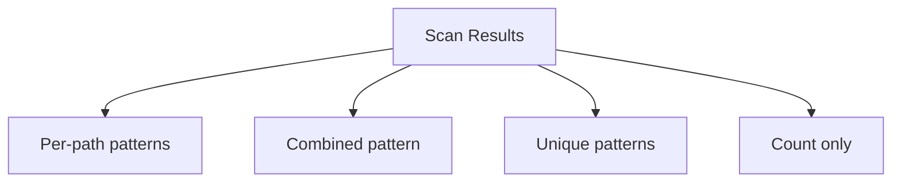

# PathSeeker

CLI tool for path analysis and pattern extraction.

## Overview

**pathseek** scans directory trees and intelligently extracts regex/glob patterns from file paths. Helps developers understand and represent directory structures programmatically.

## Architecture


## Key Features

- Directory scanning with depth limits
- Intelligent pattern extraction
- Path segment analysis (literals, digits, variables, extensions)
- Multiple output modes
- Zero external dependencies

## Segment Types

| Type | Example | Pattern |
|------|---------|---------|
| LITERAL | `data` | `data` |
| DIGITS | `2026` | `\d+` |
| VARIABLE | `bloomberg` | `[^/]+` |
| FILE_EXT | `.csv` | `\.csv` |
| HIDDEN | `.git` | `\.[^/]+` |

## Output Modes



## Technologies

| Component | Technology |
|-----------|------------|
| Language | Python 3.13+ |
| Dependencies | None (stdlib only) |
| Linting | ruff |
| Testing | pytest |
| Package Manager | uv |

## Project Structure

```
pathseek/
├── pathseek.py            # CLI entry point
├── util/
│   ├── path_tree.py       # PathNode, BFS traversal
│   ├── validators.py      # Path validation
│   └── output_utils.py    # Output handling
└── extractors/
    ├── analyzer.py        # Segment analysis
    └── glob_extractor.py  # Glob pattern modes
```

## CLI Usage

```bash
# Scan directory
pathseek scan /sf/data/bloomberg -L 3 -t f

# Extract combined regex pattern
pathseek scan /sf/data/bloomberg -r -s

# Save glob patterns to file
pathseek scan /sf/data/bloomberg -g -p -o patterns.txt
```

## Extraction Modes

| Mode | Description |
|------|-------------|
| SIMPLE | Basic wildcards |
| MEDIUM | Type-aware patterns |
| ADVANCED | Full regex alternations |

## Status

- **Version:** 0.1.0
- **Core:** Complete (scanning, validation, traversal)
- **Pattern extraction:** In progress
- **Roadmap:** regex_seeker, glob_seeker, format conversions
