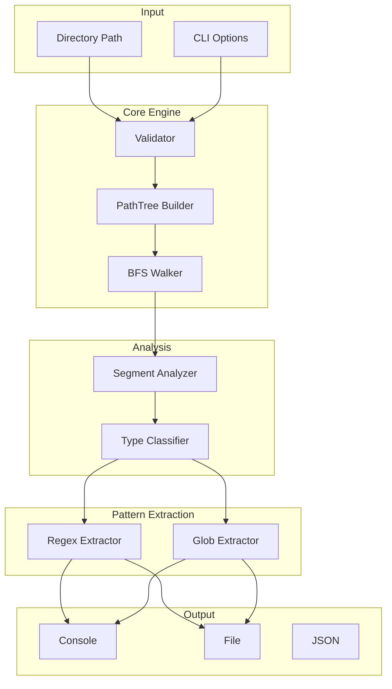
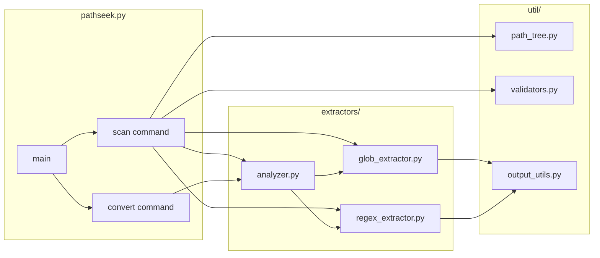
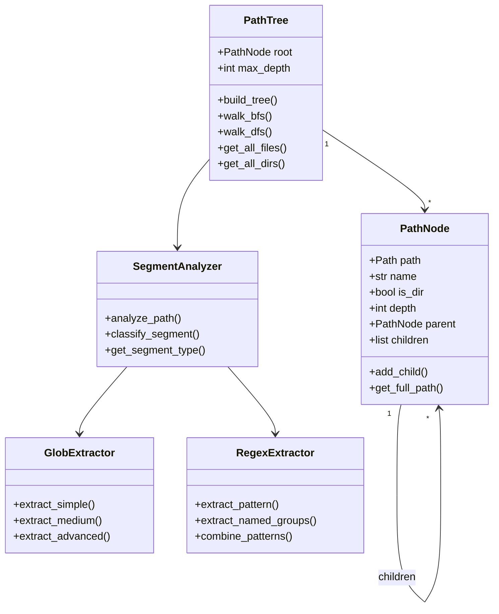
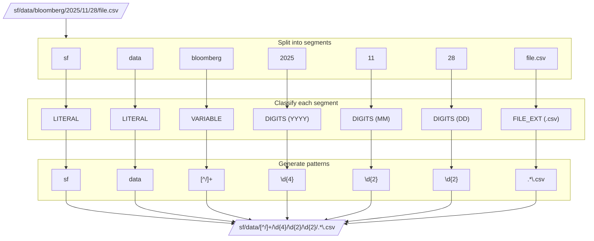
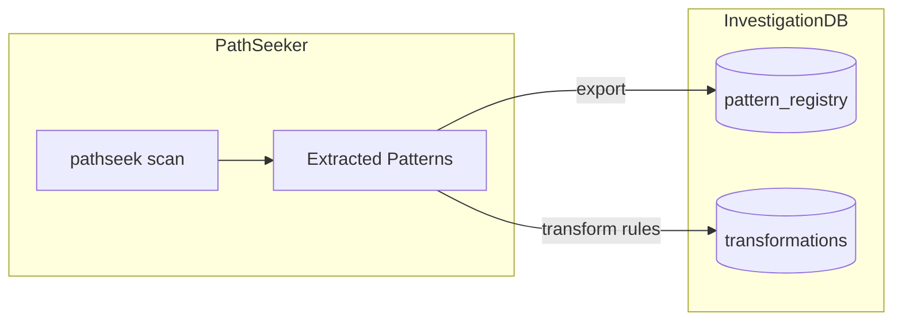
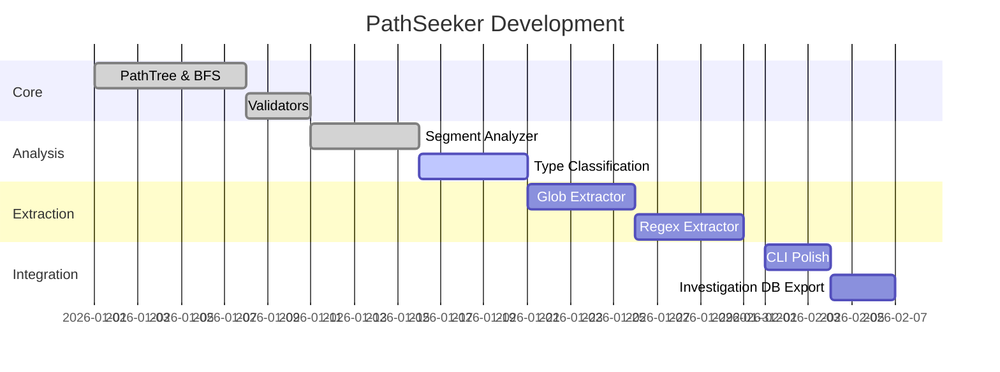

# PathSeeker

CLI tool for path analysis and pattern extraction.

## Problem

How do we analyze directory structures and extract reusable regex/glob patterns?

```
Input: /sf/data/bloomberg/bbocax_cwiq_pipe/1.0/bronze/2025/11/28/070847--file.tar.gz
Output: /sf/data/{vendor}/{dataset}/{version}/bronze/{YYYY}/{MM}/{DD}/{HHMMSS}--{filename}
```

## Full Architecture

### System Overview



### Component Diagram



### PathTree Structure



### Segment Analysis Flow



### Extraction Modes

```mermaid
flowchart LR
    subgraph Input
        PATH[/data/vendor/2025/file.csv]
    end

    subgraph Simple["SIMPLE Mode"]
        SIM["data/*/2025/*.csv"]
    end

    subgraph Medium["MEDIUM Mode"]
        MED["data/{vendor}/{YYYY}/{filename}.csv"]
    end

    subgraph Advanced["ADVANCED Mode"]
        ADV["data/(?P<vendor>[^/]+)/(?P<year>\d{4})/(?P<file>.*\.csv)"]
    end

    PATH --> Simple
    PATH --> Medium
    PATH --> Advanced
```

## Data Structures

### SegmentType Enum

```python
class SegmentType(Enum):
    LITERAL = "literal"       # Exact match: "data", "sf"
    DIGITS = "digits"         # Numeric: "2025", "11", "28"
    VARIABLE = "variable"     # Dynamic: vendor names, dataset names
    FILE_EXT = "file_ext"     # Extensions: ".csv", ".json"
    HIDDEN = "hidden"         # Hidden files: ".git", ".env"
    TIMESTAMP = "timestamp"   # Time patterns: "070847", "235959"
    DATE = "date"             # Date patterns: "20251128"
    UUID = "uuid"             # UUID patterns
    HASH = "hash"             # Hash patterns: MD5, SHA
```

### PathNode Class

```python
@dataclass(slots=True)
class PathNode:
    path: Path
    name: str
    is_dir: bool
    depth: int
    parent: Optional["PathNode"] = None
    children: list["PathNode"] = field(default_factory=list)

    def add_child(self, node: "PathNode") -> None:
        node.parent = self
        self.children.append(node)

    def get_full_path(self) -> str:
        return str(self.path)
```

## CLI Reference

### Commands

```bash
# Scan command
pathseek scan <path> [options]

# Convert command
pathseek convert <pattern> --from <format> --to <format>
```

### Scan Options

| Flag | Description | Example |
|------|-------------|---------|
| `-L, --depth` | Max depth | `-L 3` |
| `-t, --type` | File type filter | `-t f` (files), `-t d` (dirs) |
| `-r, --regex` | Output as regex | `--regex` |
| `-g, --glob` | Output as glob | `--glob` |
| `-p, --per-path` | Pattern per path | `--per-path` |
| `-s, --single` | Single combined pattern | `--single` |
| `-u, --unique` | Unique patterns only | `--unique` |
| `-c, --count` | Count only | `--count` |
| `-o, --output` | Output file | `-o patterns.txt` |
| `-m, --mode` | Extraction mode | `-m advanced` |

### Examples

```bash
# Basic scan
pathseek scan /sf/data/bloomberg -L 3

# Extract regex patterns
pathseek scan /sf/data/bloomberg -r -s -m advanced

# Save glob patterns to file
pathseek scan /sf/data/bloomberg -g -p -o patterns.txt

# Count files by pattern
pathseek scan /sf/data/bloomberg -c --group-by pattern

# Convert between formats
pathseek convert "data/*/2025/*.csv" --from glob --to regex
```

## Output Examples

### Per-path Output

```
/sf/data/bloomberg/bbocax_cwiq_pipe/1.0/bronze/2025/11/28/070847--file.tar.gz
  glob:  sf/data/*/*/*/*/bronze/[0-9][0-9][0-9][0-9]/[0-9][0-9]/[0-9][0-9]/*--*.tar.gz
  regex: sf/data/[^/]+/[^/]+/[^/]+/bronze/\d{4}/\d{2}/\d{2}/\d{6}--.*\.tar\.gz
```

### Combined Output

```
Pattern: sf/data/{vendor}/{dataset}/{version}/bronze/{YYYY}/{MM}/{DD}/{HHMMSS}--{filename}
Matches: 1,234 files
```

### JSON Output

```json
{
  "input_path": "/sf/data/bloomberg",
  "scan_depth": 3,
  "total_files": 1234,
  "total_dirs": 56,
  "patterns": [
    {
      "glob": "sf/data/*/*/bronze/*/*/*/*.tar.gz",
      "regex": "sf/data/[^/]+/[^/]+/bronze/\\d{4}/\\d{2}/\\d{2}/.*\\.tar\\.gz",
      "match_count": 890,
      "example": "sf/data/bloomberg/bbocax/bronze/2025/11/28/file.tar.gz"
    }
  ]
}
```

## Integration with Investigation DB



### Export to Investigation DB

```bash
# Extract patterns and export to SQL
pathseek scan /sf/data --export-sql patterns.sql

# Export as JSON for import
pathseek scan /sf/data -o patterns.json --format json
```

## Project Structure

```
pathseek/
├── pathseek.py              # CLI entry point
├── __init__.py
├── util/
│   ├── __init__.py
│   ├── path_tree.py         # PathNode, PathTree classes
│   ├── validators.py        # Input validation
│   └── output_utils.py      # Output formatting
├── extractors/
│   ├── __init__.py
│   ├── analyzer.py          # SegmentType, segment analysis
│   ├── glob_extractor.py    # Glob pattern generation
│   └── regex_extractor.py   # Regex pattern generation
├── tests/
│   ├── test_path_tree.py
│   ├── test_analyzer.py
│   └── test_extractors.py
├── pyproject.toml
└── README.md
```

## Technologies

| Component | Technology |
|-----------|------------|
| Language | Python 3.13+ |
| Dependencies | None (stdlib only) |
| CLI | argparse |
| Data Classes | dataclasses with slots |
| Path Handling | pathlib |
| Linting | ruff |
| Testing | pytest |
| Package Manager | uv |

## Roadmap



## Status

| Component | Status |
|-----------|--------|
| PathTree | Complete |
| BFS Walker | Complete |
| Validators | Complete |
| Segment Analyzer | Complete |
| Type Classifier | In Progress |
| Glob Extractor | Planned |
| Regex Extractor | Planned |
| CLI | Basic |
| Tests | Partial |
