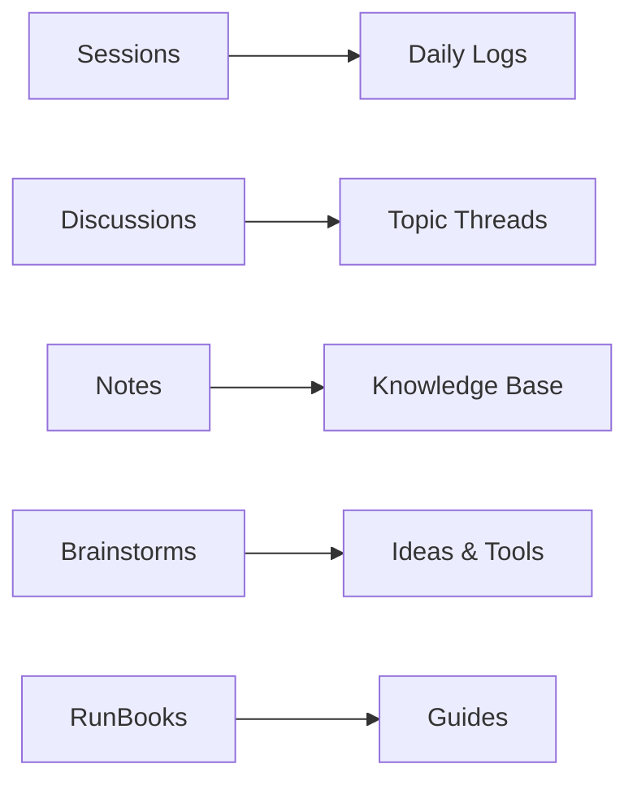
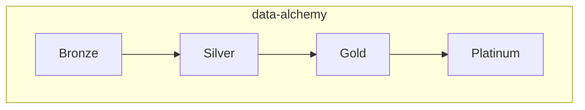

# AgentPortals

---

## Sessions

Session history lives in the **AgentContext dashboard** - searchable across
previews, commands and file paths, captured automatically by AgentProbe.

[:octicons-arrow-right-24: Open the dashboard](https://agentcontext-sessions.web.app)

---

## Recent Discussions

| Topic | Description |
|-------|-------------|
| GICS Pipeline | S&P GICS data processing |
| Data Quality | Pipeline validation framework |
| PathSeeker | Path analysis tool |
| Investigation DB | Pattern-based reverse lookup |

[:octicons-arrow-right-24: All Discussions](discussions/index.md)

---

## Overview

```mermaid
graph LR
    A[Sessions] --> B[Daily Logs]
    C[Discussions] --> D[Topic Threads]
    E[Notes] --> F[Knowledge Base]
    G[Brainstorms] --> H[Ideas & Tools]
    I[RunBooks] --> J[Guides]
```

---

## Active Projects

```mermaid
graph TD
    subgraph data-alchemy
        B[Bronze] --> S[Silver]
        S --> G[Gold]
        G --> P[Platinum]
    end
```

**Branch:** `feature/bbocax-futures`

[:octicons-arrow-right-24: Project Notes](notes/projects/data-alchemy/index.md)
