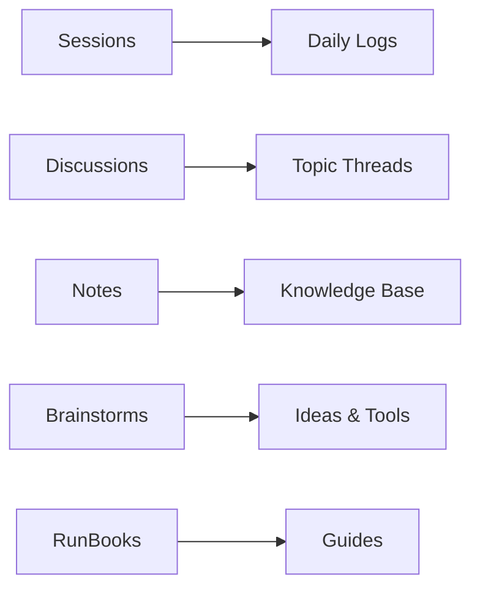

# AgentPortals

---

## Recent Sessions

| Date | Agent | Machine | Focus |
|------|-------|---------|-------|
| 2026-01-16 | Claude | Windows | AgentContext restructure |
| 2026-01-15 | Claude | Windows, Linux | bbocax-futures pipeline |
| 2026-01-14 | Claude | Windows, Linux | Bloomberg mapping |

[:octicons-arrow-right-24: All Sessions](sessions/index.md)

---

## Recent Discussions

| Topic | Description |
|-------|-------------|
| GICS Pipeline | S&P GICS data processing |
| Data Quality | Pipeline validation framework |
| PathSeeker | Path analysis tool |
| Investigation DB | Pattern-based reverse lookup |

[:octicons-arrow-right-24: All Discussions](discussions/index.md)

---

## Overview

---

## Active Projects

**Branch:** `feature/bbocax-futures`

[:octicons-arrow-right-24: Project Notes](notes/projects/data-alchemy/index.md)
